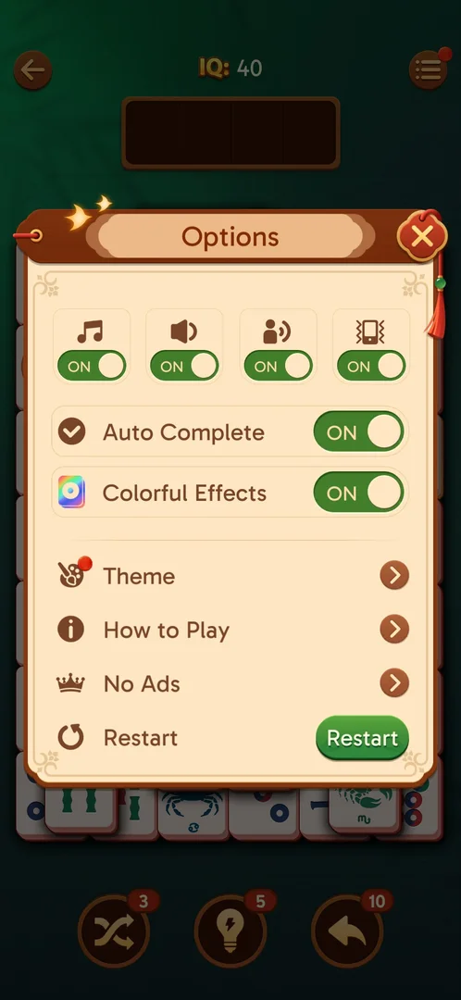
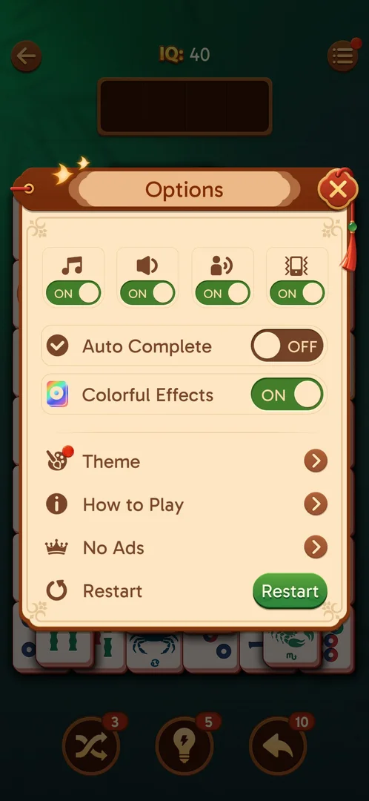

# Auto Complete

An on/off setting in the level's Options menu, on by default. Its name suggests the game finishes the
end of a level by itself (inferred); what it does in a level was not seen [^s1] [^s2].

## Why it appeared

A row in the in-level Options, present when the menu was first opened at level 19 [^s1].

## Where to find it

Level screen > menu button (three lines, top right) > Options > the "Auto Complete" row, under the four
sound toggles and above Colorful Effects [^s1] [^s2]. See [In-level Options](level-options.md).

 [^s2]
*The Auto Complete row with its toggle, first under the sound toggles*

## What it looks like

 [^s3]
*Auto Complete OFF: the switch turns dark and reads OFF; Colorful Effects stays ON*

A row with a check-mark icon, the label "Auto Complete" and a toggle: green with ON, or dark with OFF
[^s2] [^s3]. It has no screen of its own.

## How it works

Version 3.40.1.

- ON by default [^s1].
- A tap switches it OFF, another tap back ON. The state is kept when Options is closed and opened again
  [^s4].
- Its effect at the end of a level was not observed: no level was played to its end with it ON or OFF.

## Cases

| Case | What was done | Result | Source |
|---|---|---|---|
| Level Options menu (top-right list button in a level), row Auto Complete <!-- case:chk-entry --> | Opened the in-level Options | ✅ Level > menu > Auto Complete | [^s2] |
| Single ON/OFF toggle row between sound toggles and Colorful Effects; default ON <!-- case:chk-screen --> | Opened the in-level Options | ✅ A toggle row, no screen of its own | [^s2] |
| Every option or button and what it changes <!-- case:chk-options --> | Toggled OFF, then ON, closed and reopened Options | ✅ partly: the toggle switches and keeps its state; effect at level end not seen | [^s3] [^s4] |
| For a prompt: what each answer does <!-- case:chk-answers --> | — | ✅ does not apply: not a prompt | [^s4] |
| Links out <!-- case:chk-links --> | — | ✅ does not apply: no links | [^s4] |
| Why it appeared <!-- case:chk-appeared --> | Opened the in-level Options | ✅ A row there | [^s1] |

## Not verified

- What Auto Complete does at the end of a level, with it ON and with it OFF

[^s1]: session 20261003-195050-chrono-2FYKPJ, step 18 — [video at 4:51](https://youtu.be/KUKs3cQ-xqY?t=291)
[^s2]: session 20261003-231301-chrono-2FYKPJ, step 16 — [video at 3:10](https://youtu.be/D73ofuYaPzY?t=190)
[^s3]: session 20261003-231301-chrono-2FYKPJ, step 17 — [video at 3:20](https://youtu.be/D73ofuYaPzY?t=200)
[^s4]: session 20261003-231301-chrono-2FYKPJ, step 20 — [video at 3:40](https://youtu.be/D73ofuYaPzY?t=220)
