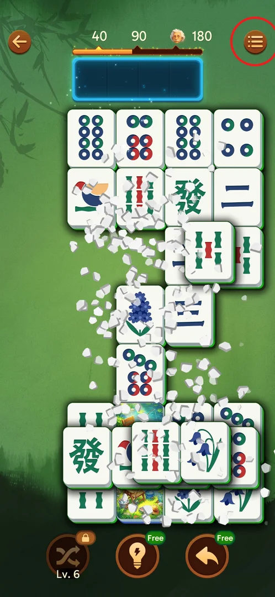
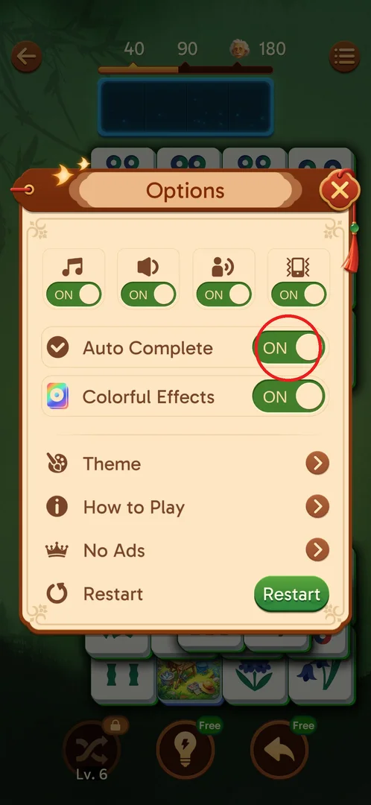
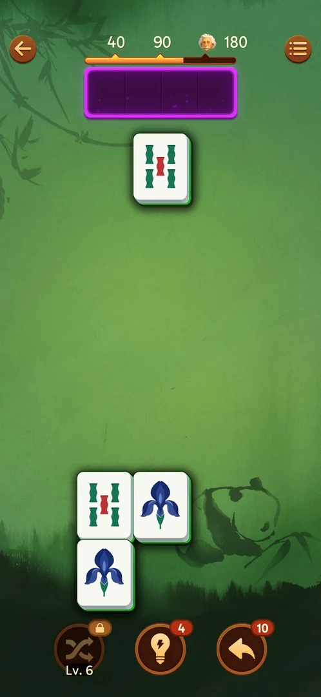

# Auto Complete option

Auto Complete is an ON/OFF switch in the in-level Options popup. It is ON by default [^s2] [^s4]. By its name it should let the game clear the rest of the board by itself near the end of a level; in practice it was seen to act only once (level 11) while levels 2–7 and 12–17 ended without it, and the condition that triggers it is unknown [^s5].

## Where to find it

Inside any level: tap the round menu button with three lines at the top right of the level screen; it opens the Options popup [^s2].

 [^s1]

## What it looks like

Options is a popup over the board: a row of four toggles (music, sound, voice, vibration), then the Auto Complete row and the Colorful Effects row, then Theme, How to Play, No Ads and a Restart button; a red X at the top right closes it [^s2]. Auto Complete is the row with the checkmark icon and a green "ON" switch.

 [^s2]

## What you can do

| Tab or button | What it does |
|---|---|
| [Auto Complete toggle](#auto-complete-toggle) | Switches Auto Complete ON or OFF; ON by default |

### Auto Complete toggle

The row has a checkmark icon, the name "Auto Complete" and an ON/OFF switch, green "ON" by default [^s2]. Switching it OFF was not tried, so a level end with Auto Complete OFF has not been compared.

 [^s2]

### Result

The typical level end with Auto Complete ON: nothing happens by itself, and the last tiles must be matched by hand. Here, level 2: 4 free tiles (two pairs) and an empty tray, no auto finish after 8 s of waiting [^s3].

 [^s3]

## How it works

Version 3.39.1.

- ON by default [^s4].
- With it ON it did not finish levels 2–7, 12–17 even with 1–12 fully free tiles left and an empty tray; each was finished by hand [^s6] [^s7] [^s8] [^s9] [^s10] [^s11] [^s12].
- On level 11 the last ~12 tiles (3 of them face-down green tiles, some still overlapping) cleared without taps while the league tutorial covered the board, and the win screen followed [^s5]. The player took this for Auto Complete; it was not seen directly.
- The trigger is unknown. The player's guess (inferred, not tested): it needs an empty tray and no two-layer stacks, or only works from some level on [^s5]. Levels 12–17 after it did not trigger it, so "from level 11 on" alone does not explain it.

## Cases

| Case | What was done | Result | Source |
|---|---|---|---|
| No trigger, 4 tiles | L2: Auto Complete ON, empty tray, 4 free tiles (2 pairs), waited 8 s | Nothing; matched by hand | [^s6] |
| No trigger, tray not empty | L3: 4 free tiles in a 2×2 block, 2 tiles in the tray, waited 3 s | Nothing; finished by hand | [^s13] |
| No trigger, 4–12 free tiles | L3–L6 near the end | Nothing on any of them | [^s7] |
| No trigger, 1 tile | L7 down to the last tile | Nothing | [^s8] |
| Fired (probably) | L11: empty tray, ~12 tiles left, league tutorial on screen | Board cleared without taps, win screen | [^s5] |
| No trigger | L12: 4 free tiles, empty tray; L13 | Nothing on either level | [^s14] [^s9] |
| No trigger | L14 (last 6 tiles in one batch), L15, L16, L17 | Nothing | [^s10] [^s11] [^s12] |

## Not verified

- The trigger condition. L11 probably finished by itself with about 12 tiles left, but behind popups, so the moment was not seen [^s5].
- What a level end looks like with Auto Complete OFF (never switched off).
- No frame of the L11 auto finish itself; only its win screen was captured [^s5].

[^s1]: session 20260930-203959-chrono-2FYKPJ, step 82 — [video at 14:36](https://youtu.be/2yK_ch59JAg?t=876)
[^s2]: session 20260930-203959-chrono-2FYKPJ, step 83 — [video at 14:53](https://youtu.be/2yK_ch59JAg?t=893)
[^s3]: session 20260930-214524-chrono-2FYKPJ, step 92 — [video at 16:54](https://youtu.be/sWuok8myZrQ?t=1014)
[^s4]: session 20260930-211039-chrono-2FYKPJ, step 133
[^s5]: session 20260930-235817-chrono-2FYKPJ, step 67 — [video at 35:54](https://youtu.be/6yY68DCT4w0?t=2154)
[^s6]: session 20260930-214524-chrono-2FYKPJ, step 96 — [video at 17:57](https://youtu.be/sWuok8myZrQ?t=1077)
[^s7]: session 20260930-221457-chrono-2FYKPJ, step 93
[^s8]: session 20260930-225122-chrono-2FYKPJ, step 76 — [video at 35:19](https://youtu.be/wSbzNbOhly8?t=2119)
[^s9]: session 20261001-031723-chrono-2FYKPJ, step 96
[^s10]: session 20261001-063226-chrono-2FYKPJ, step 31
[^s11]: session 20261001-083725-chrono-2FYKPJ, step 83
[^s12]: session 20261001-110957-chrono-2FYKPJ, step 40
[^s13]: session 20260930-221457-chrono-2FYKPJ, step 38
[^s14]: session 20261001-031723-chrono-2FYKPJ, step 51
