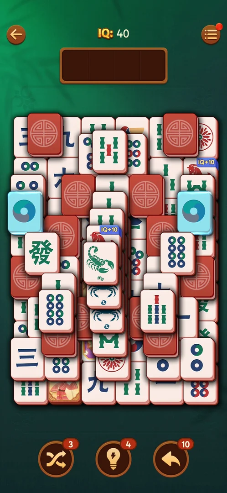
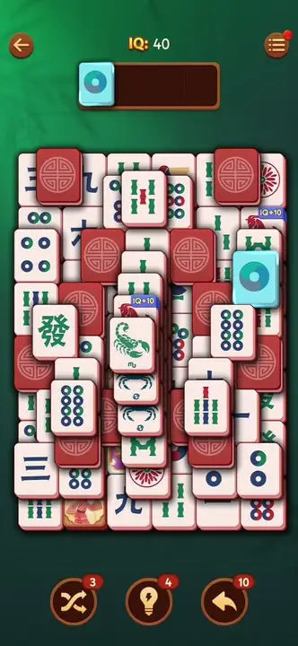
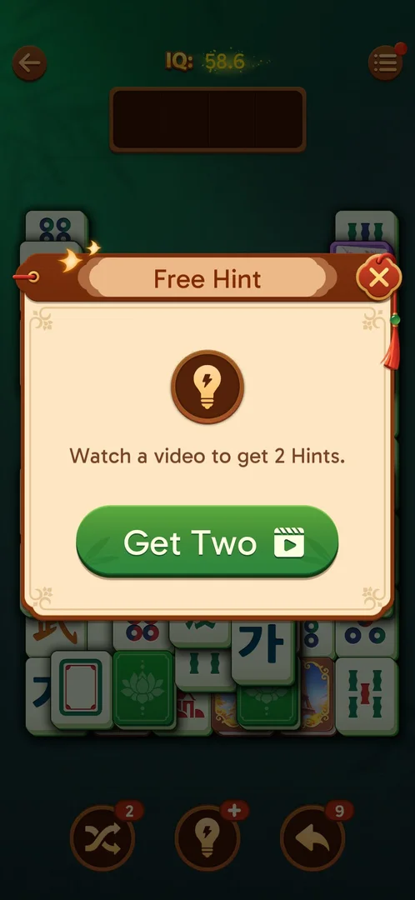
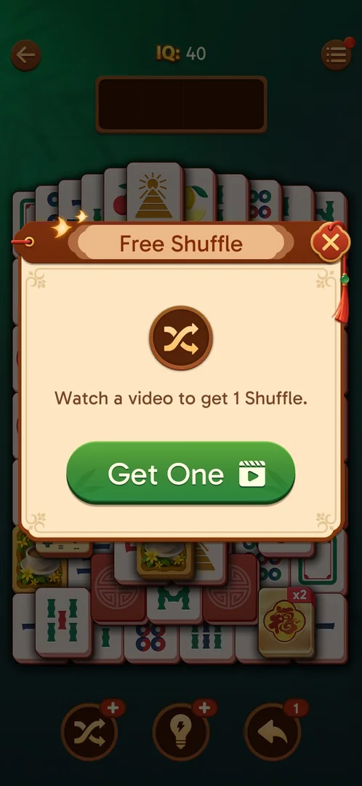
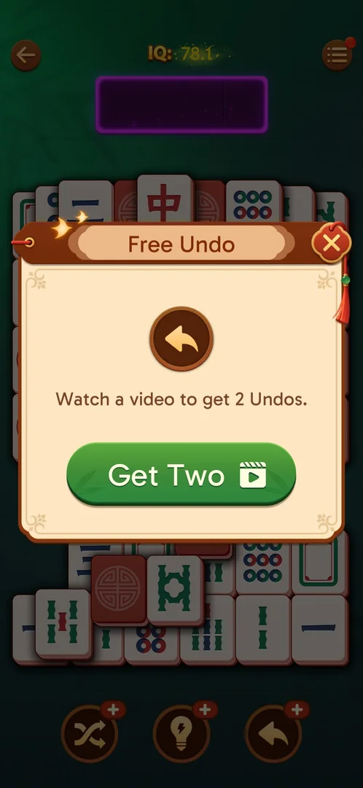
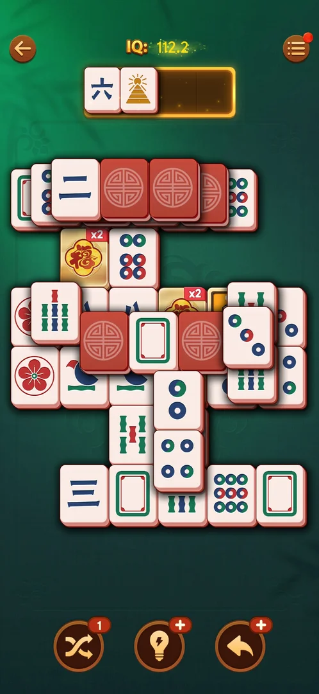
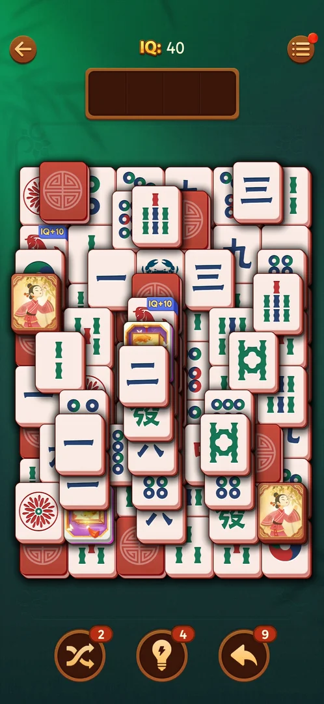
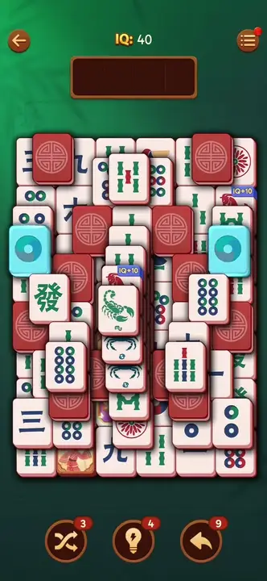

# Boosters: Shuffle, Hint, Undo

Three round buttons under the board of every level: Shuffle, Hint and Undo. Each carries a red badge
with the number of uses the player holds; one use costs one unit [^s1] [^s2]. Hint lights a matching
pair, Undo takes the last tile back out of the tray, Shuffle rearranges the tiles on the board
[^s3] [^s4] [^s5]. At zero a badge shows "+" and a tap opens a free offer for a rewarded video: 2 Hints,
1 Shuffle or 2 Undos [^s7] [^s12] [^s13].

## Why it appeared

On the level screen when level 19 was opened, with Shuffle 3, Hint 5 and Undo 10 [^s1]. The level they
first appear on is not known from these sessions.

## Where to find it

<!-- no-entry: no control opens them; they sit on the level screen itself (see "What it looks like") -->
On the level screen, in a row under the board: Shuffle left, Hint centre, Undo right [^s2]. The level
opens from the Level N button on the home screen (see [Tray mahjong level](core-level.md)).

## What it looks like

 [^s2]
*The three boosters under the board: Shuffle 3, Hint 5, Undo 10*

- Shuffle: two crossing arrows; badge 3 [^s2].
- Hint: a light bulb; badge 5 [^s2].
- Undo: a curved back arrow; badge 10 [^s2].

## What you can do

| Tab or button | What it does |
|---|---|
| [Hint](#hint) | Lights two matching free tiles in blue; badge 5 to 4 |
| [Undo](#undo) | Returns the last tile from the tray to its place on the board; badge 10 to 9 |
| [Shuffle](#shuffle) | Rearranges the tiles on the board; badge 3 to 2 |
| [Hint at zero](#hint-at-zero) | The "+" badge; a tap offers 2 Hints for a video |
| [Shuffle at zero](#shuffle-at-zero) | The "+" badge; a tap offers 1 Shuffle for a video |
| [Undo at zero](#undo-at-zero) | The "+" badge; a tap offers 2 Undos for a video |
| [Video reward](#video-reward) | Get One watched: the Shuffle badge reads 1 back in the level |

### Hint

 [^s3]
*Hint: the pair lit in blue, badge 5 to 4*

One tap lit two matching free tiles in blue and the badge went from 5 to 4 [^s3]. The light stayed on:
after one of the two was tapped into the tray, the tile in the tray and its partner on the board were
both still blue [^s6].

### Undo

 [^s4]
*Undo: the tray tile is back on the board, badge 10 to 9*

With one tile in the tray, one tap put it back in its place on the board and emptied the tray; the
badge went from 10 to 9 [^s4]. The board looked as before the move, the Hint light included [^s4].

 [^s6]
*Clip 8 s · [original on YouTube from 1:40](https://youtu.be/ssTmhwls_uc?t=100)*

### Hint at zero

 [^s7]
*Hint at zero: the "+" badge and the Free Hint offer*

After level 19 the Hint badge showed "+" instead of a number [^s8]. A tap on Hint then opened a "Free
Hint" window: "Watch a video to get 2 Hints.", a green "Get Two" button with a video icon and a close X
[^s7]. Get Two was not tapped; the X closed the window [^s7].

### Shuffle at zero

 [^s12]
*Shuffle at zero: the "+" badge bottom left opens the Free Shuffle offer*

Level 22 opened with Shuffle and Hint at "+" and Undo at 1 [^s12]. A tap on Shuffle opened a "Free
Shuffle" window: "Watch a video to get 1 Shuffle.", a green "Get One" with a video icon and a close X
[^s12]. The X closed it with nothing spent [^s14].

### Undo at zero

 [^s13]
*Undo at zero: the Free Undo offer, 2 Undos for one video*

The last Undo was spent on a single tile in the tray: it went back to its place on the board and the badge
turned to "+" [^s15]. A tap on Undo then opened a "Free Undo" window: "Watch a video to get 2
Undos.", a green "Get Two" with a video icon and a close X [^s13]. The X closed it with nothing
spent [^s16].

### Video reward

 [^s17]
*After the video: Shuffle 1*

At a dead end with two single tiles in the tray, Shuffle at "+" was tapped and Get One taken [^s18] [^s19].
The video ended on a playable ad card with an Install button and no close control; the game was brought
back to the front, and the level was where it was left with the Shuffle badge at 1 [^s17]. One tap
on Shuffle used it: the faces on the board changed, the two tiles in the tray stayed, and the badge went
back to "+" [^s20]. The ad itself is not shown on this page.

### Shuffle

 [^s5]
*Shuffle: the tiles rearranged, badge 3 to 2*

One tap kept the shape of the layout and changed which tile lies in each place: the faces changed and
the face-down red tiles moved to other places; the badge went from 3 to 2 [^s5]. The Hint light was
gone after the shuffle [^s5].

 [^s5]
*Clip 5.4 s · [original on YouTube from 1:53](https://youtu.be/ssTmhwls_uc?t=113)*

## How it works

Version 3.40.1.

- Counts at the start of level 19 on a restored save: Shuffle 3, Hint 5, Undo 10 [^s1] [^s2].
- Each use costs one unit from its own badge; no coins or other price was asked [^s3] [^s4] [^s5].
- Hint, Undo and Shuffle were each used once in one level; none of them refilled during the level
  (Shuffle 2, Hint 4, Undo 9 at the end) [^s5].
- The counts carry over from level to level: level 19 ended at Shuffle 2, Hint 0 ("+"), Undo 9, and level
  20 opened with the same; the level 19 win added none [^s8].
- At zero each booster offers a rewarded video: Hint 2, Shuffle 1, Undo 2 [^s7] [^s12] [^s13].
  The Shuffle video was watched once and gave 1 Shuffle; the reward was kept although the game was
  brought back from the ad by hand [^s17].
- The counts at the start of level 22: Shuffle 0, Hint 0, Undo 1 [^s12]. All three were at "+" at the
  end of level 22, after the won level and on its win screen [^s21].
- The level chest is a source: the one at level 20 gave Hint x1 and Undo x1; "Collect x2" with a video
  would double them [^s9] [^s10].
- "-4 to revive" in the Out of space window spends 4 Undos: 9 to 5 on the Hard level 20
  [^s11].
- Other sources and whether units refill over time are not verified: from level 20 to the end of level 22
  no unit came back by itself [^s12] [^s21].

## Cases

| Case | What was done | Result | Source |
|---|---|---|---|
| Why it appeared: the trigger that brought it up (the first launch, a level won, a threshold, a timer, a loss): a fact with its frame, or a hypothesis to test <!-- case:chk-appeared --> | Opened level 19 | ✅ On the level screen | [^s1] |
| Where to find it: the bottom bar of the level screen, Shuffle, Hint, Undo left to right <!-- case:chk-entry --> | Opened level 19 | ✅ The row under the board | [^s2] |
| What it looks like: three round buttons with count badges <!-- case:chk-screen --> | Opened level 19 | ✅ | [^s2] |
| What it does: the effect of one use <!-- case:chk-effect --> | Hint, Undo, Shuffle once each | ✅ Hint lights a pair in blue; Undo returns the tray tile to the board; Shuffle rearranges the board | [^s3] [^s4] [^s5] |
| The balance: badges on each button <!-- case:chk-balance --> | Opened level 19 | ✅ Shuffle 3, Hint 5, Undo 10 at level 19; the amount on level 1 not seen | [^s2] |
| Hint, then a tap on a lit tile, then Undo <!-- case:hint-tint --> | Hint, one lit tile into the tray, Undo | ✅ The pair lit blue; the tile kept the blue in the tray; Undo returned it to the board, still blue | [^s3] [^s6] [^s4] |
| Sources: every way to get more <!-- case:chk-sources --> | Won level 19; tapped Hint at zero | Partly: the win added none; Hint at zero offers 2 for a video, Shuffle 1, Undo 2; the Shuffle video gave 1 | [^s8] [^s7] [^s17] |
| Sinks: one unit per use, no price <!-- case:chk-sinks --> | Hint, Undo, Shuffle once each | ✅ Hint 5 to 4, Undo 10 to 9, Shuffle 3 to 2 | [^s3] [^s4] [^s5] |
| At zero: what happens and the offers to refill it <!-- case:chk-empty --> | Tapped Hint, Shuffle and Undo at zero | ✅ The badge shows "+"; a tap opens a free offer for a video: Free Hint 2, Free Shuffle 1, Free Undo 2; the X closes it with nothing spent | [^s7] [^s12] [^s13] |
| All three at zero <!-- case:zero-offers --> | Tapped Shuffle and Undo at "+" on level 22; watched the Shuffle video once | ✅ Each opens a rewarded-video window: Free Hint 2, Free Shuffle 1, Free Undo 2; X closes with nothing spent; the video gave 1 Shuffle | [^s12] [^s13] [^s17] |
| Refill timer, if any <!-- case:chk-refill --> | — | not verified: no refill seen during a level or between levels 19 and 20 | [^s8] |
| Shuffle turned face-down tiles up: about 13 red backs before, about 7 after <!-- case:shuffle-reveals --> | One Shuffle on level 19 | not verified: one observation | [^s5] |
| The level chest as a source <!-- case:source-level-chest --> | Won level 20, opened the level chest, Collect | ✅ Hint x1 and Undo x1 (with an avatar frame); the boosters then read Shuffle 1, Hint 1, Undo 2 (see [Level progress chest](level-chest.md)) | [^s10] |

## Not verified

- The balance: the starting amount on level 1 and the level the boosters first appear on <!-- case:chk-balance -->
- Sources: every way to get more (a daily reward, a pack, the chests) and how much; the Hint and Undo videos not watched <!-- case:chk-sources -->
- Refill timer, if any: how long one unit takes and the maximum <!-- case:chk-refill -->
- Whether Shuffle also turns face-down tiles up <!-- case:shuffle-reveals -->

[^s1]: session 20261003-195050-chrono-2FYKPJ, step 17 — [video at 4:17](https://youtu.be/KUKs3cQ-xqY?t=257)
[^s2]: session 20261003-231804-chrono-2FYKPJ, step 4 — [video at 1:11](https://youtu.be/ssTmhwls_uc?t=71)
[^s3]: session 20261003-231804-chrono-2FYKPJ, step 5 — [video at 1:33](https://youtu.be/ssTmhwls_uc?t=93)
[^s4]: session 20261003-231804-chrono-2FYKPJ, step 7 — [video at 1:47](https://youtu.be/ssTmhwls_uc?t=107)
[^s5]: session 20261003-231804-chrono-2FYKPJ, step 8 — [video at 1:58](https://youtu.be/ssTmhwls_uc?t=118)
[^s6]: session 20261003-231804-chrono-2FYKPJ, step 6 — [video at 1:42](https://youtu.be/ssTmhwls_uc?t=102)
[^s7]: session 20261005-073804-chrono-2FYKPJ, step 53 — [video at 18:10](https://youtu.be/nmXrQmoLWlU?t=1090)
[^s8]: session 20261005-073804-chrono-2FYKPJ, step 49 — [video at 16:19](https://youtu.be/nmXrQmoLWlU?t=979)

[^s9]: session 20261005-133525-chrono-2FYKPJ, step 46 — [video at 18:23](https://youtu.be/D10jI230Oks?t=1103)
[^s10]: session 20261005-133525-chrono-2FYKPJ, step 47 — [video at 18:42](https://youtu.be/D10jI230Oks?t=1122)
[^s11]: session 20261005-133525-chrono-2FYKPJ, step 10 — [video at 3:37](https://youtu.be/D10jI230Oks?t=217)

[^s12]: session 20261006-122751-chrono-2FYKPJ, step 2 — [video at 1:13](https://youtu.be/B2PSO6tOKeQ?t=73)
[^s13]: session 20261006-122751-chrono-2FYKPJ, step 15 — [video at 3:58](https://youtu.be/B2PSO6tOKeQ?t=238)
[^s14]: session 20261006-122751-chrono-2FYKPJ, step 3 — [video at 1:27](https://youtu.be/B2PSO6tOKeQ?t=87)
[^s15]: session 20261006-122751-chrono-2FYKPJ, step 14 — [video at 3:58](https://youtu.be/B2PSO6tOKeQ?t=238)
[^s16]: session 20261006-122751-chrono-2FYKPJ, step 16 — [video at 3:58](https://youtu.be/B2PSO6tOKeQ?t=238)
[^s17]: session 20261006-122751-chrono-2FYKPJ, step 31 — [video at 9:37](https://youtu.be/B2PSO6tOKeQ?t=577)
[^s18]: session 20261006-122751-chrono-2FYKPJ, step 29 — [video at 8:01](https://youtu.be/B2PSO6tOKeQ?t=481)
[^s19]: session 20261006-122751-chrono-2FYKPJ, step 30 — [video at 8:08](https://youtu.be/B2PSO6tOKeQ?t=488)
[^s20]: session 20261006-122751-chrono-2FYKPJ, step 32 — [video at 9:47](https://youtu.be/B2PSO6tOKeQ?t=587)
[^s21]: session 20261006-122751-chrono-2FYKPJ, step 44 — [video at 12:53](https://youtu.be/B2PSO6tOKeQ?t=773)
