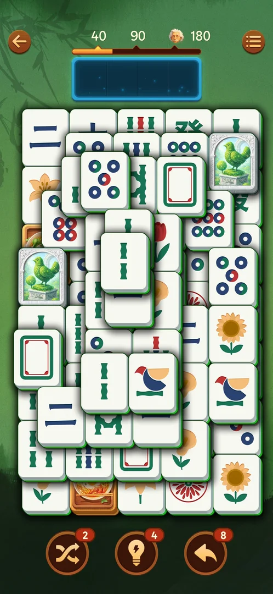

# Boosters: Shuffle, Hint, Undo

## How it works
- Level 1: Hint and Undo "Free", Shuffle locked "Lv. 6". From level 2: Hint 5, Undo 10 [s:20260930-203959-chrono-2FYKPJ#26] [s:20260930-211039-chrono-2FYKPJ#118].
- Hint lights a pair in cyan (the tray tile and its twin); the twin may still be covered — a hand
  points at the blocker [s:20260930-203959-chrono-2FYKPJ#29] [s:20260930-214524-chrono-2FYKPJ#70] [s:20260930-235817-chrono-2FYKPJ#50].
- Undo returns the last tray tile to the board; with an empty tray it does nothing; 1 per use
  [s:20260930-211039-chrono-2FYKPJ#80] [s:20260930-221457-chrono-2FYKPJ#44].
- Shuffle (from level 6, stock 3): keeps every position and reshuffles the faces [s:20260930-221457-chrono-2FYKPJ#78] [s:20260930-221457-chrono-2FYKPJ#83].
- At 0 a booster shows "+": Hint "+" offers 2 hints for a video ([rewarded ads](rewarded-ads.md))
  [s:20261001-010125-chrono-2FYKPJ#45].

*Clip 14 s · original video not uploaded*

*Clip 14 s · original video not uploaded*

## Cases
| Case | What was done | Result | Source |
|---|---|---|---|
| Hint | Tapped | A cyan pair | [s:20260930-203959-chrono-2FYKPJ#29] |
| Undo | With a tray tile | The tile returns | [s:20260930-211039-chrono-2FYKPJ#80] |
| Shuffle | Level 6 | Faces reshuffled in place | [s:20260930-221457-chrono-2FYKPJ#83] |
| Counts | Level 2 | Hint 5, Undo 10 | [s:20260930-211039-chrono-2FYKPJ#118] |
| Hint at 0 | Tapped "+" | Free Hint for a video | [s:20261001-010125-chrono-2FYKPJ#47] |

## Not verified
- Undo and Shuffle "+" at 0.
