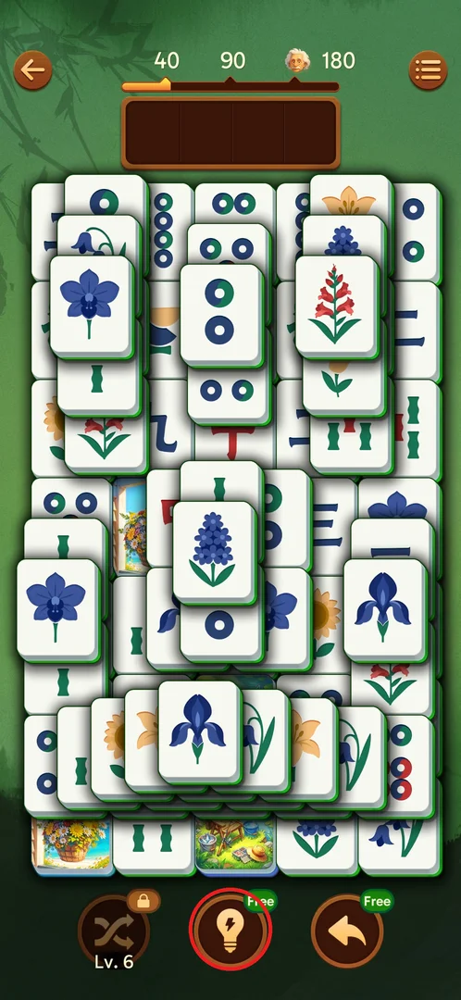
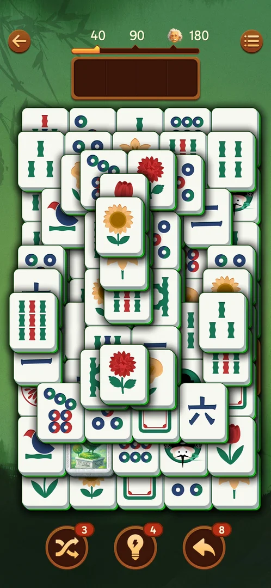
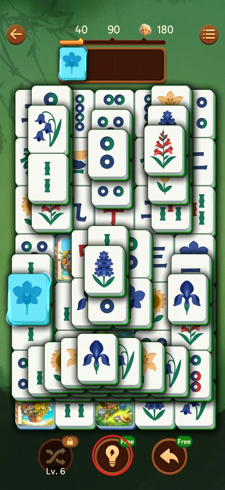
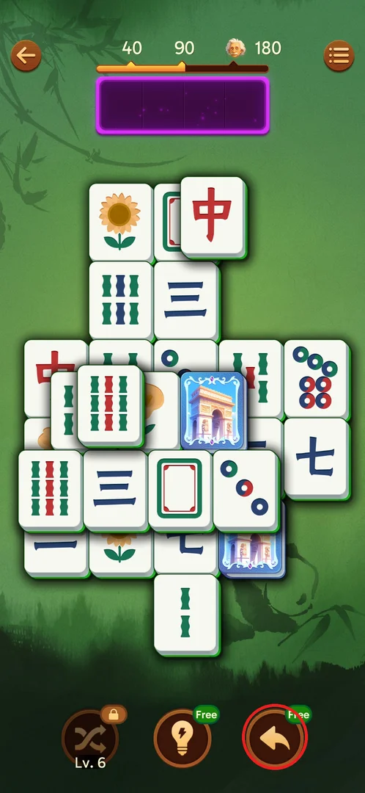
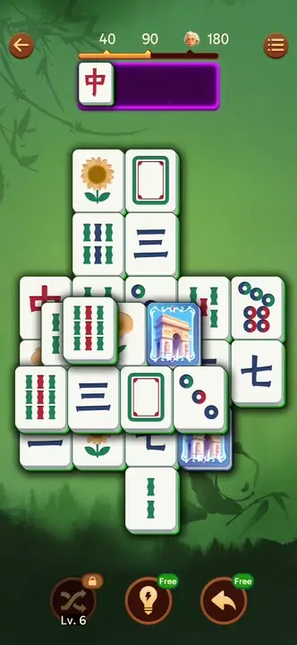
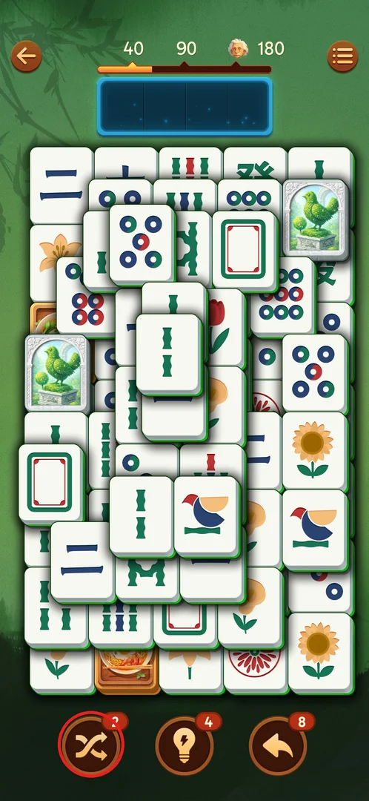
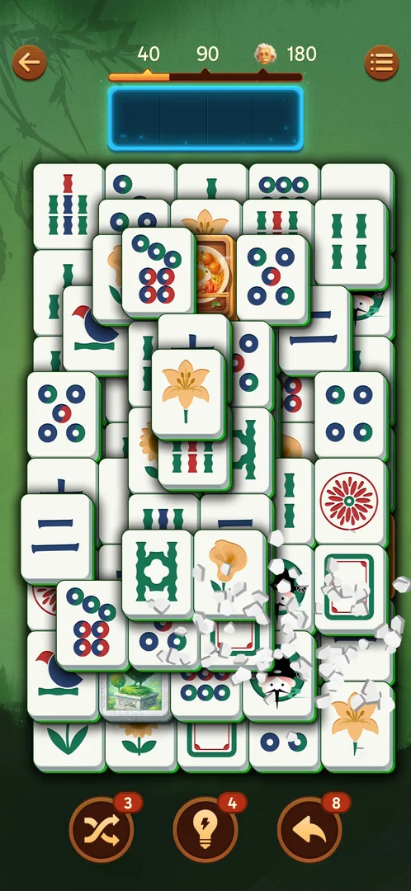
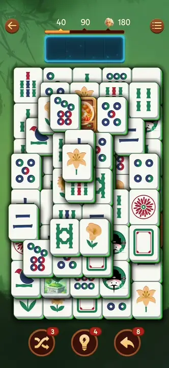
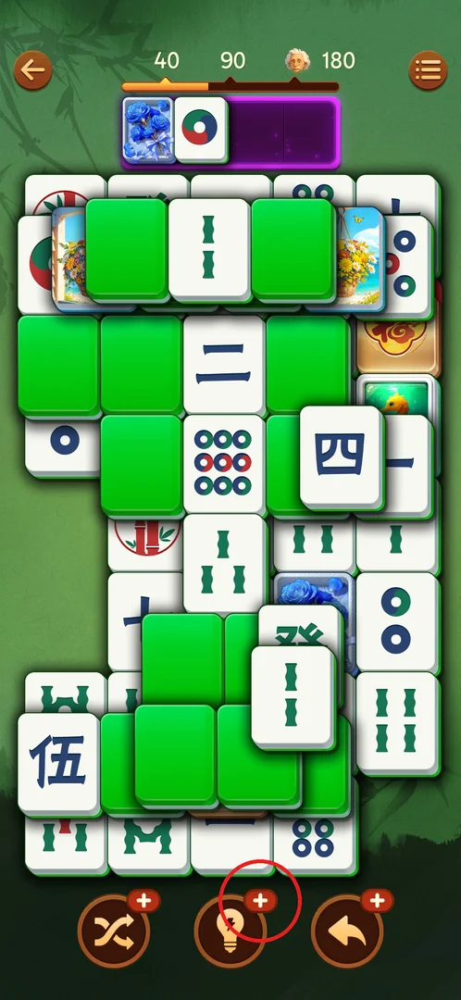

# Boosters: Shuffle, Hint, Undo

Three round buttons under the board of every level help when the player is stuck: **Shuffle** gives
the board tiles new faces, **Hint** lights up a pair to match, **Undo** sends the last tile in the tray
back to the board. Each has a stock shown as a red badge; on level 1 Hint and Undo are free and Shuffle
is locked until level 6 [^s1] [^s10] [^s2]. At stock 0 a booster shows "+", and Hint "+" gives 2 hints
for a video [^s7] [^s13].

## Where to find it

On the level screen itself: the booster bar is the row of three round buttons at the bottom, under the
board — Shuffle on the left, Hint in the middle, Undo on the right [^s1]. There is no separate screen.

 [^s1]

## What it looks like

Each button carries a badge in its top-right corner: a red number is the stock, a green "Free" means
unlimited use on level 1, a padlock with "Lv. 6" under the button means locked, a red "+" means the
stock is 0 [^s1] [^s10] [^s6]. On level 6 the bar read Shuffle 3, Hint 4, Undo 8 [^s2].

 [^s2]

## What you can do

| Tab or button | What it does |
|---|---|
| [Hint](#hint) | Lights a matching pair in cyan; a hand points at a tile that blocks it |
| [Undo](#undo) | Returns the last tray tile to its board spot |
| [Shuffle](#shuffle) | Keeps every tile position, gives the board tiles new faces (from level 6) |
| [Stock at zero](#stock-at-zero) | At stock 0: Hint "+" offers 2 hints for a video |

### Hint

Tapping Hint lights a matching pair in cyan: the tile already in the tray and its twin on the board
[^s8] [^s16]. The twin may still be covered — then a hand points at the tile that blocks it [^s11] [^s17];
one hinted bird was half-hidden under a green tile and could be tapped on its visible strip [^s18]. On
level 1 the "Free" badge stays after use; from level 2 each use spends 1 (5 → 4) [^s8] [^s11].

 [^s3]

### Undo

Undo returns the last tile placed in the tray to its board spot. With an empty tray — right after a
pair was completed — it does nothing: a completed match cannot be undone [^s4]. On level 1 the "Free"
badge stays; later each use spends 1 (10 → 8 after two undos on level 4), and the combo keeps going
[^s4] [^s12].

 [^s4]

 [^s4]
*Clip 14 s · original video not uploaded*

### Shuffle

Shuffle unlocks at level 6 with no popup: the padlock is replaced by the stock badge 3 [^s2]. It keeps
every tile position and the layout shape and gives all board tiles new faces; the tray and the combo
are kept; each use spends 1 (3 → 2 on level 6, 2 → 1 on level 10) [^s5] [^s9]. On a Hard level 10 one
Shuffle opened 5 pairs [^s9].

 [^s5]

 [^s19]

 [^s5]
*Clip 14 s · original video not uploaded*

### Stock at zero

When a booster's stock reaches 0 its badge becomes a red "+"; all three were at "+" together on one
level [^s6]. Tapping Hint "+" opens the popup "Free Hint" — "Watch a video to get 2 Hints." with the
button "Get Two" and a close cross [^s7]. After the video the reward was granted and Hint could be used
again ([rewarded ads](rewarded-ads.md)) [^s13].

 [^s6]

 [^s7]

## How it works

Version 3.39.1.

- Level 1: Hint and Undo "Free", Shuffle locked "Lv. 6" [^s1].
- From level 2: Hint 5, Undo 10 [^s10]. Seen on level 6: Shuffle 3, Hint 4, Undo 8 [^s2].
- Shuffle unlocks at level 6 with stock 3 [^s2].
- Every use spends 1 from the stock [^s11] [^s12] [^s5].
- At 0: "+"; Hint "+" = 2 hints for one rewarded video [^s7] [^s13].
- Undo stock is also a revive currency: on "Out of space" a "-4 to revive" option (by its name it spends 4 Undo — inferred) puts
  all 4 tray tiles back on the board and is hidden when Undo < 4; Revive itself had a stock of 3 that
  went to 0, after which Revive needs a video [^s14] [^s15].

## Cases

| Case | What was done | Result | Source |
|---|---|---|---|
| Shuffle on level 1 | Looked at the bar | Locked, label "Lv. 6" | [^s1] |
| Hint on level 1 | Tapped "Free" Hint | A cyan pair; "Free" badge stays | [^s8] |
| Undo with a tray tile | Tapped Undo | The tile returns to its spot; with an empty tray nothing happens | [^s4] |
| Stock from level 2 | Started level 2 | Hint 5, Undo 10 | [^s10] |
| Hint on level 2 | Tapped Hint | A cyan pair and a hand on the blocker; 5 → 4 | [^s11] |
| Undo stock | Two undos on level 4 | 10 → 8; combo kept | [^s12] |
| Shuffle unlock | Started level 6 | No popup; padlock replaced by stock 3 | [^s2] |
| Shuffle | Used on level 6 | Same positions, new faces; 3 → 2 | [^s5] |
| Shuffle | Used on Hard level 10 | Faces reshuffled, tray unchanged; 2 → 1 | [^s9] |
| Hint at stock 1 | Tapped Hint | The tray tile and its half-hidden twin light up; stock 1 → 0 ("+") | [^s16] |
| Hint at 0 | Tapped "+" | "Free Hint" popup: 2 hints for a video | [^s7] |
| Hint at 0 | Get Two, watched the video | Reward granted, hint usable | [^s13] |
| Revive stock | Out of space on levels 8–9 | Revive 3 → 0; "-4 to revive" hidden when Undo < 4 | [^s14] |
| Revive at 0 | Out of space | "Revive" with a video icon, and Restart | [^s15] |

## Not verified

- Undo "+" and Shuffle "+" at 0: what they offer.
- Whether the stocks refill on their own between levels or only from rewards (chest, ads).

[^s1]: session 20260930-203959-chrono-2FYKPJ, step 26 — [video at 5:41](https://youtu.be/2yK_ch59JAg?t=341)
[^s2]: session 20260930-221457-chrono-2FYKPJ, step 78
[^s3]: session 20260930-203959-chrono-2FYKPJ, step 28 — [video at 6:19](https://youtu.be/2yK_ch59JAg?t=379)
[^s4]: session 20260930-211039-chrono-2FYKPJ, step 80
[^s5]: session 20260930-221457-chrono-2FYKPJ, step 83
[^s6]: session 20261001-010125-chrono-2FYKPJ, step 44 — [video at 19:20](https://youtu.be/vc6OylgqaTw?t=1160)
[^s7]: session 20261001-010125-chrono-2FYKPJ, step 45 — [video at 19:47](https://youtu.be/vc6OylgqaTw?t=1187)
[^s8]: session 20260930-203959-chrono-2FYKPJ, step 29 — [video at 6:24](https://youtu.be/2yK_ch59JAg?t=384)
[^s9]: session 20260930-235817-chrono-2FYKPJ, step 41 — [video at 20:47](https://youtu.be/6yY68DCT4w0?t=1247)
[^s10]: session 20260930-211039-chrono-2FYKPJ, step 118
[^s11]: session 20260930-214524-chrono-2FYKPJ, step 96 — [video at 17:57](https://youtu.be/sWuok8myZrQ?t=1077)
[^s12]: session 20260930-221457-chrono-2FYKPJ, step 44
[^s13]: session 20261001-010125-chrono-2FYKPJ, step 47 — [video at 20:55](https://youtu.be/vc6OylgqaTw?t=1255)
[^s14]: session 20260930-225122-chrono-2FYKPJ, step 76 — [video at 35:19](https://youtu.be/wSbzNbOhly8?t=2119)
[^s15]: session 20261001-010125-chrono-2FYKPJ, step 35 — [video at 14:08](https://youtu.be/vc6OylgqaTw?t=848)
[^s16]: session 20260930-235817-chrono-2FYKPJ, step 48 — [video at 24:45](https://youtu.be/6yY68DCT4w0?t=1485)
[^s17]: session 20260930-214524-chrono-2FYKPJ, step 70 — [video at 10:44](https://youtu.be/sWuok8myZrQ?t=644)
[^s18]: session 20260930-235817-chrono-2FYKPJ, step 50 — [video at 26:10](https://youtu.be/6yY68DCT4w0?t=1570)
[^s19]: session 20260930-221457-chrono-2FYKPJ, step 82
