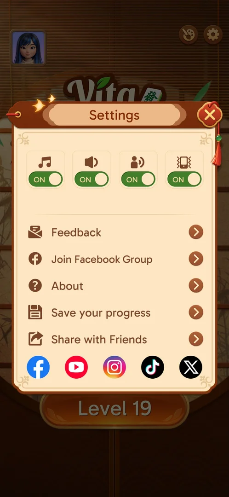
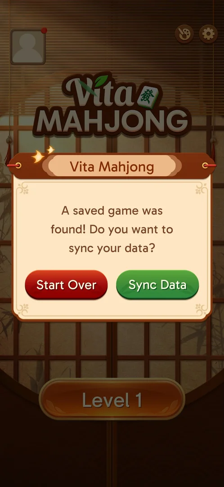
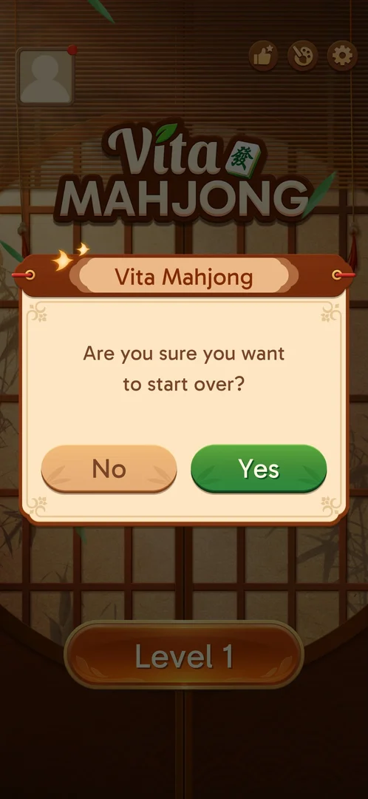
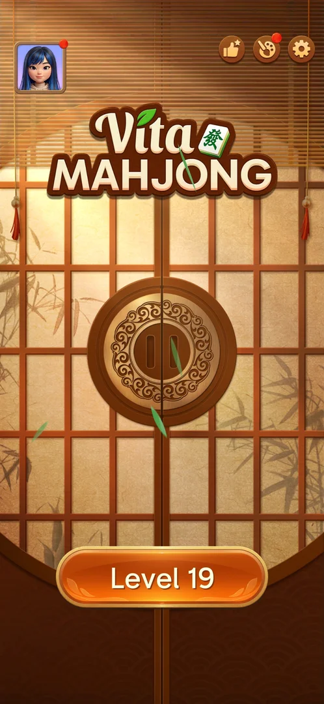
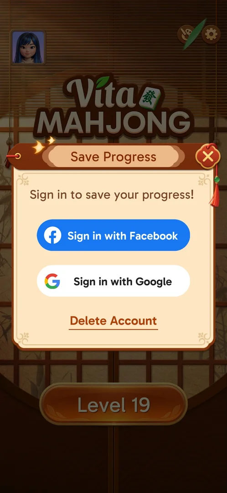

# Saved game sync

When the game starts at Level 1 on a device that had progress before, it finds the earlier save and
offers to restore it. In these sessions the save (level 19 and the chosen avatar) came back with no
account signed in [^s1] [^s5] [^s3]. Settings also has a "Save your progress" screen for signing in with
Facebook or Google [^s2].

## Why it appeared

A fresh install on a device whose earlier install had progress: right after the age selection the game
showed "A saved game was found!" [^s1]. It showed again, in the same order, in two later sessions in a row
that started with the home screen at Level 1 on a phone already synced to level 19 [^s6] [^s4]. No account was signed
in (Save Progress still asks to sign in), so the save was found without one [^s2]. Inferred: it is keyed
by the device or its Google Play account; not verified.

## Where to find it

<!-- no-entry: no control opens the prompt; it shows by itself after the age popup -->
The prompt shows by itself, after the age popup on the first home arrival [^s1] [^s6]. The sign-in screen
opens from the home screen's gear > Settings > the "Save your progress" row [^s2].

 [^s2]
*The "Save your progress" row, fourth in Settings, opens the sign-in screen*

## What it looks like

 [^s1]
*The saved-game prompt: Start Over (red) or Sync Data (green); there is no close button*

A popup titled "Vita Mahjong" with the question and two buttons. No close X and no links [^s1] [^s7].

## What you can do

| Tab or button | What it does |
|---|---|
| [Sync Data](#sync-data) | Restores the earlier save |
| [Start Over](#start-over) | Asks for confirmation: No / Yes |
| [No](#no) | Cancels Start Over; the earlier save is restored |
| [Save Progress](#save-progress) | Settings screen: sign in with Facebook or Google, Delete Account |

### Sync Data

<!-- no-frame: the button is on the prompt frame above; the restored home is on the Home screen page -->
The popup closed on the home screen, whose button still read Level 1. A few seconds later it read
Level 19 and the avatar of the earlier install was back [^s5]. See [Home screen](home.md).

### Start Over

 [^s6]
*Start Over asks "Are you sure you want to start over?": No (left) or Yes (green)*

Start Over does not reset at once: a second popup, also titled "Vita Mahjong", asks "Are you sure you
want to start over?" with No and Yes [^s6]. Yes was not tapped: it would discard the level 19 progress.

### No

 [^s3]
*After No the home screen shows Level 19 and the earlier avatar*

No closed both popups, and the home screen showed Level 19 and the earlier avatar: the same result as
Sync Data [^s3] [^s7].

### Save Progress

 [^s2]
*Settings > Save your progress: Facebook and Google sign-in, Delete Account*

Two sign-in buttons (Facebook, Google) and a "Delete Account" link. None was tapped [^s2].

## How it works

Version 3.40.1.

- The prompt comes after the consent, the loading screen and the age selection [^s1] [^s6].
- Sync Data restored level 19 and the avatar a few seconds after the prompt closed, with no account
  signed in [^s5] [^s2].
- Start Over > No also restored level 19 and the avatar [^s3] [^s7].
- After the sync the palette button (Theme) on the home screen showed a red dot (see [Theme](theme.md))
  [^s5] [^s3].

## Cases

| Case | What was done | Result | Source |
|---|---|---|---|
| Start Over on the saved-game prompt <!-- case:start-over --> | Tapped Start Over, then No | ✅ A confirmation (No / Yes); No kept the save, home at Level 19 with the avatar. Yes not tapped | [^s6] [^s7] |
| Start Over > No restores the save <!-- case:start-over-no --> | Tapped Start Over, then No | ✅ Home went from Level 1 to Level 19, avatar back | [^s3] |
| A second relaunch in a row at Level 1 <!-- case:relaunch-2 --> | Relaunched the game after the session that had restored level 19 | ✅ Logo, loading, home at Level 1 with an empty avatar, the age popup, the saved-game prompt again; Start Over > No brought Level 19 and the avatar back | [^s4] [^s7] |
| Sync Data restored the earlier save: the home button went from Level 1 to Level 19 a few seconds later, avatar restored <!-- case:sync-data --> | Tapped Sync Data on a fresh install | ✅ Level 19 and the avatar restored, no sign-in | [^s5] |
| Popup: A saved game was found, Start Over / Sync Data <!-- case:chk-screen --> | Fresh install, after the age popup | ✅ | [^s1] |
| Shown by itself after the age prompt; manual entry: Settings > Save your progress (sign-in) <!-- case:chk-entry --> | Opened Settings > Save your progress | ✅ | [^s2] |
| Why it appeared <!-- case:chk-appeared --> | Fresh install; a later launch at Level 1 | ✅ After the age popup, whenever the home screen starts at Level 1 on a device with a save | [^s1] [^s6] |
| Every option or button and what it changes <!-- case:chk-options --> | Sync Data; Start Over > No | ✅ Two buttons and a No / Yes confirmation; no close X. Yes, the sign-in buttons and Delete Account not tried | [^s7] |
| What each answer does and whether it comes back <!-- case:chk-answers --> | Sync Data; Start Over > No | ✅ Both keep the save (Level 19); the prompt came back on a later launch that started at Level 1 | [^s7] [^s6] |
| Links out <!-- case:chk-links --> | — | ✅ No links in the prompt; the Facebook and Google sign-in in Settings not tapped | [^s7] |

## Not verified

- Yes on the start-over confirmation: whether the save on the server is discarded
- The sign-in buttons and Delete Account in Settings > Save your progress
- What the save is keyed by (device ID or Google Play account)
- Why the game started at Level 1 again on a phone that had been synced

[^s1]: session 20261003-195050-chrono-2FYKPJ, step 3 — [video at 1:05](https://youtu.be/KUKs3cQ-xqY?t=65)
[^s2]: session 20261003-195050-chrono-2FYKPJ, step 12 — [video at 3:23](https://youtu.be/KUKs3cQ-xqY?t=203)
[^s3]: session 20261003-231301-chrono-2FYKPJ, step 4 — [video at 1:10](https://youtu.be/D73ofuYaPzY?t=70)
[^s4]: session 20261003-231804-chrono-2FYKPJ, step 2 — [video at 0:49](https://youtu.be/ssTmhwls_uc?t=49)
[^s5]: session 20261003-195050-chrono-2FYKPJ, step 5 — [video at 1:31](https://youtu.be/KUKs3cQ-xqY?t=91)
[^s6]: session 20261003-231301-chrono-2FYKPJ, step 3 — [video at 0:58](https://youtu.be/D73ofuYaPzY?t=58)
[^s7]: session 20261003-231804-chrono-2FYKPJ, step 3 — [video at 0:59](https://youtu.be/ssTmhwls_uc?t=59)
