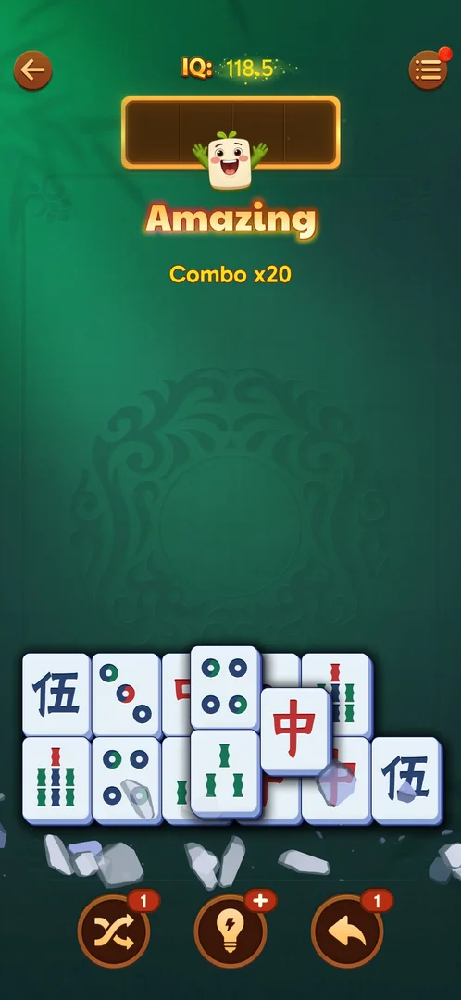
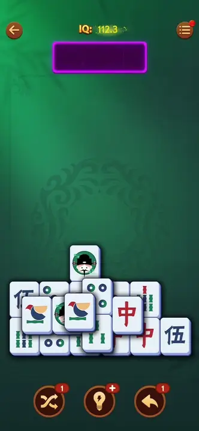
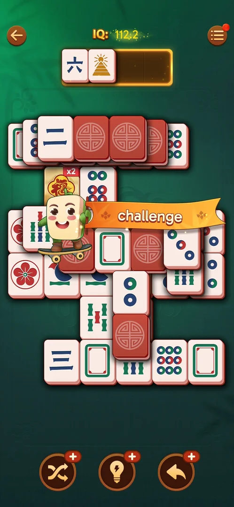

# Combo streak

A count of matches made in a row inside a level. At every fifth match of the run a tile mascot pops up
over the tray with a word and the count ("Good" at x5, "Great" at x10, "Excellent" at x15, "Amazing" at
x20), and the tray's frame takes the tier's colour; the level's win screen shows the best combo of the
level under "Combo" [^s1] [^s2].

## Why it appeared

Seen during the Hard level 20 of this session as matches followed one another: the mascot with "Good
Combo x5", "Great x10", "Excellent x15" and "Amazing x20", the tray glowing green, blue, purple and gold by
tier [^s1]. The counter itself was already on the level 19 win screen of an
earlier session ("Combo 23") [^s3], so it runs on ordinary levels too.
Hypothesis: the count goes up by one per matched pair and the banner shows every fifth; not verified.

## Where to find it

<!-- no-entry: it has no control; it shows over the tray of any level board while the player matches tiles -->
It has no button: it comes up by itself over the tray of a level board while tiles are matched (see
[Tray mahjong level](core-level.md)), and its best value is on the win screen [^s2].

## What it looks like

 [^s4]
*"Amazing, Combo x20": the fourth tier, the tray framed in gold*

- The mascot (a white tile with a leaf on top) pops up on the tray, a word in the tier's colour under it
  and "Combo xN" in yellow under that [^s4].
- The tray's frame glows in the tier's colour and keeps it between banners: green after x5, blue after
  x10, purple after x15, gold after x20 [^s1].

| Tier | Banner | Tray | Source |
|---|---|---|---|
| x5 | Good | green | [^s1] |
| x10 | Great | blue | [^s5] |
| x15 | Excellent | purple | [^s6] |
| x20 | Amazing | gold | [^s4] |

 [^s4]
*Clip 8.3 s · [original on YouTube from 14:47](https://youtu.be/D10jI230Oks?t=887)*

### Challenge banner

 [^s8]
*The "challenge" ribbon over level 22, the tray in the gold (x20 and up) frame*

On level 22, with about 70% of the board cleared, the tile mascot rode across the board on a skateboard
pulling an orange ribbon with the word "challenge" [^s8]. At that moment the tray's frame was gold,
the colour it keeps after "Amazing, Combo x20", and the moves just made raised the IQ from 109.1 to 112.2
(+3.1) [^s9] [^s8]. The ribbon was gone a moment later, with no window or button
[^s8]. It is filed under the combo by the player; what brings it up was not read on screen.
Hypothesis: it is a combo tier above "Amazing" (x25 or more); not verified. The ribbon's ride is in the
original from about [6:54](https://youtu.be/B2PSO6tOKeQ?t=414).

## How it works

Version 3.40.1.

- The best run of the level is shown on the win screen: Combo 22 after the Hard level 20, Combo 23 after
  level 19, Combo 50 with a small crown on the box after level 22 [^s2] [^s3] [^s10].
  One Undo and one Shuffle were used during level 22 [^s11]
  [^s12]. What the crown marks (a record, a
  threshold) was not seen.
- A pair matched at "Excellent, Combo x15" gave +3.1 IQ (99.9 to 103); a pair on a fresh board gives +0.4
  [^s6] [^s7]. Inferred: the IQ for a pair
  grows with the combo; not verified.
- What ends a run (a tile left single in the tray, a pause, a booster, a revive) was not seen.

## Outcomes

<!-- the map has no under-<outcome> cases for this feature yet -->

| Outcome | As the base or what differs | Frame |
|---|---|---|
| Win | As the base ([Tray mahjong level](core-level.md)); the win screen's "Combo" box shows the best run (22 on the Hard level 20, 50 with a crown on level 22) [^s2] [^s10] | — |
| Out of space, Restart, exit the app | not verified: what they do to a running combo | — |

## Cases

| Case | What was done | Result | Source |
|---|---|---|---|
| Why it appeared <!-- case:chk-appeared --> | Matched pairs in a row on Hard level 20 | ✅ The mascot banner at x5, x10, x15, x20; the tray glows by tier; Combo 22 on the win screen | [^s1] |
| Where to find it <!-- case:chk-entry --> | — | Seen: no control, it shows over the tray; still open in the map | |
| What it looks like <!-- case:chk-screen --> | — | Seen: frame and clip above; still open in the map | [^s4] |
| The first level it shows on and how the game introduces it <!-- case:chk-first-level --> | — | not verified: "Combo 23" was on the level 19 win screen already | [^s3] |
| What it does and how it is used <!-- case:chk-rules --> | — | not verified: what counts and what resets it | |
| How it interacts with the other pieces <!-- case:chk-interactions --> | — | not verified: +3.1 IQ for a pair at x15, and again with the tray gold on level 22; one Shuffle used during level 22, Combo 50 at its end | [^s6] [^s8] [^s10] |
| Whether it adds a way to lose <!-- case:chk-loss --> | — | not verified | |

## Not verified

- Where to find it: no control; it shows over the tray (seen, not closed in the map) <!-- case:chk-entry -->
- What it looks like: the banner and the tray colours (seen, not closed in the map) <!-- case:chk-screen -->
- The first level with a combo and how the game introduces it <!-- case:chk-first-level -->
- What counts toward it and what resets it <!-- case:chk-rules -->
- What brings up the "challenge" ribbon (a combo tier above x20, or something else) and what the crown on the Combo box means
- How it changes the IQ for a pair, and how it meets boosters, flips and revives <!-- case:chk-interactions -->
- Whether it adds a way to lose (inferred: no, it only adds banners) <!-- case:chk-loss -->

[^s1]: session 20261005-133525-chrono-2FYKPJ, step 49 — [video at 19:53](https://youtu.be/D10jI230Oks?t=1193)
[^s2]: session 20261005-133525-chrono-2FYKPJ, step 44 — [video at 17:24](https://youtu.be/D10jI230Oks?t=1044)
[^s3]: session 20261005-073804-chrono-2FYKPJ, step 47 — [video at 15:43](https://youtu.be/nmXrQmoLWlU?t=943)
[^s4]: session 20261005-133525-chrono-2FYKPJ, step 39 — [video at 14:55](https://youtu.be/D10jI230Oks?t=895)
[^s5]: session 20261005-133525-chrono-2FYKPJ, step 25 — [video at 9:33](https://youtu.be/D10jI230Oks?t=573)
[^s6]: session 20261005-133525-chrono-2FYKPJ, step 34 — [video at 13:01](https://youtu.be/D10jI230Oks?t=781)
[^s7]: session 20261005-002327-chrono-2FYKPJ, step 13 — [video at 4:31](https://youtu.be/2aQPmh7YksQ?t=271)

[^s8]: session 20261006-122751-chrono-2FYKPJ, step 27 — [video at 7:02](https://youtu.be/B2PSO6tOKeQ?t=422)
[^s9]: session 20261006-122751-chrono-2FYKPJ, step 26 — [video at 6:54](https://youtu.be/B2PSO6tOKeQ?t=414)
[^s10]: session 20261006-122751-chrono-2FYKPJ, step 44 — [video at 12:53](https://youtu.be/B2PSO6tOKeQ?t=773)

[^s11]: session 20261006-122751-chrono-2FYKPJ, step 14 — [video at 3:58](https://youtu.be/B2PSO6tOKeQ?t=238)
[^s12]: session 20261006-122751-chrono-2FYKPJ, step 32 — [video at 9:47](https://youtu.be/B2PSO6tOKeQ?t=587)
