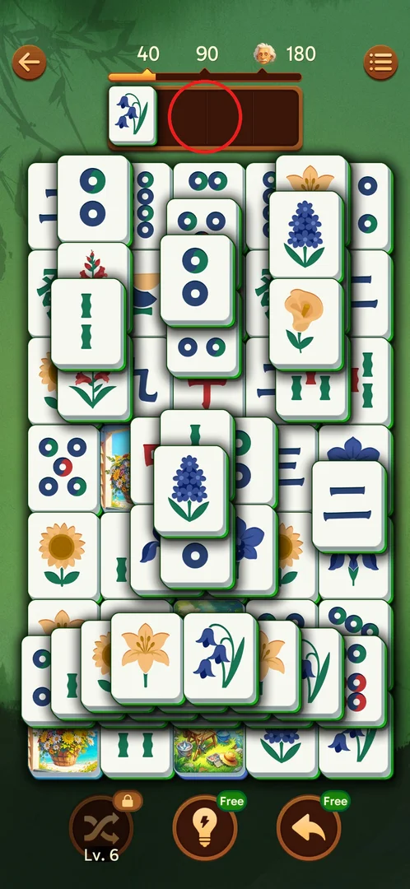
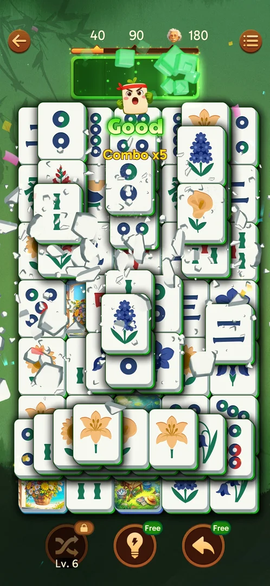
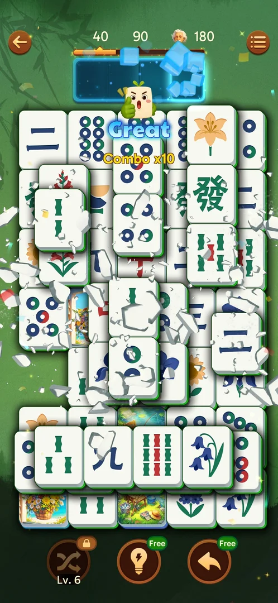
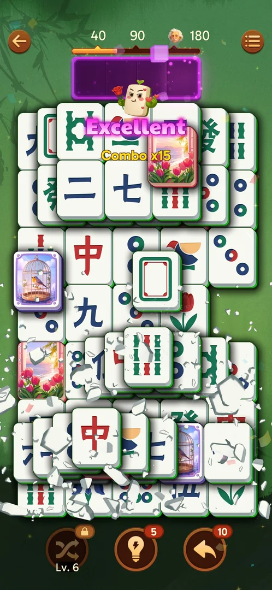
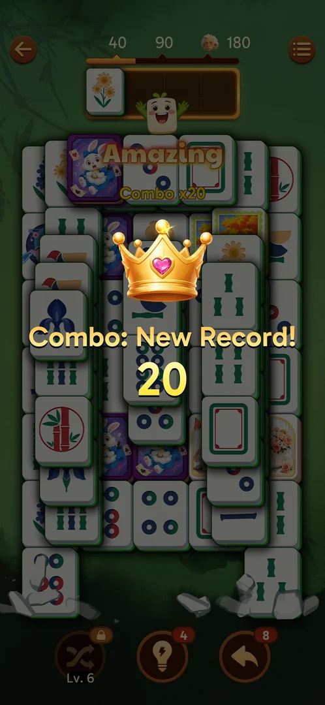
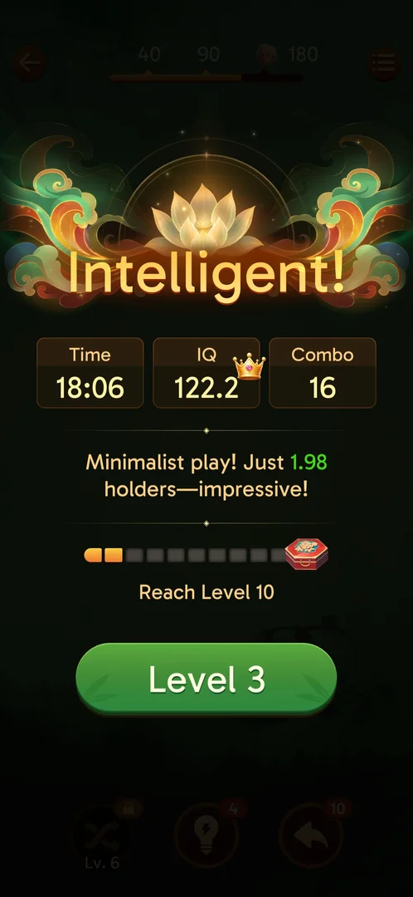

# Combo tiers (shown by the tray border)

Making quick matches one after another builds a combo counter. The combo has no screen or button of its own. It lives on the level screen, where the 4-slot tray above the board also works as the combo meter. Each tier (x5, x10, x15, x20, x40) changes the colour of the tray border, and a mascot pops out with a word ("Good", "Great", …) and "Combo xN" [^s1] [^s2]. The win screen shows the level's combo [^s3].

## Where to find it

<!-- no-entry: the combo has no button; it appears by itself in any level, in the tray under the score bar (circled) -->

It is in every level: the tray under the score bar at the top of the board. With no combo the tray border is plain brown [^s4] [^s2].

 [^s4]

## What it looks like

<!-- no-screen: the combo is an overlay on the level screen, not a screen of its own -->

When you reach a tier, the tray border glows in the tier's colour and cubes of that colour fly off it. The mascot (a tile with a face) pops out under the tray, with the tier word and "Combo xN" over the board [^s1]. The tray keeps the colour of the tier reached [^s3]. Some matches also show "Perfect" [^s3].

 [^s1]

## What you can do

There is nothing to tap. The tiers come by themselves as the combo grows.

| Tab or button | Combo | Tray |
|---|---|---|
| [Good](#good) | x5 | green |
| [Great](#great) | x10 | blue, ice cubes |
| [Excellent](#excellent) | x15 | purple |
| [Amazing](#amazing) | x20 | gold |
| [Unbelievable](#unbelievable) | x40 ("Unbelievable x2") | rainbow |

### Good

Combo x5: a green tray, the mascot in a red headband, and "Good" in green [^s1].

 [^s1]

### Great

Combo x10: a blue tray with ice cubes, the mascot giving a thumbs up, and "Great" in blue [^s5]. On level 2 it already appeared after the third quick match, with Colorful Effects OFF [^s6].

 [^s5]

### Excellent

Combo x15: a purple tray, the mascot holding a rose, and "Excellent" in pink [^s7].

 [^s7]

### Amazing

Combo x20: a gold tray, the mascot with its arms up, and "Amazing" in gold [^s8]. When you beat your best combo so far, a crown and "Combo: New Record! N" also appear over the board [^s9].

 [^s8]

 [^s9]

### Unbelievable

Combo x40: a rainbow tray, the mascot with starry eyes, and "Unbelievable x2" [^s10]. It is not known what the "x2" means. No tier between x20 and x40 was seen.

 [^s10]

### Result

The win screen shows the level's Combo next to Time and IQ. A record gets a crown [^s3] [^s11].

 [^s3]

## How it works

Version 3.39.1.

- Tiers: x5 Good (green), x10 Great (blue), x15 Excellent (purple), x20 Amazing (gold) and x40 Unbelievable x2 (rainbow). With no combo the tray is brown [^s2] [^s10].
- The combo counter resets when the chain of quick matches breaks [^s3]. What exactly breaks it is not known.
- Undo and Shuffle do not break the combo. It survived two Undos and a Shuffle [^s9] [^s12].
- The combo carries over between levels. L17 ended at combo 27, and the 2nd match of L18 showed Combo x30. Later in L18 it was back at x5 [^s13]. L14 showed x15 after its first 6 matches [^s14].
- Turning Colorful Effects OFF does not change the tray colours [^s15].
- Combo values seen on win screens: 19 (L1), 16 (L2), 33 with a crown (L4), 52 with a crown (L6) and 32 (L14) [^s2] [^s3] [^s11] [^s16] [^s14]. Inferred: this is the highest combo during the level, including any part carried over from the previous level.
- No reward for reaching a tier was seen.

## Cases

| Case | What was done | Result | Source |
|---|---|---|---|
| First combo | L1–L2: several quick matches in a row | The tray turned green: "Good" + "Combo x5" | [^s1] |
| Tiers on level 2 | Kept matching quickly | x10 "Great" (blue, ice cubes), then x15 "Excellent" (purple, rose); the counter reset when the chain broke | [^s3] |
| New record | L4: the combo passed the old best | x20 "Amazing", a crown and "Combo: New Record! 20" | [^s9] |
| Undo during a combo | L4: two Undos (counter 10 → 8) | The combo was kept | [^s9] |
| Shuffle during a combo | L6: one Shuffle (stock 3 → 2) | The tray and the combo were kept | [^s12] |
| Highest tier seen | L6: a long chain | x40 "Unbelievable x2" with a rainbow tray; win screen Combo 52 with a crown | [^s10] [^s16] |
| Carry-over | L17 ended at combo 27, then L18 started | x30 on the 2nd match of L18; later back at x5 | [^s13] |
| Colorful Effects OFF | L2 with it OFF vs L3 with it ON | The tray turned blue/purple/gold in both | [^s15] |

## Not verified

- What breaks the combo (a time limit, a non-matching tile in the tray, or something else), and why x10 appeared after only the 3rd match of level 2 [^s6].
- Whether a tier gives any reward, and what the "x2" in "Unbelievable x2" means.
- Whether there are tiers between x20 and x40, or above x40.
- Whether the win-screen Combo counts the combo carried over from the previous level (inferred from L14 and L18).

[^s1]: session 20260930-203959-chrono-2FYKPJ, step 39 — [video at 8:01](https://youtu.be/2yK_ch59JAg?t=481)
[^s2]: session 20260930-211039-chrono-2FYKPJ, step 148
[^s3]: session 20260930-214524-chrono-2FYKPJ, step 96 — [video at 17:57](https://youtu.be/sWuok8myZrQ?t=1077)
[^s4]: session 20260930-203959-chrono-2FYKPJ, step 38 — [video at 7:56](https://youtu.be/2yK_ch59JAg?t=476)
[^s5]: session 20260930-203959-chrono-2FYKPJ, step 49 — [video at 9:17](https://youtu.be/2yK_ch59JAg?t=557)
[^s6]: session 20260930-214524-chrono-2FYKPJ, step 10 — [video at 2:07](https://youtu.be/sWuok8myZrQ?t=127)
[^s7]: session 20260930-214524-chrono-2FYKPJ, step 20 — [video at 3:36](https://youtu.be/sWuok8myZrQ?t=216)
[^s8]: session 20260930-214524-chrono-2FYKPJ, step 125 — [video at 24:07](https://youtu.be/sWuok8myZrQ?t=1447)
[^s9]: session 20260930-221457-chrono-2FYKPJ, step 44
[^s10]: session 20260930-221457-chrono-2FYKPJ, step 88
[^s11]: session 20260930-221457-chrono-2FYKPJ, step 60
[^s12]: session 20260930-221457-chrono-2FYKPJ, step 83
[^s13]: session 20261001-110957-chrono-2FYKPJ, step 71
[^s14]: session 20261001-063226-chrono-2FYKPJ, step 31
[^s15]: session 20260930-214524-chrono-2FYKPJ, step 108 — [video at 21:05](https://youtu.be/sWuok8myZrQ?t=1265)
[^s16]: session 20260930-221457-chrono-2FYKPJ, step 90
