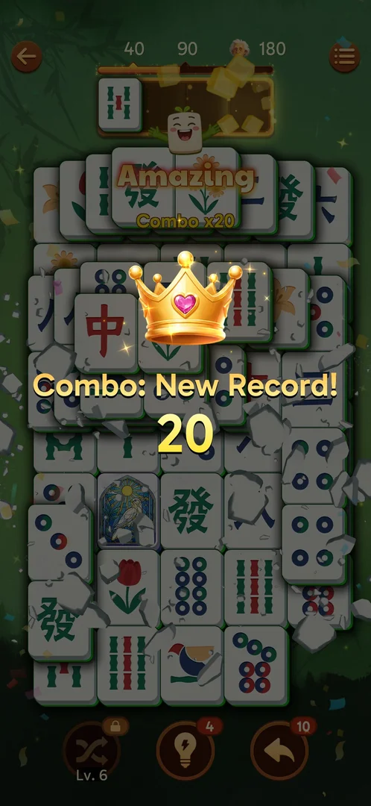
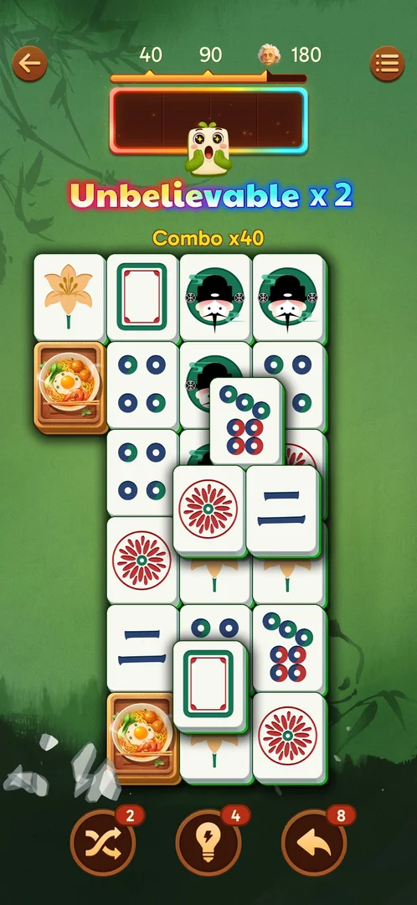

# Combo tiers

Quick consecutive matches build a combo; the tier shows in the tray border and a mascot:

| Combo | Tier | Tray | Source |
|---|---|---|---|
| x5 | Good | green | [s:20260930-203959-chrono-2FYKPJ#39] |
| x10 | Great | blue, ice cubes | [s:20260930-214524-chrono-2FYKPJ#10] |
| x15 | Excellent | purple | [s:20260930-214524-chrono-2FYKPJ#20] |
| x20 | Amazing | gold, "Combo: New Record!" | [s:20260930-214524-chrono-2FYKPJ#125] |
| x40 | Unbelievable x2 | rainbow | [s:20260930-221457-chrono-2FYKPJ#88] |

The combo survived two Undos and a Shuffle [s:20260930-221457-chrono-2FYKPJ#83].

## Not verified
- What breaks the combo; why x10 appeared after the 3rd match of level 2 [s:20260930-214524-chrono-2FYKPJ#10].
