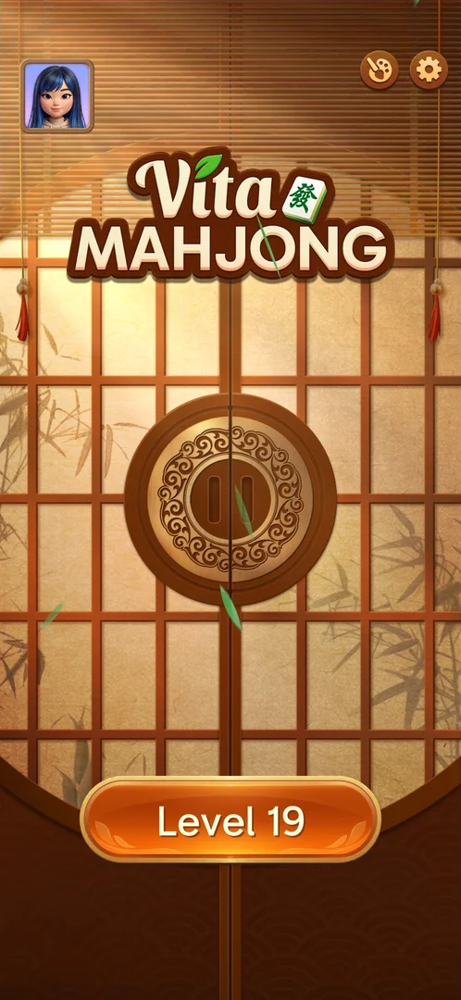
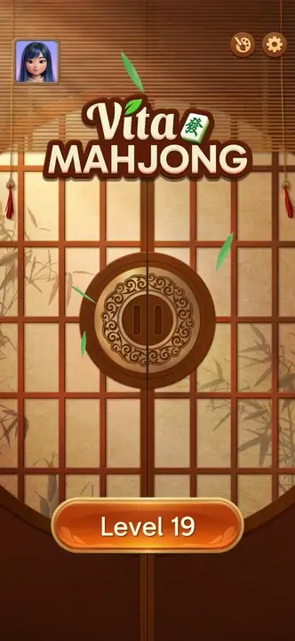
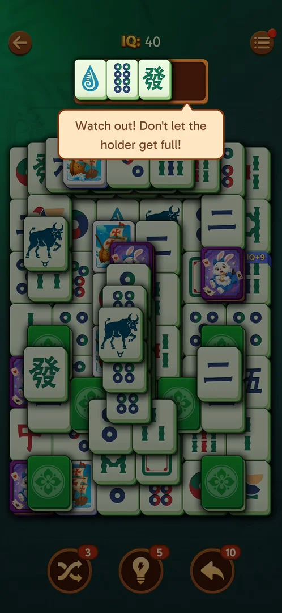
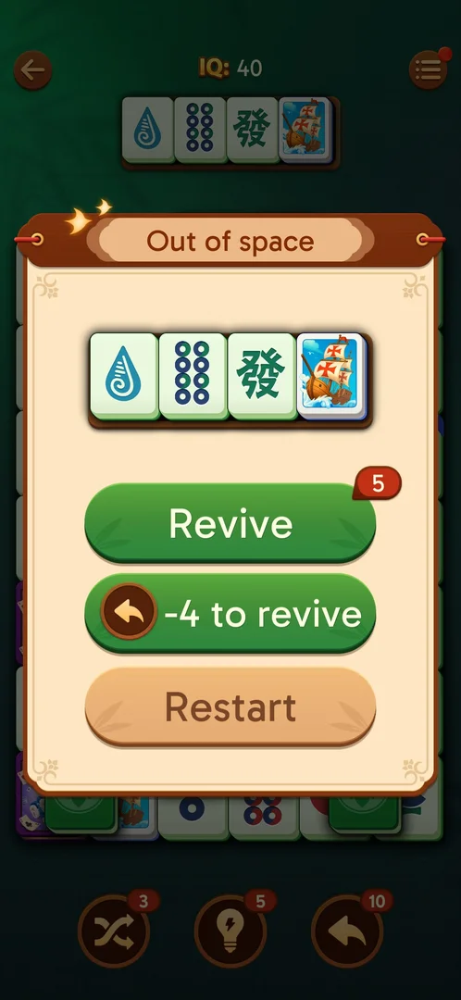
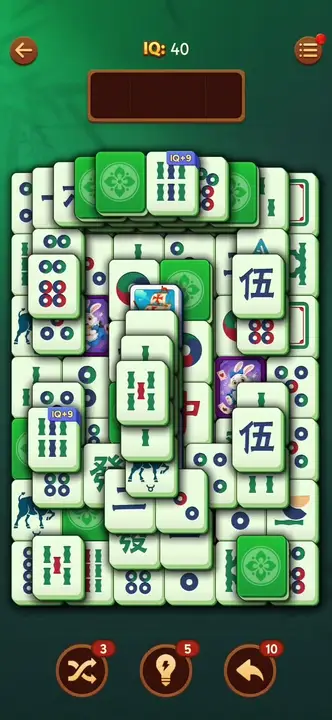
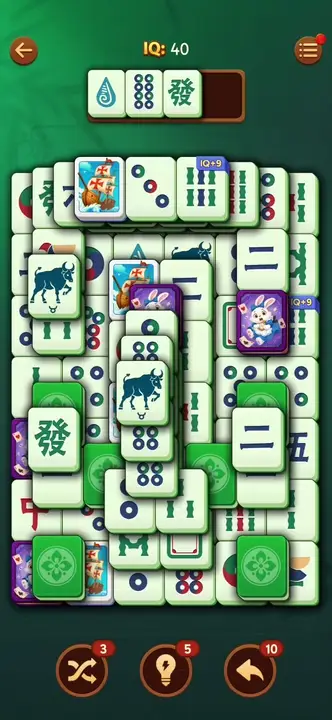
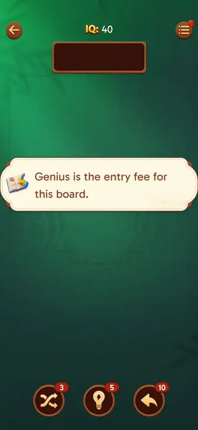
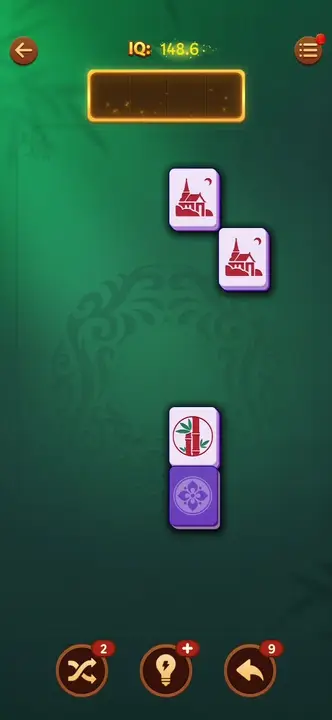
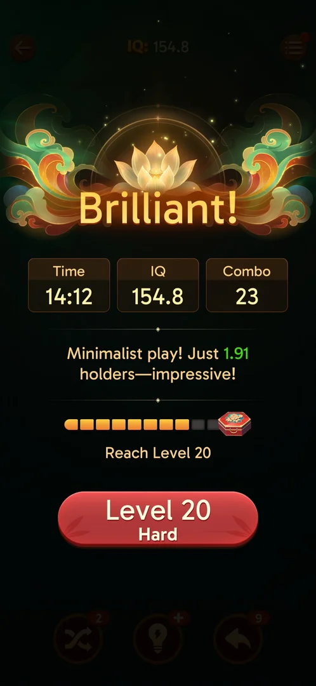
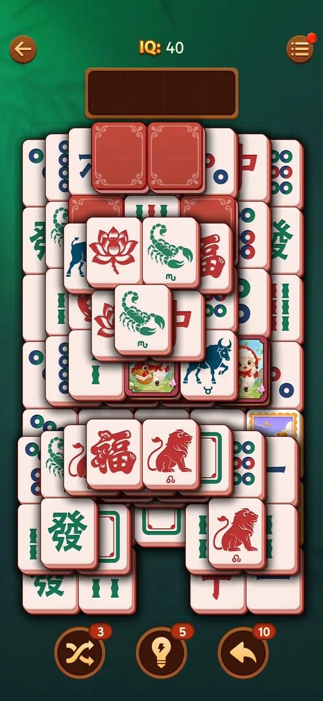

# Tray mahjong level

The game's core: a numbered level with a pile of mahjong tiles. The player taps free tiles to move them
into a 4-slot tray above the board; identical tiles match and leave. Tiles on top block the ones they
cover, and the ends of a row free the inner tiles [^s1]. The level is lost
when the tray fills with 4 tiles that do not match [^s2], and won when the board is cleared: a win
screen with the time, the IQ and the best combo, then the next level [^s15]. One level at a time
is played, from the Level N button on the home screen [^s3].

## Why it appeared

The Level N button on the home screen, there from the first launch [^s3].

## Where to find it

Home screen > the large orange "Level N" button at the bottom (Level 19 in these sessions)
[^s3].

 [^s3]
*The "Level 19" button at the bottom of the home screen opens the level*

Tapping it slides the doors of the home screen apart with a beam of light, then the board appears
[^s3]:

 [^s3]
*Clip 5.6 s · [original on YouTube from 4:16](https://youtu.be/KUKs3cQ-xqY?t=256)*

## What it looks like

 [^s4]
*The level screen: HUD on top, the 4-slot tray, the board, three boosters at the bottom*

- Top left: a back arrow to the home screen [^s5].
- Top centre: "IQ: 40" (see [IQ score](iq-score.md)) [^s4].
- Top right: the menu button (three lines) for Options (see [In-level Options](level-options.md))
  [^s6].
- Under the HUD: an empty tray of 4 slots [^s4].
- The board: stacked tiles: dots, bamboo, characters, dragons and winds, zodiac animals, and picture
  tiles (a ship, a rabbit, an eagle, a tea cup); some tiles carry a blue "IQ+9" or "IQ+6" banner; and
  face-down tiles (see [Face-down tiles](face-down-tiles.md)) [^s4]
  [^s7]. What the IQ banners give was not tried.
- Bottom: Shuffle 3, Hint 5, Undo 10 (see [Boosters](boosters.md)) [^s4].

No level number is shown on the level screen itself; it is on the home button
[^s3].

### Popup

 [^s8]
*The warning tooltip under the tray once 3 unmatched tiles are in it*

### Result

 [^s2]
*Out of space: Revive (badge 5), "-4 to revive" (Undo icon), Restart*

## What you can do

| Tab or button | What it does |
|---|---|
| [Tiles](#tiles) | Tap a free tile to move it into the tray; two identical tiles leave |
| [Back arrow](#back-arrow) | Leaves to the home screen at once |
| [Menu](#menu) | Opens the in-level Options |
| [Out of space](#out-of-space) | The loss window: Revive, -4 to revive, Restart |
| [Win screen](#win-screen) | After the board is cleared: Time, IQ, Combo, the chest bar, the next-level button |

### Tiles

 [^s9]
*Clip 6.1 s · [original on YouTube from 2:35](https://youtu.be/2aQPmh7YksQ?t=155)*

The rules as the game's How to Play shows them: match identical tiles in the tray; tiles need not be
adjacent on the board to match; tap the top tiles to free the ones below; tap the left or right end of a
row to free the inner tiles [^s1]. See [How to Play](how-to-play.md).

Two identical free tiles tapped one after the other broke apart with a burst of shards; the tray was empty
right after, "+0.4" showed over the tray and the score went from IQ 40 to 40.4
[^s9].

### Back arrow

<!-- no-frame: the arrow is on the level frame above -->
Goes straight to the home screen: no confirmation popup and no cost shown
[^s5]. That the board is kept for the next visit was seen in earlier
sessions, not in these ones [^s5].

### Menu

 [^s6]
*The menu button opens Options: sound toggles, Auto Complete, Colorful Effects, Theme, How to Play, No Ads, Restart*

Options' Restart row starts the level over mid-level, with no confirmation (see [In-level Options](level-options.md#restart)) [^s18].

### Out of space

 [^s2]
*Clip 4.8 s · [original on YouTube from 1:56](https://youtu.be/2aQPmh7YksQ?t=116)*

The window shows the four tiles of the full tray and three buttons [^s2]:

| Button | What was seen |
|---|---|
| Revive | Green, a red badge "5"; not tried. What the 5 counts is not verified (inferred: free revives left, or a video) |
| -4 to revive | Green, with the Undo booster icon; not tried. Inferred from the icon: it spends 4 Undo |
| Restart | Free: a new board at once, boosters unchanged (Shuffle 3, Hint 5, Undo 10) |

 [^s10]
*Clip 3 s · [original on YouTube from 2:11](https://youtu.be/2aQPmh7YksQ?t=131)*

After Restart a card with a book-and-pen icon and a one-line, 7-word remark about genius stood over the
empty board, then a new board was laid out: another layout and other tiles than before, IQ 40, the
boosters at 3, 5 and 10 [^s10].

### Win screen

 [^s14]
*Clip 6.8 s · [original on YouTube from 14:19](https://youtu.be/nmXrQmoLWlU?t=859)*

The last pair left with "Amazing" and "Combo x20" over the tray; the board's tiles then came back as a
fading replay of the cleared board, with a short remark on the IQ by the IQ score [^s14]. On the first win
of the day the [Daily Victories](daily-victories.md) panel came next (leaf 0 to 1, OK) [^s14], then the win
screen [^s15]:

 [^s15]
*The win screen: Time, IQ, Combo, the holder line, the chest bar, the next-level button*

- "Brilliant!" as the title [^s15].
- Three boxes: Time 14:12, IQ 154.8, Combo 23 [^s15].
- A line on the tray use: "Minimalist play! Just 1.91 holders—impressive!" [^s15]. What "holders" counts
  is not explained on the screen; inferred, the tray is the holder (the 3-tile tooltip calls it so).
- The [Level progress chest](level-chest.md) bar: 8 of 10 segments, then 9, "Reach Level 20" [^s15]
  [^s16].
- The next-level button: here red "Level 20 / Hard" (see [Hard level](hard-level.md)) [^s15]. A tap while
  the bar was still animating did nothing; the next tap opened Level 20 [^s16] [^s17].
- No coins or other reward were shown [^s15].
- A rating popup ("Are you enjoying Vita Mahjong?", five stars, Rate Us) came over the win screen a moment
  after it appeared (see the clip on [Level progress chest](level-chest.md)) [^s15].

The level 22 win screen, after the chain of league standing, notification notice, Daily Victories panel
and Rate Us popup [^s19] [^s20] [^s21] [^s22]:

 [^s23]
*The level 22 win screen: a different line under the boxes, the chest bar restarted toward level 30*

- The same title and boxes: Time 11:17, IQ 180.4, Combo 50; the Combo box carries a small crown
  [^s23].
- The line under the boxes is another one: "Not one fumble, you identified locked tiles accurately!"
  [^s23]. Inferred: the game picks the line from how the level was played (tray use on level 19,
  locked-tile taps on level 22); not verified.
- The chest bar: 2 of 10 segments, "Reach Level 30" (the level 20 chest was opened earlier) [^s23].
- The next-level button: green "Level 23" with the purple x2 tag of the [League](leagues.md) [^s23].

## How it works

Version 3.40.1.

- Tray of 4 slots [^s3] [^s1].
- 3 unmatched tiles in the tray: a tooltip "Watch out! Don't let the holder get full!" under it
  [^s8].
- 4 unmatched tiles: the level is lost, the "Out of space" window [^s2].
  No other way to lose was seen; no lives or energy were seen to be spent
  [^s10].
- A matched pair: +0.4 IQ (40 to 40.4) [^s9].
- Level 19 was won in 14:12 at IQ 154.8, with one Shuffle, one Undo and several Hints used [^s14]
  [^s15].
- Level 22 was won in 11:17 at IQ 180.4, with one Undo and one Shuffle (the Shuffle from a video, see
  [Boosters](boosters.md)) [^s24] [^s25] [^s23].
- The board of a level is generated anew: level 19 had a different layout and set of tiles after a
  Restart and after the app was force-stopped and reopened [^s10]
  [^s7]. The colour of the face-down backs differed between boards and
  sessions (purple, red, green) (see [Face-down tiles](face-down-tiles.md)). In a later session level 19
  opened on yet another layout, with red backs again, zodiac and lotus tiles and two cartoon picture
  tiles (a sheep scene), at IQ 40 and boosters 3, 5, 10 [^s13]:

   [^s13]
  *Another level 19 board: red backs, a different layout*
- Leaving a level with the back arrow made a new button (Achievements) appear on the home screen (see
  [Achievements](achievements.md)) [^s5].

## Outcomes

| Outcome | What happens | Frame | Source |
|---|---|---|---|
| Win <!-- case:chk-win --> | The cleared board replays as a fade; on the first win of the day the Daily Victories panel; then the win screen: Brilliant!, Time, IQ, Combo, a line on the play, the chest bar and the next-level button; no coins | the Win screen frames and clip above | [^s14] [^s15] [^s23] |
| Out of space (loss) <!-- case:out-of-space --> | The tray holds 4 unmatched tiles; the "Out of space" window: Revive, -4 to revive, Restart | the Result frame and the Out of space clip above | [^s2] |
| Restart after the loss <!-- case:chk-restart --> | Free; a new board right away, IQ 40, boosters 3/5/10 | the Restart clip above | [^s10] |
| Quit with the back arrow <!-- case:chk-quit --> | Home screen at once, no confirmation, no cost seen | — | [^s5] |
| Exit the app mid-level <!-- case:chk-exit-app --> | Progress in the level lost: a new board at IQ 40 | — | [^s7] |
| Restart from the in-level Options <!-- case:restart-menu --> | No confirmation: Options closes, the board clears and redeals behind the one-line IQ banner, the tray is emptied, IQ 40 | the Restart frame on [In-level Options](level-options.md#restart) | [^s18] |

## Cases

| Case | What was done | Result | Source |
|---|---|---|---|
| How to Play (Options): match identical tiles via the 4-slot tray; top tiles unlock covered ones; row ends unlock inner tiles <!-- case:chk-rules --> | Read How to Play from the level's Options | ✅ | [^s1] |
| Back arrow in the level goes straight to the home screen, no confirmation, no cost seen (board kept, per earlier sessions) <!-- case:chk-quit --> | Tapped the back arrow on level 19 | ✅ | [^s5] |
| Level N button on the home screen <!-- case:chk-entry --> | Tapped Level 19 | ✅ Door transition, then the board | [^s3] |
| Board with a 4-slot tray above it <!-- case:chk-screen --> | Opened level 19 | ✅ | [^s3] |
| Back arrow, IQ score, menu; 4-slot tray; Shuffle 3, Hint 5, Undo 10 at level 19 <!-- case:chk-hud --> | Opened level 19 | ✅ | [^s3] |
| Why it appeared <!-- case:chk-appeared --> | — | ✅ The Level N button, from the first launch | [^s3] |
| Win: the win screen, its rewards and what comes next <!-- case:chk-win --> | Cleared the level 19 board | ✅ Fade replay, the Daily Victories panel (leaf +1, today checked, OK), then the win screen: Brilliant!, Time 14:12, IQ 154.8, Combo 23, the holder line, the 10-segment chest bar "Reach Level 20" (8 of 10), the next-level button (Level 20 Hard); no coins | [^s14] [^s15] |
| Each loss <!-- case:chk-loss --> | Put 4 different free tiles into the tray on level 19 | ✅ Tooltip at 3 tiles, "Out of space" at 4; no life lost seen; no other kind of loss seen | [^s2] |
| After a loss: retry and continue offers <!-- case:chk-retry --> | Read the Out of space window | ✅ Revive (badge 5), -4 to revive (Undo icon), Restart (free); Revive and -4 not tried | [^s2] |
| Restart <!-- case:chk-restart --> | Tapped Restart in the Out of space window | ✅ Free; a message card, then a new board (other layout and tiles), IQ 40, boosters 3/5/10 | [^s10] |
| Exit the app mid-level <!-- case:chk-exit-app --> | Cleared one pair (IQ 40.4), force-stopped the app, reopened it, synced the save, opened Level 19 | ✅ The home screen first read "Level 1" with the saved-game prompt (see [Cloud sync](cloud-sync.md)); after Sync Data, Level 19 opened a new board at IQ 40: the progress in the level was not kept | [^s11] [^s12] [^s7] |
| Level elements: each obstacle or special piece the levels introduce, with the level it first shows on <!-- case:chk-elements --> | — | partly: face-down tiles on level 19 ([Face-down tiles](face-down-tiles.md)); picture tiles and IQ+N banners seen, not studied | [^s4] |
| Restart row in the in-level Options, mid-level <!-- case:restart-menu --> | On level 21 with one tile in the tray, Menu > Restart | ✅ No confirmation; the board redeals at once behind the IQ banner, tray emptied, IQ 40 | [^s18] |
| Out of space: tray holds 4 unmatched tiles; window offers Revive, -4 to revive, Restart <!-- case:out-of-space --> | Filled the tray with 4 different tiles | Seen (frame and clip above); the case stays open in the map: Revive and -4 to revive untried | [^s2] |

## Not verified

- Level elements: the first level of each element; the picture tiles and the IQ+N banners <!-- case:chk-elements -->
- Out of space: what Revive (badge 5) and "-4 to revive" do and cost; not tried <!-- case:out-of-space -->

[^s1]: session 20261003-195050-chrono-2FYKPJ, step 20 — [video at 5:26](https://youtu.be/KUKs3cQ-xqY?t=326)
[^s2]: session 20261005-002327-chrono-2FYKPJ, step 6 — [video at 2:00](https://youtu.be/2aQPmh7YksQ?t=120)
[^s3]: session 20261003-195050-chrono-2FYKPJ, step 17 — [video at 4:17](https://youtu.be/KUKs3cQ-xqY?t=257)
[^s4]: session 20261005-002327-chrono-2FYKPJ, step 2 — [video at 0:53](https://youtu.be/2aQPmh7YksQ?t=53)
[^s5]: session 20261003-195050-chrono-2FYKPJ, step 22 — [video at 6:00](https://youtu.be/KUKs3cQ-xqY?t=360)
[^s6]: session 20261003-195050-chrono-2FYKPJ, step 18 — [video at 4:51](https://youtu.be/KUKs3cQ-xqY?t=291)
[^s7]: session 20261005-002327-chrono-2FYKPJ, step 11 — [video at 3:40](https://youtu.be/2aQPmh7YksQ?t=220)
[^s8]: session 20261005-002327-chrono-2FYKPJ, step 4 — [video at 1:37](https://youtu.be/2aQPmh7YksQ?t=97)
[^s9]: session 20261005-002327-chrono-2FYKPJ, step 8 — [video at 2:41](https://youtu.be/2aQPmh7YksQ?t=161)
[^s10]: session 20261005-002327-chrono-2FYKPJ, step 7 — [video at 2:14](https://youtu.be/2aQPmh7YksQ?t=134)
[^s11]: session 20261005-002327-chrono-2FYKPJ, step 9 — [video at 2:59](https://youtu.be/2aQPmh7YksQ?t=179)
[^s12]: session 20261005-002327-chrono-2FYKPJ, step 10 — [video at 3:26](https://youtu.be/2aQPmh7YksQ?t=206)
[^s13]: session 20261005-073409-chrono-2FYKPJ, step 5 — [video at 1:54](https://youtu.be/vgVMznU7XG0?t=114)
[^s14]: session 20261005-073804-chrono-2FYKPJ, step 46 — [video at 14:26](https://youtu.be/nmXrQmoLWlU?t=866)
[^s15]: session 20261005-073804-chrono-2FYKPJ, step 47 — [video at 15:14](https://youtu.be/nmXrQmoLWlU?t=914)
[^s16]: session 20261005-073804-chrono-2FYKPJ, step 48 — [video at 15:59](https://youtu.be/nmXrQmoLWlU?t=959)
[^s17]: session 20261005-073804-chrono-2FYKPJ, step 49 — [video at 16:19](https://youtu.be/nmXrQmoLWlU?t=979)

[^s18]: session 20261006-022624-chrono-2FYKPJ, step 21 — [video at 4:54](https://youtu.be/D6M-84xYVJM?t=294)

[^s19]: session 20261006-122751-chrono-2FYKPJ, step 40 — [video at 11:12](https://youtu.be/B2PSO6tOKeQ?t=672)
[^s20]: session 20261006-122751-chrono-2FYKPJ, step 41 — [video at 11:58](https://youtu.be/B2PSO6tOKeQ?t=718)
[^s21]: session 20261006-122751-chrono-2FYKPJ, step 42 — [video at 12:09](https://youtu.be/B2PSO6tOKeQ?t=729)
[^s22]: session 20261006-122751-chrono-2FYKPJ, step 43 — [video at 12:39](https://youtu.be/B2PSO6tOKeQ?t=759)
[^s23]: session 20261006-122751-chrono-2FYKPJ, step 44 — [video at 12:53](https://youtu.be/B2PSO6tOKeQ?t=773)
[^s24]: session 20261006-122751-chrono-2FYKPJ, step 14 — [video at 3:58](https://youtu.be/B2PSO6tOKeQ?t=238)
[^s25]: session 20261006-122751-chrono-2FYKPJ, step 32 — [video at 9:47](https://youtu.be/B2PSO6tOKeQ?t=587)
