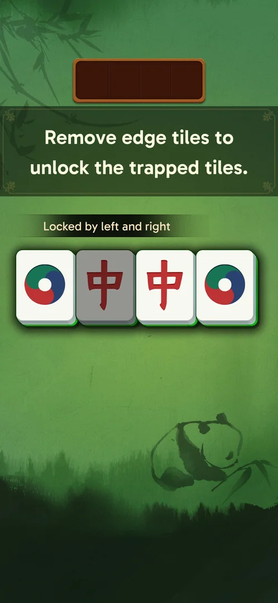
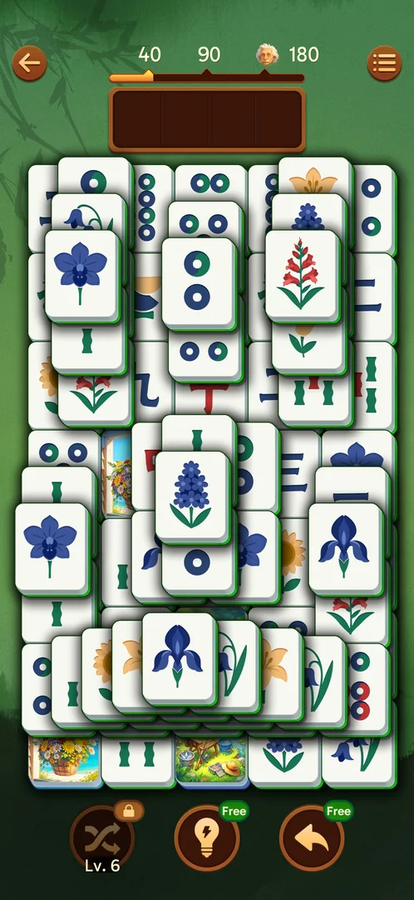

# Core loop: tile matching

Tray mahjong: tap a free tile and it flies into a 4-slot [tray](tray.md); two identical tiles in the
tray vanish [s:20260930-211039-chrono-2FYKPJ#13] [s:20260930-211039-chrono-2FYKPJ#80]. A tile is free when nothing lies on it and its left or right side
is open; a locked tile greys and shows "Locked by left and right" [s:20260930-203959-chrono-2FYKPJ#22].

## How it works
- Special-looking tiles (painted pictures, carved golden tiles, "official" faces) are ordinary pairs
  [s:20260930-203959-chrono-2FYKPJ#82] [s:20260930-225122-chrono-2FYKPJ#1].
- Some pairs carry a blue IQ+N badge (IQ+5, IQ+8, IQ+10) on both tiles; it adds about N IQ [s:20260930-225122-chrono-2FYKPJ#9] [s:20260930-225122-chrono-2FYKPJ#24].
- Win screen: a title (Intelligent!, Brilliant!, Perceptive!, Genius! on a Hard level), Time / IQ /
  Combo with a crown on a personal best, a line ("Beat 84.31% of players!", "You click 0 locked
  tiles…", "Minimalist play! Just 1.82 holders"), the [level chest](level-chest.md) bar and Level N+1
  [s:20260930-211039-chrono-2FYKPJ#117] [s:20260930-221457-chrono-2FYKPJ#39] [s:20260930-221457-chrono-2FYKPJ#90] [s:20260930-235817-chrono-2FYKPJ#41].
- Leaving a level and coming back keeps the board; a killed app resumes the level (L12) — except a
  half-played level 1, which restarted from the tutorial [s:20260930-203959-chrono-2FYKPJ#94] [s:20261001-031723-chrono-2FYKPJ#4] [s:20260930-211039-chrono-2FYKPJ#2].
- The win-screen time is game time: L12 showed 30:29 after 42 minutes of play [s:20261001-031723-chrono-2FYKPJ#54].

## Cases
| Case | What was done | Result | Source |
|---|---|---|---|
| Locked tap | Tapped a blocked tile | Greys, "Locked by left and right", nothing enters the tray | [s:20260930-203959-chrono-2FYKPJ#22] |
| Pair | Two identical free tiles | Into the tray, then they burst | [s:20260930-211039-chrono-2FYKPJ#80] |
| Win | Cleared levels 1–13 | Win screen as above | [s:20260930-211039-chrono-2FYKPJ#117] |
| Titles | Levels 3–13 | Intelligent!, Brilliant!, Perceptive!, Genius! | [s:20260930-221457-chrono-2FYKPJ#60] [s:20260930-225122-chrono-2FYKPJ#61] [s:20260930-235817-chrono-2FYKPJ#41] |
| Resume | Killed the app mid-L12 | Board, tray and stock kept | [s:20261001-031723-chrono-2FYKPJ#4] |
| Level 1 after a relaunch | Relaunched | The tutorial started again | [s:20260930-211039-chrono-2FYKPJ#2] |

## Not verified
- What decides the title; what "holders" measures; whether the game timer pauses during ads.
