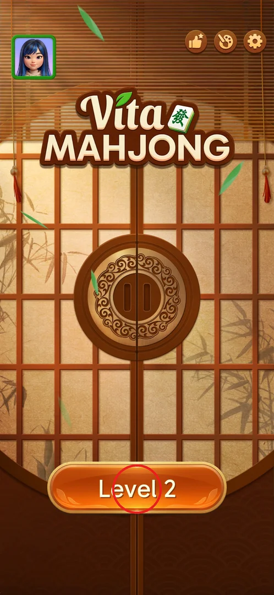
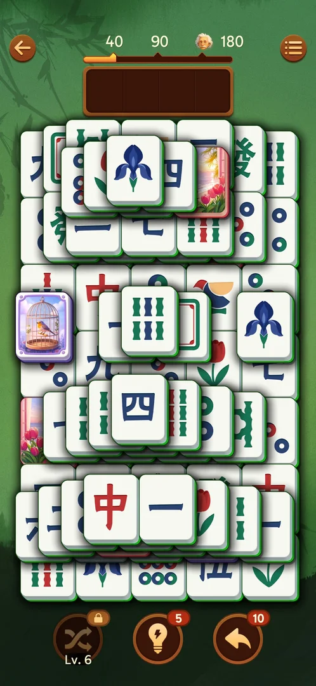
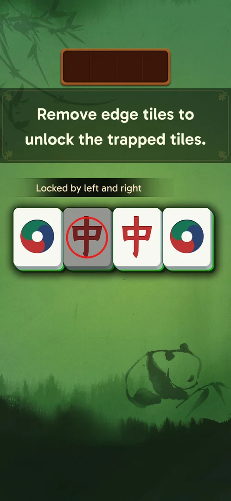
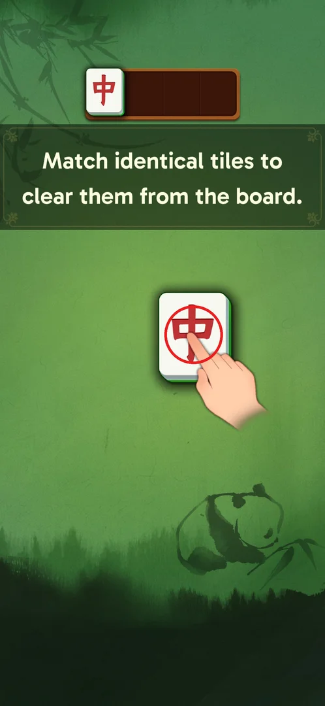
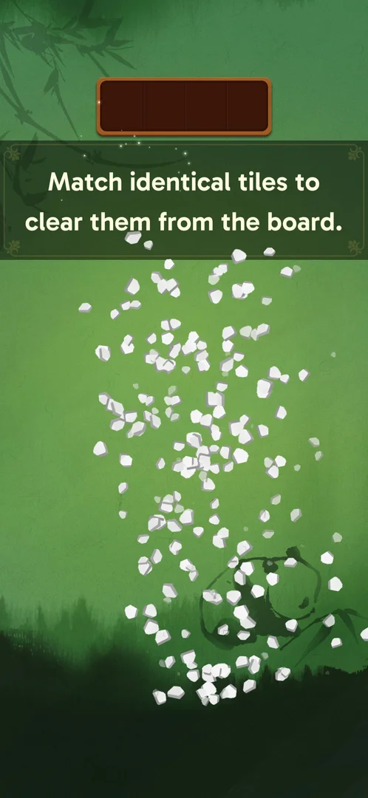
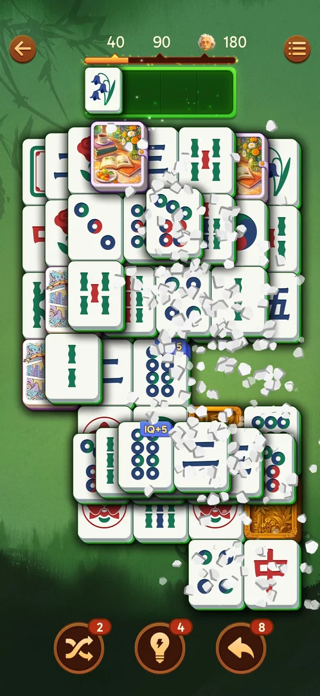
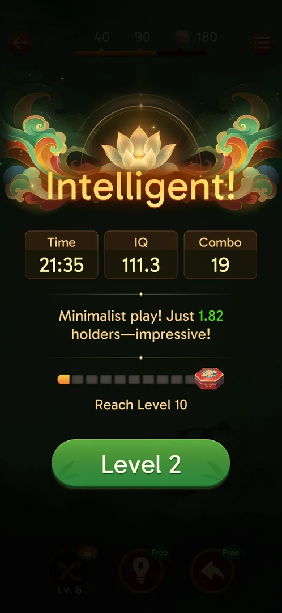

# Core loop: tile matching

This is the game itself: a "tray mahjong" level. You tap a free tile on a layered board and it flies
into a 4-slot [tray](tray.md). Two identical tiles in the tray vanish [^s23] [^s8]. You win by clearing
the board. Each win shows a results screen and moves you on to the next level.

## Where to find it

On the main screen, the orange **Level N** button at the bottom opens the next unplayed level [^s1].
Leaving a level with the back arrow (top left) brings you back to the main screen [^s1].

 [^s1]

## What it looks like

The level screen, from top to bottom [^s2]:

- the back arrow and the menu button;
- the IQ bar with marks at 40, 90 and 180;
- the brown 4-slot tray;
- the board: tiles stacked in several layers, with upper tiles drawn shifted over the ones below;
- the booster buttons: Shuffle (locked until level 6), Hint and Undo, each with its stock
  (see [boosters](boosters.md)).

 [^s2]

## What you can do

| Tab or button | What it does |
|---|---|
| [Locked tile](#locked-tile) | Tapping a blocked tile greys it and shows why it is locked; nothing goes into the tray |
| [Free tile](#free-tile) | Tapping a free tile sends it into the next empty tray slot |
| [Pair](#pair) | Two identical tiles in the tray burst and free their slots |
| [IQ badge](#iq-badge) | Some pairs carry a blue IQ+N badge; matching them adds about N IQ |

### Locked tile

A tile is free when nothing lies on it and its left or right side is open. If you tap a locked
tile, it turns grey, a tooltip says "Locked by left and right", and nothing enters the tray [^s3]. The
level 1 tutorial teaches this rule with the line "Remove edge tiles to unlock the trapped tiles." [^s3]

 [^s3]

### Free tile

A tapped free tile moves into the leftmost empty tray slot. When its twin is tapped, the two complete a
pair [^s4] [^s23]. The tutorial says "Match identical tiles to clear them from the board." [^s4]

 [^s4]

### Pair

Two identical tiles in the tray burst into shards and disappear, which frees their slots [^s5] [^s8].
Tiles that look special are still ordinary pairs: painted pictures, carved golden tiles, "official"
faces, and picture cards with the same picture [^s9] [^s22] [^s15].

 [^s5]

### IQ badge

On some pairs, both tiles carry a blue IQ+N badge (IQ+5, IQ+8 or IQ+10). Matching the pair adds
about N IQ to the bar at the top [^s11] [^s21].

 [^s6]

### Result

Clearing the board opens the win screen [^s7] [^s12] [^s14] [^s19]. It shows:

- a title: Intelligent!, Brilliant!, Perceptive!, or Genius! on a Hard level;
- Time, IQ and Combo, with a crown on a personal best;
- one line of text, for example "Beat 84.31% of players!", "You click 0 locked tiles, right matches
  in every move!" or "Minimalist play! Just 1.82 holders—impressive!";
- the [level chest](level-chest.md) bar;
- a green **Level N+1** button.

No coins were shown on this screen [^s7].

 [^s7]

## How it works

Observed in version 3.39.1.

- **The tray and the board.** The tray has 4 slots. A pair leaves the tray as soon as both of its
  tiles are in it [^s23] [^s8]. A tile is free when nothing lies on it and its left or right side is
  open [^s3].
- **The title.** The title seems to depend on how well you played. L3 gave Intelligent! with IQ 122
  (84%). L4 gave Brilliant! with IQ 153.6, combo 33 and 99.99% [^s13]. Titles seen on levels 3–13:
  Intelligent!, Brilliant!, Perceptive!, and Genius! on a Hard level [^s13] [^s24] [^s19].
- **Game time.** The time on the win screen is game time, not wall time: L12 showed 30:29 after
  42 minutes of play [^s20].
- **Leaving with the back arrow.** If you leave a level with the back arrow and come back, the board,
  score and combo tier are kept [^s10] [^s18].
- **Closing the app.** Results after the app was closed differ between levels:
  - a killed app resumed L12 with its board, tray and stock intact [^s16];
  - a half-played level 1 restarted from the tutorial [^s17];
  - L17 restarted from scratch after a relaunch [^s18].

  What decides between resuming and restarting is not known.

## Cases

| Case | What was done | Result | Source |
|---|---|---|---|
| Locked tap | Tapped a tile blocked on both sides | It greys, the tooltip "Locked by left and right" shows, nothing enters the tray | [^s3] |
| Pair | Tapped two identical free tiles | Both go into the tray, then burst into shards and disappear | [^s8] |
| Picture tiles | Matched painted-scene tiles (e.g. a flower basket) | An ordinary pair; no visible extra reward | [^s9] |
| Special tiles | Matched carved golden tiles, "official" faces, picture cards and IQ+N tiles | All are ordinary pairs | [^s15] [^s22] |
| IQ badge | Matched pairs with a blue IQ+N badge (IQ+5, IQ+8, IQ+10) | The IQ bar grows by about N | [^s11] [^s21] |
| Win | Cleared levels 1–13 | The win screen described above | [^s7] |
| Percentile line | Won level 3 | "Beat 84.31% of players!", "Extraordinary strategy!" | [^s12] |
| Accuracy line | Won a level without a locked tap | "You click 0 locked tiles, right matches in every move!" | [^s14] |
| Titles | Won levels 3–13 | Intelligent!, Brilliant!, Perceptive!, Genius! (on Hard) | [^s13] [^s24] [^s19] |
| Title vs. score | Compared L3 and L4 | L3: Intelligent! at IQ 122, 84%. L4: Brilliant! at IQ 153.6, combo 33, 99.99% | [^s13] |
| Back-arrow exit | Left a level mid-game, then entered it again | Board, score and combo tier were kept | [^s10] [^s18] |
| Resume after a kill | Killed the app in the middle of L12 | Board, tray and stock were kept | [^s16] |
| Level 1 after a relaunch | Relaunched the app with level 1 half-played | The tutorial started again | [^s17] |
| L17 after a relaunch | Relaunched the app with L17 half-played | The level restarted from scratch | [^s18] |
| Game time | Played L12 for 42 minutes | The win screen showed 30:29 | [^s20] |

## Not verified

- What decides the title.
- What "holders" measures.
- Whether the game timer pauses during ads.
- What decides whether a relaunch resumes a level or restarts it.
- One board tile, whose twin was in the tray, was drawn grey while it was locked (a monkey tile, L15).
  Is grey a "locked" cue for tray twins?

[^s1]: session 20260930-211039-chrono-2FYKPJ, step 119
[^s2]: session 20260930-211039-chrono-2FYKPJ, step 118
[^s3]: session 20260930-203959-chrono-2FYKPJ, step 22 — [video at 4:48](https://youtu.be/2yK_ch59JAg?t=288)
[^s4]: session 20260930-211039-chrono-2FYKPJ, step 3
[^s5]: session 20260930-211039-chrono-2FYKPJ, step 4
[^s6]: session 20260930-225122-chrono-2FYKPJ, step 8 — [video at 4:02](https://youtu.be/wSbzNbOhly8?t=242)
[^s7]: session 20260930-211039-chrono-2FYKPJ, step 117
[^s8]: session 20260930-211039-chrono-2FYKPJ, step 80
[^s9]: session 20260930-203959-chrono-2FYKPJ, step 82 — [video at 14:36](https://youtu.be/2yK_ch59JAg?t=876)
[^s10]: session 20260930-203959-chrono-2FYKPJ, step 94 — [video at 18:02](https://youtu.be/2yK_ch59JAg?t=1082)
[^s11]: session 20260930-225122-chrono-2FYKPJ, step 9 — [video at 4:19](https://youtu.be/wSbzNbOhly8?t=259)
[^s12]: session 20260930-221457-chrono-2FYKPJ, step 39
[^s13]: session 20260930-221457-chrono-2FYKPJ, step 60
[^s14]: session 20260930-221457-chrono-2FYKPJ, step 90
[^s15]: session 20260930-225122-chrono-2FYKPJ, step 76 — [video at 35:19](https://youtu.be/wSbzNbOhly8?t=2119)
[^s16]: session 20261001-031723-chrono-2FYKPJ, step 4
[^s17]: session 20260930-211039-chrono-2FYKPJ, step 2
[^s18]: session 20261001-110957-chrono-2FYKPJ, step 70
[^s19]: session 20260930-235817-chrono-2FYKPJ, step 41 — [video at 20:47](https://youtu.be/6yY68DCT4w0?t=1247)
[^s20]: session 20261001-031723-chrono-2FYKPJ, step 54
[^s21]: session 20260930-225122-chrono-2FYKPJ, step 24 — [video at 10:46](https://youtu.be/wSbzNbOhly8?t=646)
[^s22]: session 20260930-225122-chrono-2FYKPJ, step 1 — [video at 0:24](https://youtu.be/wSbzNbOhly8?t=24)
[^s23]: session 20260930-211039-chrono-2FYKPJ, step 13
[^s24]: session 20260930-225122-chrono-2FYKPJ, step 61 — [video at 26:45](https://youtu.be/wSbzNbOhly8?t=1605)
