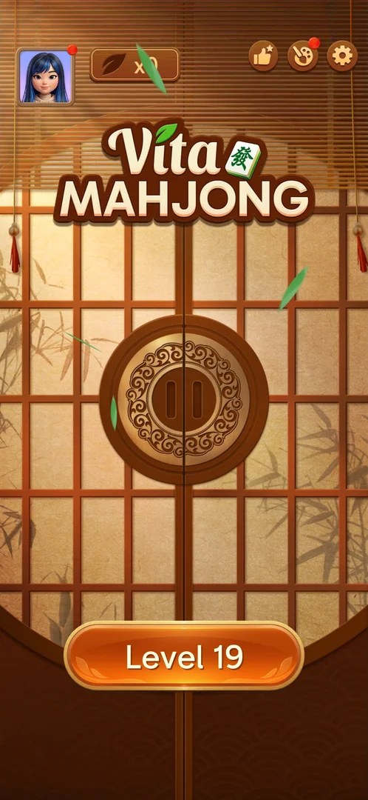
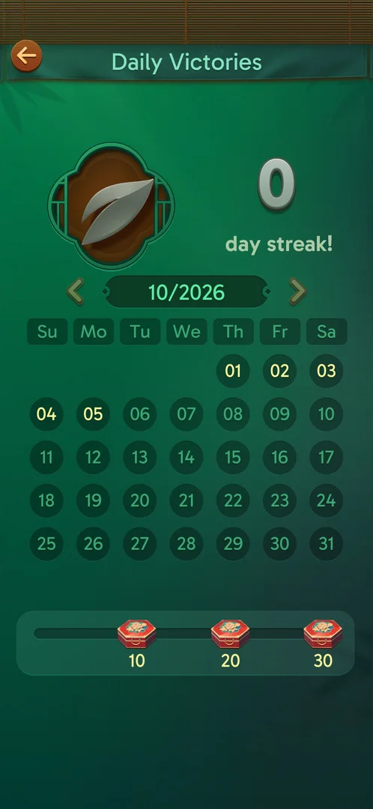
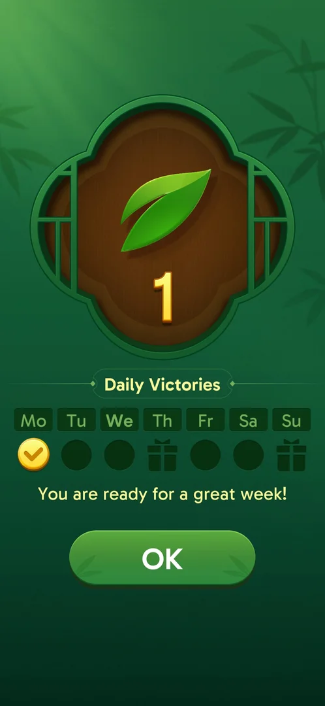

# Daily Victories streak

A day streak of won levels. The home screen's leaf counter shows it ("x0", then "x1") and opens the Daily
Victories screen: a month calendar, the streak in days next to a large leaf emblem, and a track of three
chests at 10, 20 and 30 days [^s1] [^s2]. The first win of the day adds a day: a full-screen Daily
Victories panel comes up right after the board is cleared, with the leaf count going from 0 to 1 and
today's day checked in a week row [^s3]. A second win on the same day
adds nothing: the panel comes again with the same count [^s4]
[^s5]. What the chests hold was not seen [^s6] [^s7] [^s8].

## Why it appeared

Opened by tapping the leaf counter "x0" on the home screen; the screen is a day-streak calendar and the
leaf is its emblem, so the home counter shows the streak (0) [^s1]. The counter was on the home screen
from the first arrival (see [Leaf counter](leaves.md)). The panel also comes up by itself after the first
won level of the day [^s3].

## Where to find it

Home screen > the leaf counter right of the avatar, top left [^s9]. The tap slides the home doors apart
onto the calendar, the same door transition as for a level (see [Tray mahjong level](core-level.md)); the
back arrow top left returns to the home screen [^s1] [^s10].

 [^s9]
*The leaf counter "x0" right of the avatar on the home top bar*

The door transition of this tap is not cut as a clip: the session's clip came out as a single still. It
is in the original on YouTube from about [0:47](https://youtu.be/vgVMznU7XG0?t=47).

After the first win of the day the Daily Victories panel opens by itself, before the win screen [^s3]
(see [Result](#result)).

## What it looks like

 [^s11] [^s13]
*Daily Victories at streak 1: today (05) gold in the calendar; the same screen later that day*

- Top: a back arrow and the title "Daily Victories" [^s1].
- The streak: a leaf in a carved wooden frame, grey at streak 0 and green at streak 1; the number and
  "day streak!" right of it [^s1] [^s11].
- The calendar: "10/2026" between a left and a right arrow, both drawn dim; days Su to Sa [^s1] [^s13]. On 5 October, after the
  first win of the day, the 05 circle was gold; 01 to 04 were drawn brighter than 06 to 31, as before any
  win [^s1] [^s11]. Inferred: gold marks a won day, and the brighter days are the past days of the month,
  not won days.
- Bottom: a progress track with three red chests marked 10, 20 and 30; at streak 1 a small dot sat at the
  start of the track [^s11].

The streak 0 screen, before any win:

 [^s1]
*Daily Victories at streak 0*

### Result

 [^s3]
*The Daily Victories panel after the level 19 win: leaf 1, Monday checked*

A full-screen green panel: the leaf with the new count (1), "Daily Victories", a week row Mo to Su in
which today (Monday) has a gold check, Thursday and Sunday show a gift icon, the other days an empty
circle, a one-line caption and an OK button [^s3]. OK leads on to the win screen [^s3]. The gift icons
were not tapped; inferred, the week holds rewards on days 4 and 7; not verified.

The same panel came again after the Hard level 20 win later that day: the leaf animated to 1 again,
Monday checked, the same caption, although the home counter already read "x1" before that win; the
counter stayed "x1" after it [^s4] [^s5].

## What you can do

| Tab or button | What it does |
|---|---|
| [Back arrow](#back-arrow) | Returns to the home screen |
| [Chests](#chests) | Nothing seen at streak 0 or 1 |
| [Month arrows](#month-arrows) | The left arrow did nothing at streak 1 |
| [OK](#ok) | Closes the post-win panel and goes on to the win screen |

### Back arrow

<!-- no-frame: the arrow is on the screen frame above, top left -->
Returned to the home screen [^s10].

### Chests

<!-- no-frame: the chests are on the screen frame above, bottom track -->
The 10-day chest was tapped at streak 0 and three times at streak 1 (in three sessions): the screen did
not change, no popup, tooltip or reward preview [^s6] [^s7] [^s8] [^s14].

### Month arrows

<!-- no-frame: the arrows are on the screen frame above, either side of 10/2026 -->
The left arrow (previous month) was tapped at streak 1 on 5 October: the calendar stayed on 10/2026 and
the screen did not change [^s15]. Inferred from their dim look: both arrows are inactive while there
is no other month with play to show; not verified. The right arrow
was not tapped.

### OK

<!-- no-frame: the button is on the Result frame above -->
On the post-win panel: closes it; the level's win screen follows [^s3].

## How it works

Version 3.40.1.

- The first won level of the day added one day: 0 to 1, shown on the post-win panel, the home counter
  ("x1") and the Daily Victories screen [^s3] [^s2] [^s11].
- One day per day: a second won level on the same day left the streak at 1; the post-win panel still came
  up [^s4] [^s5].
- Quitting a level with the back arrow after the day's win left the counter at "x1"
  [^s2].
- Nothing about the streak shows inside a level (the level 19 and level 20 HUDs are unchanged); it shows
  only after the win [^s7].
- Chests at 10, 20 and 30 days of streak; their contents not shown at streak 0 or 1 [^s1] [^s6] [^s7] [^s14].
- Out of space in the Hard level 20 with a 1-day streak, continued with "-4 to revive", left the streak
  and the leaf counter as they were [^s12].
- What breaks the streak (a missed day, a loss) and any offer to keep it were not seen.

## Cases

| Case | What was done | Result | Source |
|---|---|---|---|
| Why it appeared: the trigger that brought it up (the first launch, a level won, a threshold, a timer, a loss): a fact with its frame, or a hypothesis to test <!-- case:chk-appeared --> | Tapped the leaf counter on home | ✅ Opens Daily Victories; the leaf is its streak counter | [^s1] |
| Where to find it: the screen and the button that open it <!-- case:chk-entry --> | Tapped the leaf counter on home; won a level | ✅ The home leaf counter opens it; the panel also comes up by itself after the first win of the day | [^s7] [^s3] |
| What it looks like: its screen <!-- case:chk-screen --> | Opened it at streak 1 | ✅ Title, leaf with "N day streak!", the month calendar (the won day gold), month arrows, chests at 10, 20, 30 | [^s7] [^s11] |
| The counter: where it shows and what it counts <!-- case:chk-counter --> | Won level 19, the first win of the day | ✅ The panel showed leaf 1 and today checked in a Mo-Su row; the home counter went from "x0" to "x1" | [^s3] [^s2] |
| The reward for each step of the streak <!-- case:chk-rewards --> | Tapped the 10-day chest at streak 0 and at streak 1 | Nothing happened; contents unknown | [^s6] [^s7] |
| What shows during a level while the streak runs <!-- case:chk-in-level --> | Played level 19 and level 20 | ✅ Nothing in the level; the streak shows only after the win | [^s7] |
| What breaks it (a loss, a quit, a missed day) and what the break costs <!-- case:chk-break --> | — | not verified |  |
| Offers to keep it after a break and their price (a video, coins) <!-- case:chk-save --> | — | not verified |  |
| Win under Daily Victories streak: as the base, or what differs <!-- case:under-win --> | Won level 19 | ✅ After the board clears, the Daily Victories panel comes up before the win screen: leaf 0 to 1, today checked, OK to go on | [^s3] |
| Quit with the back arrow under Daily Victories streak: as the base, or what differs <!-- case:under-quit --> | After the day's win, left the Hard level 20 with the back arrow | ✅ As the base; the leaf counter stays "x1" | [^s2] |
| A second win on the same day <!-- case:one-leaf-per-day --> | Won the Hard level 20 on the day level 19 was won | ✅ No second leaf: the panel shows day 1 again, the home counter stays "x1" | [^s5] |
| A tap on a locked chest <!-- case:chest-tap-no-preview --> | Tapped the 10-day chest at streak 1 | ✅ No preview or tooltip; contents shown only when reached | [^s8] [^s14] |
| The month arrows <!-- case:month-arrows --> | Tapped the left (previous month) arrow at streak 1 | ✅ No change: the calendar stays on 10/2026 | [^s15] |
| Restart in the Out of space window under Daily Victories streak: as the base, or what differs <!-- case:under-restart --> | — | not verified |  |
| Exit the app mid-level (a force-stop after one pair) under Daily Victories streak: as the base, or what differs <!-- case:under-exit-app --> | — | not verified |  |
| Restart row in the in-level Options under Daily Victories streak: as the base, or what differs <!-- case:under-restart-menu --> | — | not verified |  |
| Out of space under Daily Victories streak: as the base, or what differs <!-- case:under-out-of-space --> | Ran out of space in the Hard level 20 with a 1-day streak, revived with "-4 to revive" | ✅ As the base; the streak and the leaf counter unchanged | [^s12] |

## Not verified

- The reward in each chest (10, 20, 30 days), and the gifts on Thursday and Sunday of the week row <!-- case:chk-rewards -->
- What breaks the streak and what the break costs <!-- case:chk-break -->
- Offers to keep the streak after a break <!-- case:chk-save -->
- A Restart in the Out of space window and an app exit mid-level with a streak running: whether either touches the streak <!-- case:under-restart --> <!-- case:under-exit-app -->
- A Restart from the in-level Options mid-level with a streak running: whether it touches the streak <!-- case:under-restart-menu -->
- What the right month arrow does, and whether the arrows work once there is a past month with play

[^s1]: session 20261005-073409-chrono-2FYKPJ, step 2 — [video at 0:53](https://youtu.be/vgVMznU7XG0?t=53)
[^s2]: session 20261005-073804-chrono-2FYKPJ, step 55 — [video at 19:26](https://youtu.be/nmXrQmoLWlU?t=1166)
[^s3]: session 20261005-073804-chrono-2FYKPJ, step 46 — [video at 14:49](https://youtu.be/nmXrQmoLWlU?t=889)
[^s4]: session 20261005-133525-chrono-2FYKPJ, step 43 — [video at 17:14](https://youtu.be/D10jI230Oks?t=1034)
[^s5]: session 20261005-133525-chrono-2FYKPJ, step 49 — [video at 20:30](https://youtu.be/D10jI230Oks?t=1230)
[^s6]: session 20261005-073409-chrono-2FYKPJ, step 3 — [video at 1:28](https://youtu.be/vgVMznU7XG0?t=88)
[^s7]: session 20261005-073804-chrono-2FYKPJ, step 57 — [video at 20:23](https://youtu.be/nmXrQmoLWlU?t=1223)
[^s8]: session 20261005-133525-chrono-2FYKPJ, step 51 — [video at 22:01](https://youtu.be/D10jI230Oks?t=1321)
[^s9]: session 20261005-073409-chrono-2FYKPJ, step 1 — [video at 0:40](https://youtu.be/vgVMznU7XG0?t=40)
[^s10]: session 20261005-073409-chrono-2FYKPJ, step 4 — [video at 1:42](https://youtu.be/vgVMznU7XG0?t=102)
[^s11]: session 20261005-073804-chrono-2FYKPJ, step 56 — [video at 19:46](https://youtu.be/nmXrQmoLWlU?t=1186)
[^s12]: session 20261005-133525-chrono-2FYKPJ, step 10 — [video at 3:43](https://youtu.be/D10jI230Oks?t=223)
[^s13]: session 20261005-221108-chrono-2FYKPJ, step 1 — [video at 0:32](https://youtu.be/3FoFiC5gYbs?t=32)
[^s14]: session 20261005-221108-chrono-2FYKPJ, step 2 — [video at 0:52](https://youtu.be/3FoFiC5gYbs?t=52)
[^s15]: session 20261005-221108-chrono-2FYKPJ, step 3 — [video at 1:04](https://youtu.be/3FoFiC5gYbs?t=64)
