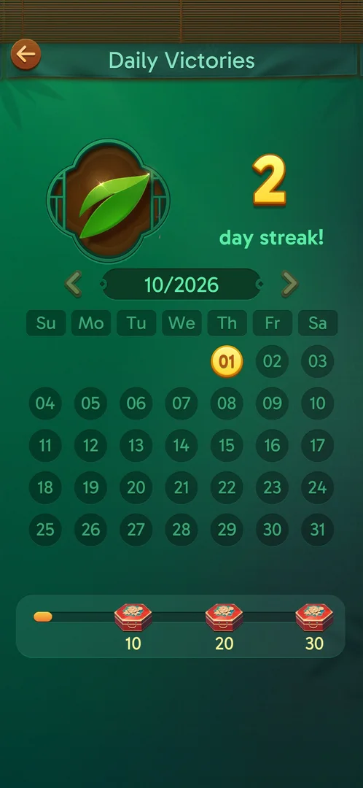

# Daily Victories

The first win of a calendar day shows a popup with the streak count and a week row with gifts; a leaf
pill on the main screen opens a monthly calendar with chests at 10, 20 and 30 won days [s:20260930-235817-chrono-2FYKPJ#20] [s:20261001-010125-chrono-2FYKPJ#1].

## Cases
| Case | What was done | Result | Source |
|---|---|---|---|
| First win of the day | Won L9 on 2026-10-01 | Popup, 2 days | [s:20260930-235817-chrono-2FYKPJ#20] |
| Second win | Won L10 and L11 the same day | No popup | [s:20260930-235817-chrono-2FYKPJ#67] |
| Calendar | Leaf pill | Monthly view with chests | [s:20261001-010125-chrono-2FYKPJ#1] |

## Not verified
- Day 4 and day 7 gifts, the monthly chests, a missed day.
