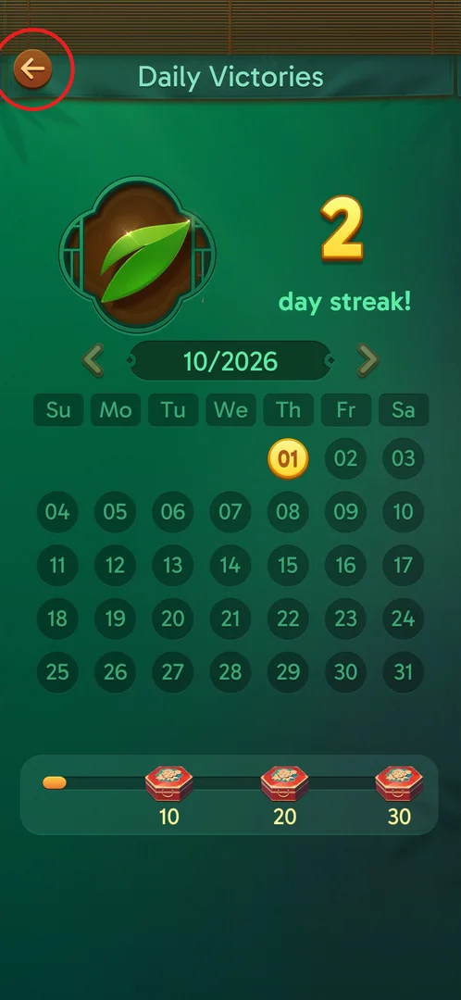
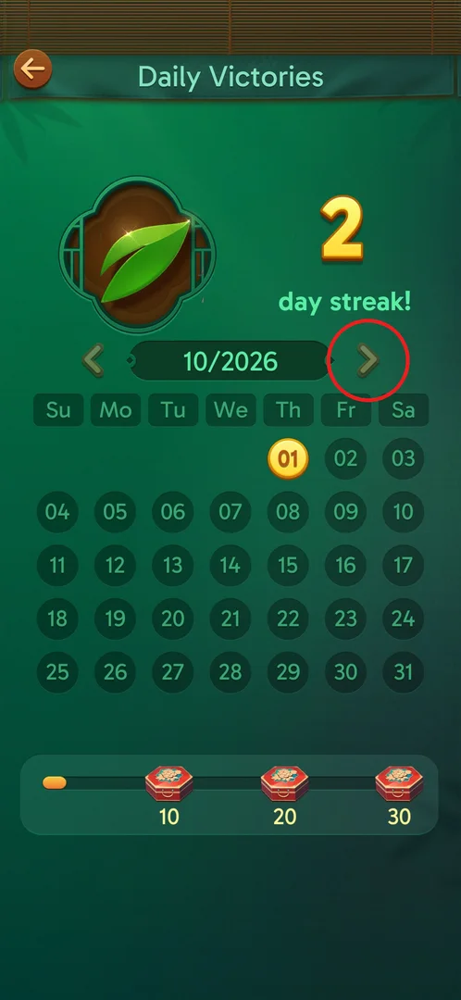
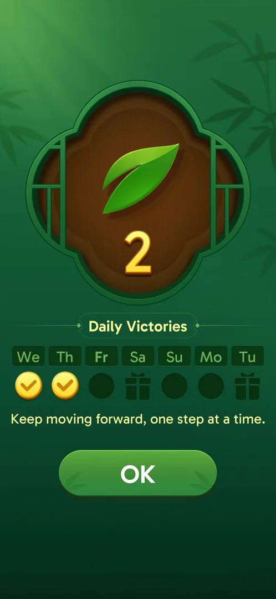

# Daily Victories

Daily Victories counts the calendar days on which the player won at least one level. The first win of a
new day shows a popup with the day streak and a week row with gift boxes; a leaf pill on the main screen
opens a monthly calendar of won days with chests at 10, 20 and 30 won days [^s3] [^s2].

## Where to find it

On the main screen, tap the green-leaf pill to the right of the avatar (top left, circled). The number on
the pill is the current day streak: "x2" on 2026-10-01 [^s1] [^s2]. The pill appeared after the first
win of the second day; it was not seen before that [^s4] (the start condition on a fresh install is not
verified).

 [^s1]

The popup is not opened by a button: it comes up by itself after the first level won on a new calendar
day [^s3].

## What it looks like

A green screen titled "Daily Victories" with a back arrow (top left) [^s2]:

- a leaf emblem and the streak: "2 day streak!";
- the month header "10/2026" with arrows to the previous and next month;
- the month's calendar (Su..Sa); won days are gold coins (01 in October 2026), the other days are dark;
- at the bottom, a progress bar of won days in the month with three chests at 10, 20 and 30.

 [^s2]

The calendar shows only 01 in gold although the streak is 2: the other won day (2026-09-30) belongs to
the previous month (inferred from the popup's week row, which starts on Wednesday 09-30) [^s2] [^s3].

## What you can do

| Tab or button | What it does |
|---|---|
| [Back arrow](#back-arrow) | Returns to the main screen |
| [Month arrows](#month-arrows) | Switch the calendar month; not tried |
| [Monthly chests](#monthly-chests) | Rewards for 10, 20 and 30 won days in the month; none opened yet |
| [Popup](#popup) | Shows the new streak after the first win of a day; OK closes it |

### Back arrow

The orange arrow at the top left of the screen (circled) leaves Daily Victories (inferred: the usual back
button; the return is not recorded as a separate step).

 [^s2]

### Month arrows

Arrows on both sides of the month header "10/2026" (the right one circled). They presumably browse other
months; not tried, so whether the previous month (9/2026) shows the won day 30 is not known [^s2].

 [^s2]

### Monthly chests

A progress bar under the calendar fills with the month's won days; red chests sit at 10, 20 and 30. On
2026-10-01 the bar had just started (1 won day in October) and no chest was opened [^s2].

 [^s2]

### Popup

After the first level won on a new calendar day: the leaf emblem with the streak (the counter animates
1 → 2), the title "Daily Victories", a week row starting on the streak's first day (We..Tu) with gold
checks on the won days and gift boxes on the 4th (Sa) and 7th (Tu) day, the line "Keep moving forward,
one step at a time." and an OK button [^s3].

 [^s3]

## How it works

Version 3.39.1.

- One count per calendar day: the first win of the day shows the popup and adds a leaf; further wins the
  same day (L10 and L11 after L9) show no popup [^s3] [^s4].
- The week row has gifts on day 4 and day 7 of the streak [^s3]; their contents are not verified.
- The month has its own progress of won days with chests at 10, 20 and 30 [^s2]; their contents are not
  verified.

## Cases

| Case | What was done | Result | Source |
|---|---|---|---|
| First win of the day | Won L9 on 2026-10-01 | Popup, streak 2 | [^s3] |
| Second and third win the same day | Won L10 and L11 | No popup | [^s4] |
| Calendar | Tapped the leaf pill on the main screen | Monthly calendar, "2 day streak!", chests at 10/20/30 | [^s2] |
| Gift on day 4 (Sa) | — | not verified | |
| Gift on day 7 (Tu) | — | not verified | |
| A missed day: does the streak reset? | — | not verified | |
| Monthly chest at 10/20/30 won days | — | not verified | |
| Month arrows: previous month (9/2026) | — | not verified | |

## Not verified

- The day 4 and day 7 gifts.
- The monthly chests at 10, 20 and 30 won days.
- What a missed day does to the streak.
- The month arrows (does 9/2026 show 30 in gold?).
- Whether Daily Victories is shown from day 1 on a fresh install.

[^s1]: session 20261001-010125-chrono-2FYKPJ, step 0 — [video at 0:00](https://youtu.be/vc6OylgqaTw?t=0)
[^s2]: session 20261001-010125-chrono-2FYKPJ, step 1 — [video at 0:30](https://youtu.be/vc6OylgqaTw?t=30)
[^s3]: session 20260930-235817-chrono-2FYKPJ, step 20 — [video at 10:06](https://youtu.be/6yY68DCT4w0?t=606)
[^s4]: session 20260930-235817-chrono-2FYKPJ, step 67 — [video at 35:54](https://youtu.be/6yY68DCT4w0?t=2154)
