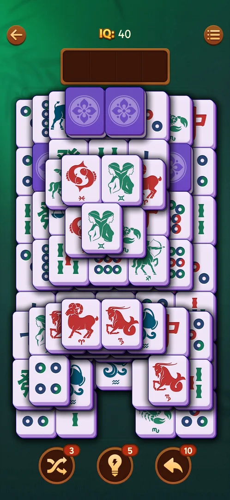

# Face-down tiles

Tiles on the board that show their back instead of their face: the player cannot see which tile it is.
In the Simple tile set they are purple with a white flower; in the Classic set they are green [^s1].

## Why it appeared

On the board of level 19 [^s1]. Earlier sessions (on 3.39.1) saw them from level 11; that session is not
a source of this page, so the first level is not verified here [^s1].

## Where to find it

<!-- no-entry: a board element; it has no control of its own, it is on the level board (see Tray mahjong level) -->
On the level board itself: level 19 has several among the face-up tiles (see
[Tray mahjong level](core-level.md)) [^s1].

## What it looks like

 [^s1]
*Purple face-down tiles with a white flower on the level 19 board (Simple tile set)*

A tile of the same size as the others, with a solid purple face and a white four-petal flower [^s1].

## How it works

Version 3.40.1.

- The colour of the back follows the tile set: purple in Simple, green in Classic [^s1].
- The game's How to Play (two pages) does not mention them [^s2].
- What turns them face up, and whether they can be moved to the tray face down, is not verified in this
  session (no tile was played).

## Outcomes

<!-- the map has no under-<outcome> cases for this feature yet -->

| Outcome | As the base or what differs | Frame |
|---|---|---|
| Win | not verified | — |
| Loss | not verified | — |

## Cases

| Case | What was done | Result | Source |
|---|---|---|---|
| Why it appeared: the trigger that brought it up (the first launch, a level won, a threshold, a timer, a loss): a fact with its frame, or a hypothesis to test <!-- case:chk-appeared --> | Opened level 19 | ✅ On the board | [^s1] |
| Where to find it: the screen and the button that open it <!-- case:chk-entry --> | — | ✅ On the level board | [^s1] |
| What it looks like: its screen <!-- case:chk-screen --> | Opened level 19 | ✅ Purple backs with a flower | [^s1] |
| The first level it shows on and how the game introduces it <!-- case:chk-first-level --> | — | not verified in this session |  |
| What it does and how it is used <!-- case:chk-rules --> | — | not verified |  |
| How it interacts with the other pieces <!-- case:chk-interactions --> | — | not verified |  |
| Whether it adds a way to lose <!-- case:chk-loss --> | — | not verified |  |

## Not verified

- The first level it shows on and how the game introduces it <!-- case:chk-first-level -->
- What it does and how it is used: when it turns face up <!-- case:chk-rules -->
- How it interacts with the other pieces <!-- case:chk-interactions -->
- Whether it adds a way to lose <!-- case:chk-loss -->

[^s1]: session 20261003-195050-chrono-2FYKPJ, step 17 — [video at 4:21](https://youtu.be/KUKs3cQ-xqY?t=261)
[^s2]: session 20261003-195050-chrono-2FYKPJ, step 20 — [video at 5:29](https://youtu.be/KUKs3cQ-xqY?t=329)
