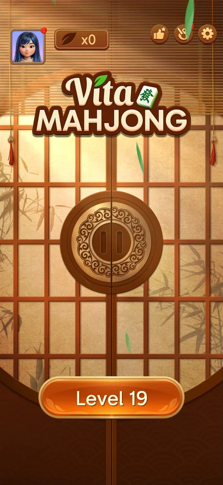
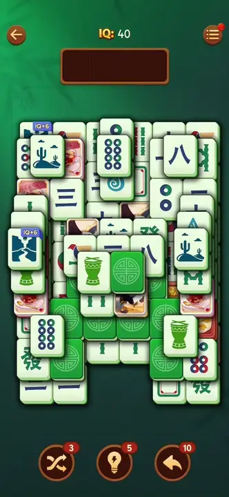

# Face-down tiles

Tiles on the level board that show their back instead of their face, so the player cannot see which tile
it is. A tap on a free one turns it face up where it lies, without moving it into the tray
[^s1].

## Why it appeared

On the board of level 19 at its first open on 3.40.1 [^s2]. Earlier
sessions on 3.39.1 recorded them from level 11; how the game introduces them there was not seen again
[^s3].

## Where to find it

Home screen > the orange "Level 19" button at the bottom: they are on the board of the level it opens;
they have no control of their own [^s3].

 [^s3]
*The "Level 19" button opens a board with face-down tiles*

## What it looks like

 [^s4]
*Green face-down tiles with a flower medallion on the level 19 board*

A tile of the same size as the others, a solid coloured back with an emblem [^s4].
The back is not the same on every board:

| Board | Back | Source |
|---|---|---|
| Level 19, session 20261003-195050 | purple, a white flower | [^s2] |
| Level 19, session 20261003-231301 | red, a lotus | [^s5] |
| Level 19, session 20261003-231804 (another layout) | red, another emblem | [^s5] |
| Level 19, session 20261005-002327, first board | green, a four-petal flower medallion | [^s4] |
| Level 19, session 20261005-002327, after the app was reopened | green, a round lattice medallion | [^s3] |
| Level 20 (Hard), session 20261005-133525 | blue, a scrolled corner ornament (white tile faces) | [^s6] |

The Theme popup's tile sets show Simple with a green back, Classic blue and Vintage red
[^s5]. No theme was changed between these boards. Inferred: the back
follows the board the game generates, not only the chosen tile set (see [Theme](theme.md)).

## What you can do

| Tab or button | What it does |
|---|---|
| [Flip](#flip) | A tap on a free face-down tile turns it face up in place |
| [Flip two of a kind](#flip-two-of-a-kind) | Two flipped tiles of the same face leave the board |
| [Flip a tile seen before](#flip-a-tile-seen-before) | A back whose face was seen earlier, flipped while its twin is face up, leaves the board with the twin |

### Flip

<!-- no-frame: the flip is in the clip under "Flip two of a kind"; the board before it is the frame above -->
A tap on the free green tile at the bottom left of the board turned it face up in place: a four-dots
tile. The tray stayed empty, the boosters stayed at 3, 5 and 10, and nothing was charged
[^s1].

### Flip two of a kind

 [^s7]
*Clip 8.1 s · [original on YouTube from 4:18](https://youtu.be/2aQPmh7YksQ?t=258)*

Two free face-down tiles next to each other were tapped in a row. The first turned face up as a green
drum [^s7]; after the tap on the second, both were gone in a burst of
shards, "+0.4" showed over the tray and the score went from IQ 40 to 40.4; the tray stayed empty
[^s8]. The face of the second tile is not on any frame; inferred from the
match: it was a drum too.

### Flip a tile seen before

 [^s9]
*Clip 6.1 s · [original on YouTube from 12:56](https://youtu.be/D10jI230Oks?t=776)*

On the Hard level 20 board a flipped tile that found no twin turned face down again when the next back
was flipped: a red wheel flipped up, then the flip of another back (a 九) showed that tile and turned the
red wheel back over [^s10] [^s11]. Later a
second back was flipped and showed a red wheel; a tap on the first back, the one seen as a red wheel
before, cleared both red wheels at once. The tray kept the single tile it held, and the IQ rose from 99.9
to 103 [^s12] [^s9]. Inferred from these
frames: only one flipped tile stays face up at a time.

## How it works

Version 3.40.1.

- A tap on a free face-down tile flips it face up where it lies; it takes no tray slot and costs nothing
  [^s1].
- A flipped tile and a face-up twin match the usual way: +0.4 IQ for the pair, with no tile left in the
  tray [^s8].
- A flipped tile that has no twin face up turns face down again when another back is flipped
  [^s11].
- A tap on a face-up tile whose twin is the flipped tile clears both, without a tray slot; the same when
  the back tapped was seen before and its twin is face up [^s13]
  [^s9].
- Only taps on face-up tiles fill the tray, so a flip adds no way to lose
  [^s1].
- The IQ for a pair is +0.4 on a fresh board; with a combo running it was +3.1 (see
  [Combo streak](combo.md)) [^s8] [^s9].
- The game's How to Play (two pages) does not mention them [^s14].

## Outcomes

<!-- the map has no under-<outcome> cases for this feature yet -->

| Outcome | As the base or what differs | Frame |
|---|---|---|
| Win | not verified: no level finished | — |
| Out of space (loss) | As the base ([Tray mahjong level](core-level.md)); flips take no tray slot, so they do not bring the loss closer | — |
| Restart, exit the app | As the base: a new board, with face-down tiles again (another back on the board after the reopen) | — |

## Cases

| Case | What was done | Result | Source |
|---|---|---|---|
| Why it appeared <!-- case:chk-appeared --> | Opened level 19 | ✅ On the board | [^s2] |
| Where to find it <!-- case:chk-entry --> | Opened Level 19 from the home screen | ✅ On the board of the level from the home Level button; no separate entry | [^s3] |
| What it looks like <!-- case:chk-screen --> | Opened level 19, then again after reopening the app | ✅ Green flower-medallion backs on the first board, green round-lattice backs on the next; earlier boards purple and red | [^s3] |
| The first level it shows on and how the game introduces it <!-- case:chk-first-level --> | — | ✅ Earlier sessions (3.39.1): from level 11; on 3.40.1 on level 19 at its first open; the level 11 introduction not seen again | [^s3] |
| What it does and how it is used <!-- case:chk-rules --> | Tapped a free face-down tile | ✅ Turned face up in place (four dots); tray empty, no cost | [^s1] |
| How it interacts with the other pieces <!-- case:chk-interactions --> | Tapped two free face-down tiles in a row | ✅ The first showed a drum; after the second tap both left the board, +0.4 IQ, tray empty | [^s8] |
| Whether it adds a way to lose <!-- case:chk-loss --> | Flipped a tile and watched the tray | ✅ No: a flip takes no tray slot | [^s1] |
| A back seen before, flipped while its twin is face up <!-- case:seen-back-with-faceup-twin --> | Hard level 20, white and blue set: tapped the back seen earlier as a red wheel while the other red wheel (a flipped back) was face up | ✅ Both cleared, no tray slot | [^s9] |

The last row was recorded in the map under a second feature id, face-down-backs, which is the same
mechanic; it is folded into this page.

## Not verified

- Whether a flipped tile, once face up, goes into the tray like any other tile when tapped again
- How level 11 introduces them on 3.40.1

[^s1]: session 20261005-002327-chrono-2FYKPJ, step 3 — [video at 1:20](https://youtu.be/2aQPmh7YksQ?t=80)
[^s2]: session 20261003-195050-chrono-2FYKPJ, step 17 — [video at 4:17](https://youtu.be/KUKs3cQ-xqY?t=257)
[^s3]: session 20261005-002327-chrono-2FYKPJ, step 11 — [video at 3:46](https://youtu.be/2aQPmh7YksQ?t=226)
[^s4]: session 20261005-002327-chrono-2FYKPJ, step 2 — [video at 0:53](https://youtu.be/2aQPmh7YksQ?t=53)
[^s5]: session 20261003-195050-chrono-2FYKPJ, step 7 — [video at 2:23](https://youtu.be/KUKs3cQ-xqY?t=143)
[^s6]: session 20261005-133525-chrono-2FYKPJ, step 10 — [video at 3:37](https://youtu.be/D10jI230Oks?t=217)
[^s7]: session 20261005-002327-chrono-2FYKPJ, step 12 — [video at 4:26](https://youtu.be/2aQPmh7YksQ?t=266)
[^s8]: session 20261005-002327-chrono-2FYKPJ, step 13 — [video at 4:31](https://youtu.be/2aQPmh7YksQ?t=271)
[^s9]: session 20261005-133525-chrono-2FYKPJ, step 34 — [video at 13:01](https://youtu.be/D10jI230Oks?t=781)
[^s10]: session 20261005-133525-chrono-2FYKPJ, step 22 — [video at 8:45](https://youtu.be/D10jI230Oks?t=525)
[^s11]: session 20261005-133525-chrono-2FYKPJ, step 23 — [video at 8:59](https://youtu.be/D10jI230Oks?t=539)
[^s12]: session 20261005-133525-chrono-2FYKPJ, step 33 — [video at 12:42](https://youtu.be/D10jI230Oks?t=762)
[^s13]: session 20261005-133525-chrono-2FYKPJ, step 24 — [video at 9:13](https://youtu.be/D10jI230Oks?t=553)
[^s14]: session 20261003-195050-chrono-2FYKPJ, step 20 — [video at 5:26](https://youtu.be/KUKs3cQ-xqY?t=326)
