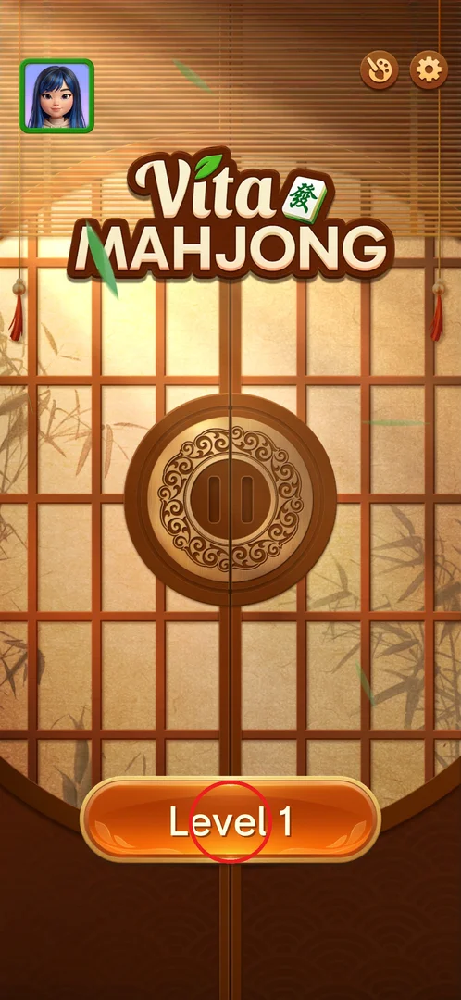
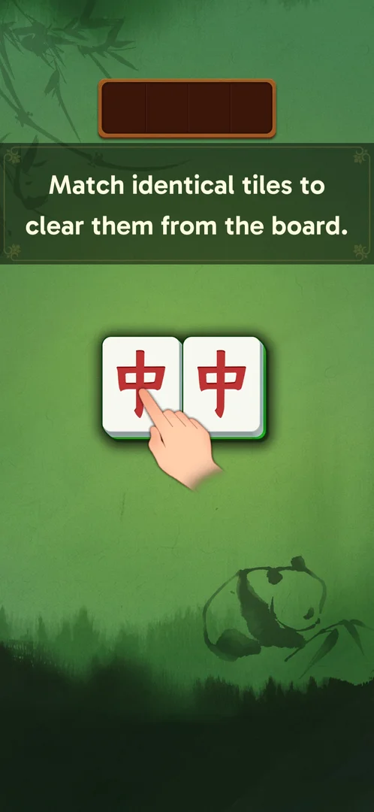
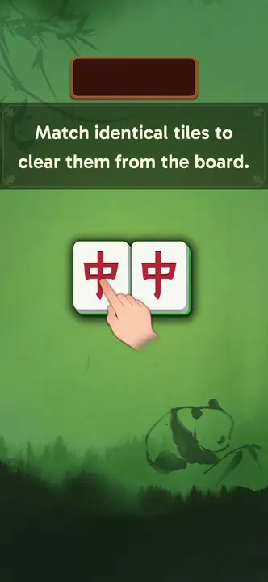
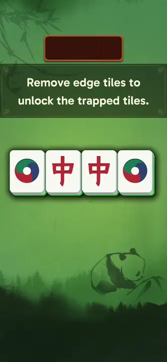
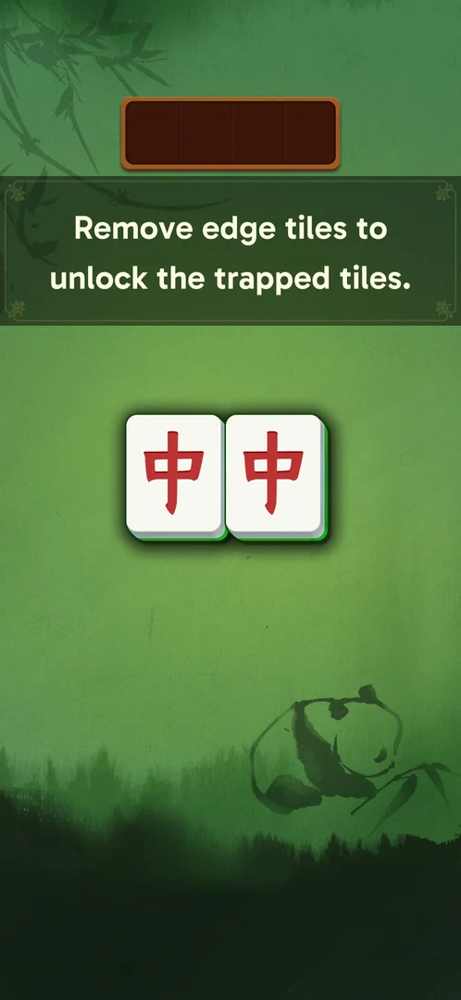

# FTUE / tutorial levels

The first-time user experience: level 1 opens with a three-step guided tutorial that teaches matching
identical tiles and the "free tile" rule, then hands the player a full board; the following levels
unlock boosters, the level chest, leagues and new tile types one by one [^s5] [^s11] [^s9] [^s12] [^s13] [^s14].

## Where to find it

On a fresh install, the main screen has a single play button, "Level 1"; tapping it starts the
tutorial [^s1] [^s2]. There is no separate tutorial menu.

 [^s1]

## What it looks like

A plain board with a dark banner carrying the instruction, a few large tiles and a hand pointer; the
empty 4-slot tray is already at the top, but there is no score bar, no back or menu button and no
boosters until the tutorial ends [^s2] [^s5].

 [^s2]

## What you can do

| Tab or button | What it does |
|---|---|
| [Step 1: match a pair](#step-1-match-a-pair) | Tap two identical tiles to clear them |
| [Step 2: edge tiles](#step-2-edge-tiles) | Shows that a tile between two others is locked; match the edge tiles first |
| [Step 3: last pair](#step-3-last-pair) | Match the pair that the edge tiles freed |
| [Full board](#full-board) | The real level 1 board, with free Hint and Undo |

### Step 1: match a pair

The banner reads "Match identical tiles to clear them from the board."; the hand points at two
red-dragon tiles, and tapping both clears them [^s2] [^s3].

 [^s2]

*Clip 17 s · [original on YouTube from 3:54](https://youtu.be/2yK_ch59JAg?t=234)*

### Step 2: edge tiles

The banner reads "Remove edge tiles to unlock the trapped tiles."; four tiles in a row (circle, dragon,
dragon, circle). Tapping a middle tile greys it out with the label "Locked by left and right" and selects
nothing [^s3].

 [^s3]

*Clip 17 s · [original on YouTube from 4:46](https://youtu.be/2yK_ch59JAg?t=286)*

### Step 3: last pair

Once the two edge circles are matched, the two red dragons are free; matching them ends the tutorial [^s4] [^s5].

 [^s4]

### Full board

After the three steps the full layered level 1 board appears, with the score bar (40 / 90 / 180), the
back arrow and the menu button. Shuffle is locked with "Lv. 6"; Hint and Undo carry a "Free" badge [^s5].

 [^s5]

### Result

Clearing level 1 shows the "Intelligent!" win screen with Time, IQ and Combo, a "holders" line, the chest
bar "Reach Level 10" at 1 of 10 segments and a green "Level 2" button; no coins are given [^s6].

 [^s6]

## How it works

Version 3.39.1.

- Level 1 is a tutorial in 3 steps: "Match identical tiles to clear them from the board", then "Remove
  edge tiles to unlock the trapped tiles", then a last pair; then the full board [^s2] [^s3] [^s5].
- After a relaunch of the app, a half-played level 1 started again from tutorial step 1; the
  half-cleared board was not kept [^s10].
- "Level N+1" on a win screen starts the next level at once, without the main screen [^s11].
- Unlocks: booster counters from level 2 (Hint 5, Undo 10; on level 1 they are "Free"), Shuffle at
  level 6 (stock 3, no popup), the level-10 chest, leagues after the level-10 win, face-down tiles on
  level 11 [^s11] [^s9] [^s12] [^s13] [^s14].
- No new main-screen sections (shop, leagues, events) through level 6 [^s15].

## Cases

| Case | What was done | Result | Source |
|---|---|---|---|
| Steps | Played level 1 on a fresh install | 3 steps (step 1 match a pair; step 2 edge tiles, with the locked-tile hint; step 3 the last pair), then the full board | [^s5] |
| Relaunch | Relaunched the app with level 1 half-cleared and entered it | Level 1 restarted from tutorial step 1 | [^s10] |
| Level 1 | Won it | "Intelligent!" win screen, chest bar 1/10, "Level 2" button | [^s6] |
| Level 2 | Won it | Win screen, chest bar 2/10, no unlock | [^s8] |
| Level 6 | Won it | Shuffle unlocked (stock 3), nothing new on the main screen | [^s9] |

## Not verified

- Whether the tutorial can be skipped.
- Whether leaving level 1 within a session (not a relaunch) also resets the tutorial.

[^s1]: session 20260930-203959-chrono-2FYKPJ, step 18 — [video at 3:29](https://youtu.be/2yK_ch59JAg?t=209)
[^s2]: session 20260930-203959-chrono-2FYKPJ, step 19 — [video at 3:34](https://youtu.be/2yK_ch59JAg?t=214)
[^s3]: session 20260930-203959-chrono-2FYKPJ, step 22 — [video at 4:48](https://youtu.be/2yK_ch59JAg?t=288)
[^s4]: session 20260930-203959-chrono-2FYKPJ, step 24 — [video at 5:10](https://youtu.be/2yK_ch59JAg?t=310)
[^s5]: session 20260930-203959-chrono-2FYKPJ, step 26 — [video at 5:41](https://youtu.be/2yK_ch59JAg?t=341)
[^s6]: session 20260930-211039-chrono-2FYKPJ, step 117
[^s8]: session 20260930-214524-chrono-2FYKPJ, step 96 — [video at 17:57](https://youtu.be/sWuok8myZrQ?t=1077)
[^s9]: session 20260930-221457-chrono-2FYKPJ, step 78
[^s10]: session 20260930-211039-chrono-2FYKPJ, step 2
[^s11]: session 20260930-211039-chrono-2FYKPJ, step 118
[^s12]: session 20260930-235817-chrono-2FYKPJ, step 42 — [video at 21:12](https://youtu.be/6yY68DCT4w0?t=1272)
[^s13]: session 20260930-235817-chrono-2FYKPJ, step 43 — [video at 21:33](https://youtu.be/6yY68DCT4w0?t=1293)
[^s14]: session 20260930-235817-chrono-2FYKPJ, step 51 — [video at 26:32](https://youtu.be/6yY68DCT4w0?t=1592)
[^s15]: session 20260930-221457-chrono-2FYKPJ, step 93
