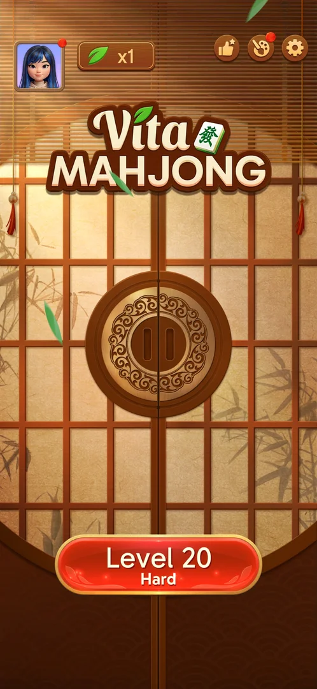
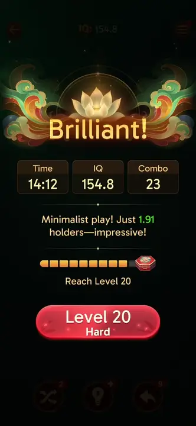
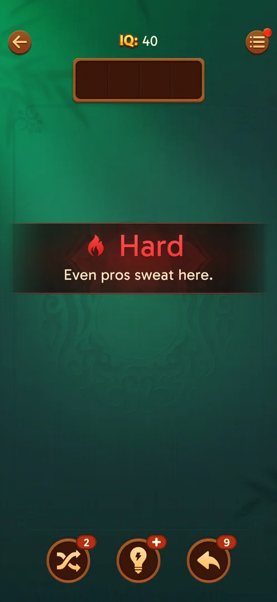
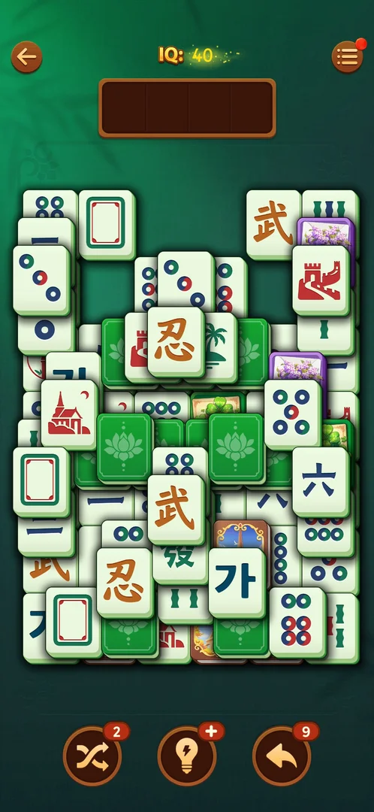
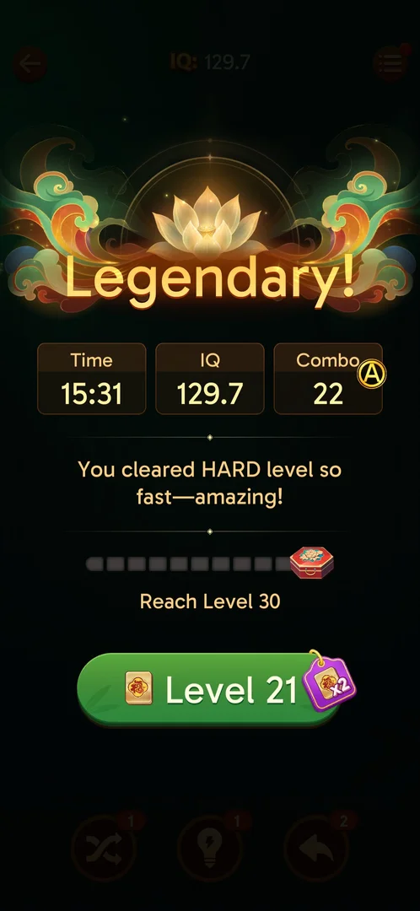

# Hard level

A numbered level the game marks as "Hard": the next-level button and the home Level button turn red with
the subtitle "Hard", and the level opens with a red "Hard" banner before its board [^s1] [^s2] [^s3].
Level 20 was Hard on version 3.40.1; level 10 was marked so in earlier sessions on 3.39.1 [^s4]. It is
played as a [Tray mahjong level](core-level.md): the same tray, rules, HUD and boosters, on a denser board
[^s3] [^s5]. Its win screen reads "Legendary!"
with a line on clearing a Hard level, and level 21 after it is an ordinary level [^s6]
[^s7].

## Why it appeared

Announced on the level 19 win screen: the next-level button turned red "Level 20 / Hard"; the Hard banner
showed when Level 20 opened [^s1] [^s3]. Hypothesis: every tenth level is Hard (level 10 on 3.39.1
[^s4], level 20 on 3.40.1, level 21 not Hard [^s7]); not verified, to be checked at level 30.

## Where to find it

Home screen > the Level button at the bottom, which reads "Level 20" with "Hard" under it and is red
instead of orange [^s2]. The same red button is the next-level button on the win screen of the level
before it (see [Tray mahjong level](core-level.md#outcomes)) [^s1].

 [^s2]
*The red "Level 20 / Hard" button at the bottom of the home screen*

Once leagues were open the button also carried a purple "x2" tag with a 福 tile (see [Leagues](leagues.md))
[^s8].

## What it looks like

The level opens on an empty table with a dark red banner across it: a flame icon, "Hard" in red and a
one-line subtitle, "Even pros sweat here." [^s3]. Then the board is laid out [^s3]:

 [^s3]
*Clip 5.6 s · [original on YouTube from 16:13](https://youtu.be/nmXrQmoLWlU?t=973)*

 [^s3]
*The banner Level 20 opens with*

 [^s3]
*The level 20 board: the same HUD, tray and boosters as any level*

- The HUD, the 4-slot tray and the three boosters are those of the base level [^s3].
- IQ starts at 40, as on level 19 [^s3].
- The board is denser: three or more layers, four green face-down backs on the top layer (see
  [Face-down tiles](face-down-tiles.md)) [^s3] [^s5].
- No timer and no move counter are shown [^s3].
- The boosters keep the counts left from level 19: Shuffle 2, Hint at zero (a "+" badge), Undo 9 [^s3]
  (see [Boosters](boosters.md)).
- In the next session Level 20 came up as a new board at IQ 40 in another tile set: white faces with blue
  backs [^s9].
- Gold 福 tiles fly to a counter at the top right when matched; at about three quarters cleared two
  encouragement lines ran across the top, starting "Deep breath!" and "That's the way!"
  [^s10].

### Result

 [^s11]
*The Hard win screen: "Legendary!"*

After the last pair the screens came in this order: the league standing, a notification pitch, the Daily
Victories panel, the win screen "Legendary!", the Rate Us popup, then the level chest opening over the win
screen [^s12] [^s13] [^s14]
[^s6] [^s15]. The level 19 win screen read
"Brilliant!" with a line about the holders [^s1]; the Hard one reads
"Legendary!" with "You cleared HARD level so fast—amazing!" [^s6]. Whether
the title depends on the Hard mark or on the time was not checked.

## How it works

Version 3.40.1.

- Same rules as the base level: free tiles go into the 4-slot tray, identical tiles leave [^s5].
- 13 moves over three rounds raised the IQ from 40 to 58.6 [^s2]; the
  won level ended at IQ 129.7, Time 15:31, Combo 22 [^s6].
- No limit beyond the tray was seen [^s3] [^s5].
- Out of space came twice; "-4 to revive" emptied the tray, kept the board and the IQ (45.4), and took
  the Undo count from 9 to 5 [^s16] [^s17]
  [^s18].
- The win's reward seen: the level chest, which fell on level 20 (Hint, a Level 20 avatar frame, Undo;
  see [Level progress chest](level-chest.md)), and 8 福 tiles for the league [^s19]
  [^s12]. Whether a Hard win gives more than an ordinary one was not seen.

## Outcomes

Each way a [Tray mahjong level](core-level.md) ends, under the Hard mark:

| Outcome | As the base or what differs | Frame |
|---|---|---|
| Quit with the back arrow <!-- case:under-quit --> | As the base: the back arrow goes home with no confirmation. Reopening Level 20 brought back the same board at IQ 58.6, without the Hard banner [^s5] | — |
| Win <!-- case:under-win --> | Seen, not closed in the map: "Legendary!" and the Hard line instead of "Brilliant!"; the post-win chain as above [^s6] |  |
| Restart <!-- case:under-restart --> | not verified | — |
| Restart from the in-level Options <!-- case:under-restart-menu --> | not verified | — |
| Exit the app <!-- case:under-exit-app --> | Seen, not closed in the map: on the next launch of the game, Level 20 came back as a new board at IQ 40 in another tile set [^s9] | — |
| Out of space <!-- case:under-out-of-space --> | Seen, not closed in the map: the base window (Revive, -4 to revive, Restart); -4 to revive took 4 Undos [^s17] | — |

## Cases

| Case | What was done | Result | Source |
|---|---|---|---|
| Why it appeared <!-- case:chk-appeared --> | Won level 19 | ✅ The next-level button turned red "Level 20 / Hard" | [^s1] |
| Where to find it <!-- case:chk-entry --> | Returned home after the win | ✅ The red "Level 20 / Hard" button on the previous win screen and on the home screen | [^s2] |
| What it looks like <!-- case:chk-screen --> | Opened Level 20 | ✅ The red Hard banner (flame, "Even pros sweat here."), then the base HUD and tray on a denser board | [^s3] |
| How it is announced <!-- case:chk-announce --> | Won level 19 | ✅ The win screen's next-level button turns red with the subtitle "Hard" (Level 20 Hard) | [^s1] |
| What differs in play from the base level <!-- case:chk-differs --> | Played 13 moves on Level 20 | ✅ Same rules, HUD, tray and boosters; a denser board (3+ layers, 4 green backs on top); the red Hard banner on the first open; IQ starts at 40; no timer or move limit | [^s3] [^s5] |
| Its win <!-- case:chk-win --> | Won level 20 | Seen: "Legendary!", the Hard line, the level chest; still open in the map | [^s6] |
| Each loss <!-- case:chk-loss --> | Ran out of space twice | Seen: the base Out of space window; still open in the map | [^s17] |
| Retry and continue offers after a loss <!-- case:chk-retry --> | Tapped "-4 to revive" | Seen: 4 Undos spent, the tray emptied, play went on; still open in the map | [^s17] |
| Where and how often it comes up <!-- case:chk-frequency --> | — | not verified: level 10 (3.39.1) and level 20 (3.40.1) Hard, level 21 not | [^s7] |

## Not verified

- Its win: whether the reward differs from an ordinary win <!-- case:chk-win -->
- Each loss: Restart and what a loss costs <!-- case:chk-loss -->
- Retry and continue offers: Revive (badge 5) not tried <!-- case:chk-retry -->
- Which levels are Hard: every tenth is a hypothesis (levels 10 and 20 seen) <!-- case:chk-frequency -->
- Win, Restart, an app exit and Out of space under the Hard mark: the win, the exit and Out of space are seen above, none closed in the map <!-- case:under-win --> <!-- case:under-restart --> <!-- case:under-exit-app --> <!-- case:under-out-of-space -->
- Restart from the in-level Options in a Hard level: as the base (no confirmation, a redeal) or what differs <!-- case:under-restart-menu -->

[^s1]: session 20261005-073804-chrono-2FYKPJ, step 47 — [video at 15:43](https://youtu.be/nmXrQmoLWlU?t=943)
[^s2]: session 20261005-073804-chrono-2FYKPJ, step 55 — [video at 19:26](https://youtu.be/nmXrQmoLWlU?t=1166)
[^s3]: session 20261005-073804-chrono-2FYKPJ, step 49 — [video at 16:48](https://youtu.be/nmXrQmoLWlU?t=1008)
[^s4]: session 20261003-195050-chrono-2FYKPJ, step 28 — [video at 7:46](https://youtu.be/KUKs3cQ-xqY?t=466)
[^s5]: session 20261005-073804-chrono-2FYKPJ, step 59 — [video at 21:09](https://youtu.be/nmXrQmoLWlU?t=1269)
[^s6]: session 20261005-133525-chrono-2FYKPJ, step 44 — [video at 17:24](https://youtu.be/D10jI230Oks?t=1044)
[^s7]: session 20261005-133525-chrono-2FYKPJ, step 48 — [video at 19:04](https://youtu.be/D10jI230Oks?t=1144)
[^s8]: session 20261005-133525-chrono-2FYKPJ, step 0 — [video at 0:00](https://youtu.be/D10jI230Oks?t=0)
[^s9]: session 20261005-133525-chrono-2FYKPJ, step 2 — [video at 0:44](https://youtu.be/D10jI230Oks?t=44)
[^s10]: session 20261005-133525-chrono-2FYKPJ, step 19 — [video at 7:37](https://youtu.be/D10jI230Oks?t=457)
[^s11]: session 20261005-133525-chrono-2FYKPJ, step 47 — [video at 18:42](https://youtu.be/D10jI230Oks?t=1122)
[^s12]: session 20261005-133525-chrono-2FYKPJ, step 41 — [video at 15:43](https://youtu.be/D10jI230Oks?t=943)
[^s13]: session 20261005-133525-chrono-2FYKPJ, step 42 — [video at 16:24](https://youtu.be/D10jI230Oks?t=984)
[^s14]: session 20261005-133525-chrono-2FYKPJ, step 43 — [video at 16:43](https://youtu.be/D10jI230Oks?t=1003)
[^s15]: session 20261005-133525-chrono-2FYKPJ, step 45 — [video at 18:05](https://youtu.be/D10jI230Oks?t=1085)
[^s16]: session 20261005-133525-chrono-2FYKPJ, step 9 — [video at 3:21](https://youtu.be/D10jI230Oks?t=201)
[^s17]: session 20261005-133525-chrono-2FYKPJ, step 10 — [video at 3:37](https://youtu.be/D10jI230Oks?t=217)
[^s18]: session 20261005-133525-chrono-2FYKPJ, step 31 — [video at 11:59](https://youtu.be/D10jI230Oks?t=719)
[^s19]: session 20261005-133525-chrono-2FYKPJ, step 46 — [video at 18:23](https://youtu.be/D10jI230Oks?t=1103)
