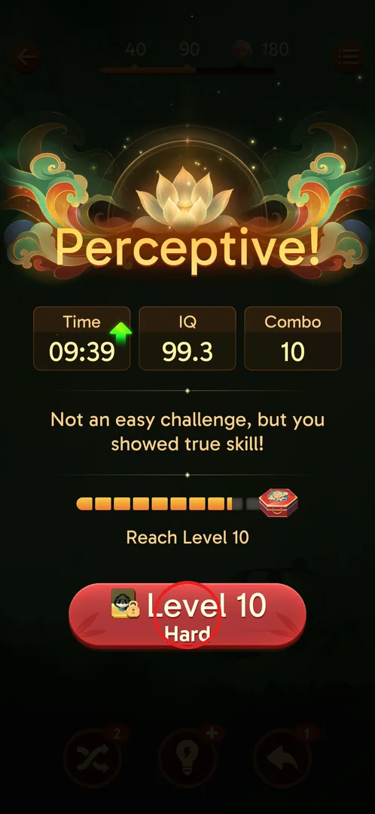
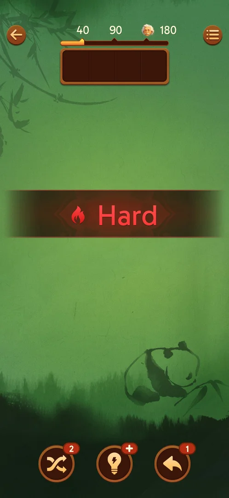
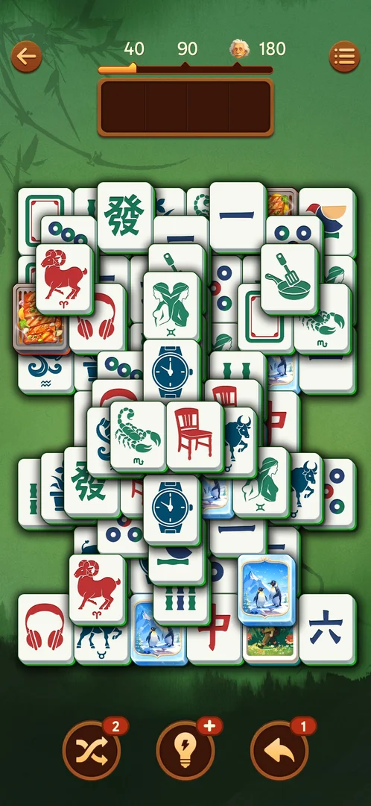
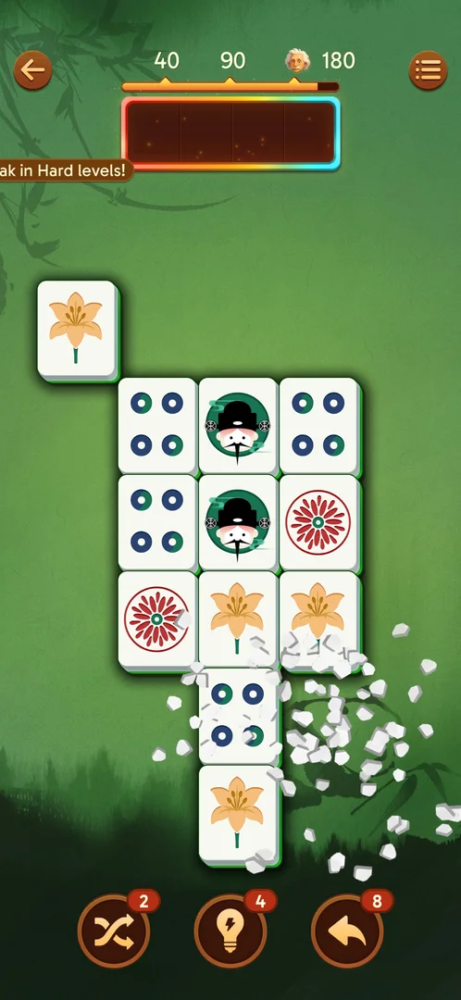

# Hard levels

Some levels of the main campaign are flagged "Hard": a bigger, more layered board that is played with the
same [rules](core-match.md), announced by a red button and a red flame banner. Level 10 is the first one
[^s1] [^s2]. Winning it gives a special win title and an "x2" tag on the next level button, which
doubles the [league](leagues.md) Elite Tiles of the next level [^s3] [^s6].

## Where to find it

<!-- no-entry: a Hard level has no button of its own in a menu; it is the next level of the campaign, started from the previous level's win screen (or the main screen's Level button). -->

On the win screen of the level before a Hard level, the next-level button is red instead of the usual
orange and carries the subtitle "Hard" under "Level 10". Tap it (circled) to start the Hard level
[^s1].

 [^s1]

## What it looks like

<!-- no-screen: a Hard level is a level type, played on the normal game board; what it adds is the intro banner, the board itself and the win screen. -->

The level opens with a red banner across the empty board: a flame icon and the word "Hard". The tiles
are dealt after it [^s2].

 [^s2]

## What you can do

| Tab or button | What it does |
|---|---|
| [Hard board](#hard-board) | The Hard board: played like any level, with the tray and the [boosters](boosters.md) |
| [Win screen](#win-screen) | After a Hard win: "Genius!", the Hard line, and the x2 tag on the next level |
| [Popup](#popup) | A ticker about Hard levels seen on an earlier, non-Hard level |

### Hard board

The Level 10 board has many layers and tile faces not seen before it (ram, Gemini, Scorpio, bull,
watch, pan, headphones, chair, penguin cards). The tray, Shuffle, Hint and Undo are the usual ones
[^s2]. The player won it in 9.6 min with 1 Undo and 1 Shuffle and no "Out of space"; tiles whose side
neighbours sit half a row offset are side-blocked too [^s5].

 [^s2]

### Win screen

A Hard win shows the title "Genius!" and the line "This HARD level was no match for your skills."
(Time 09:36, IQ 135.9, Combo 24) [^s5]. The next button (Level 11) is green, its badge became a golden
Elite Tile, and a purple "x2" tag with the golden tile hangs on it [^s5]. Level 10 also completes the
[level chest](level-chest.md): after it opens, the bar reads "Reach Level 20" [^s3].

 [^s3]

### Popup

On level 6, which is not Hard, a ticker slid in at the top left, cut off by the screen edge, ending
"…ak in Hard levels!" [^s4]. Inferred, not verified: a "win streak in Hard levels" message, like the
other-player ticker that slides in on win screens.

 [^s4]

## How it works

Version 3.39.1.

- Level 10 is the first Hard level; levels 9 and 11 were normal [^s1] [^s7].
- Signs of a Hard level: red "Level N / Hard" button on the previous win screen (normal levels: orange),
  red flame "Hard" banner at the start [^s1] [^s2].
- Reward for a Hard win: the next level gets an "x2" tag. In the league, Elite Tiles (golden tiles on the
  board) are the points, and the x2 tag doubles them: 1 pair of x2 tiles = 4 points [^s6].
- Leagues unlock right after the first Hard win: tapping Level 11 opens the Bronze League intro [^s7].
- No win-streak banner or reward appeared on levels 9–11 [^s7].

## Cases

| Case | What was done | Result | Source |
|---|---|---|---|
| First Hard level | Won level 9 and read the next button | Level 10 is the first Hard level: red "Level 10 / Hard" button, flame "Hard" banner at the start | ✅ [^s1] [^s2] |
| Win a Hard level | Won level 10 (9.6 min, 1 Undo, 1 Shuffle) | "Genius!", "This HARD level was no match for your skills.", x2 tag on the Level 11 button | ✅ [^s5] |
| The "…ak in Hard levels!" banner | Seen cut off on level 6; not seen again on levels 9–11 | full text and what the streak gives unknown | not verified [^s4] [^s7] |

## Not verified

- The interval between Hard levels (not 11–14).
- The full text of the banner "…ak in Hard levels!" seen on level 6, and whether a Hard-level win streak
  gives anything [^s4].
- Whether losing a Hard level differs from losing a normal one.

[^s1]: session 20260930-235817-chrono-2FYKPJ, step 21 — [video at 10:59](https://youtu.be/6yY68DCT4w0?t=659)
[^s2]: session 20260930-235817-chrono-2FYKPJ, step 22 — [video at 11:18](https://youtu.be/6yY68DCT4w0?t=678)
[^s3]: session 20260930-235817-chrono-2FYKPJ, step 42 — [video at 21:12](https://youtu.be/6yY68DCT4w0?t=1272)
[^s4]: session 20260930-221457-chrono-2FYKPJ, step 89
[^s5]: session 20260930-235817-chrono-2FYKPJ, step 41 — [video at 20:47](https://youtu.be/6yY68DCT4w0?t=1247)
[^s6]: session 20260930-235817-chrono-2FYKPJ, step 65 — [video at 34:45](https://youtu.be/6yY68DCT4w0?t=2085)
[^s7]: session 20260930-235817-chrono-2FYKPJ, step 67 — [video at 35:54](https://youtu.be/6yY68DCT4w0?t=2154)
