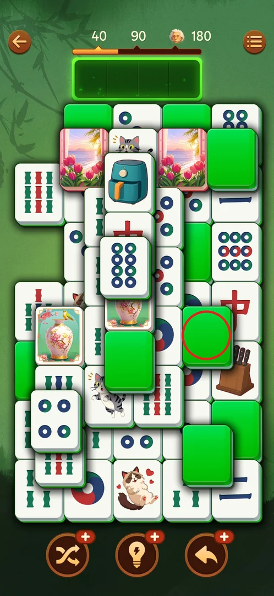
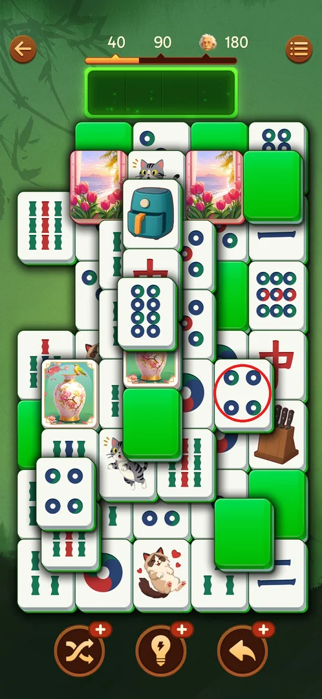
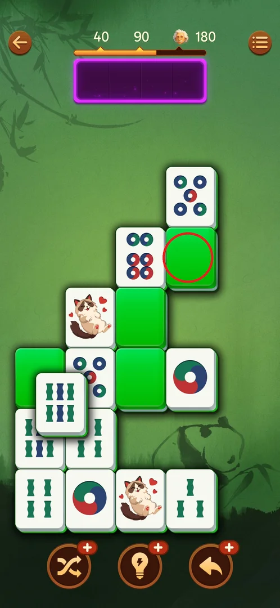
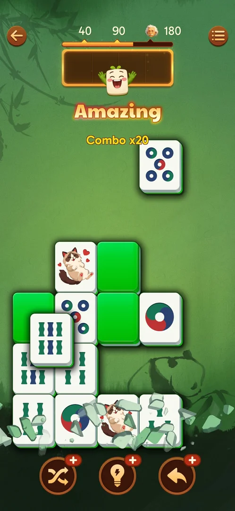
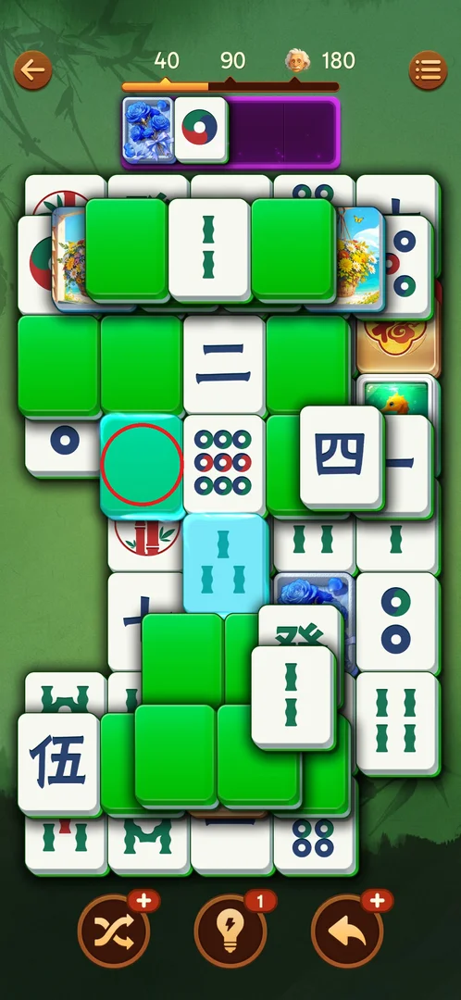
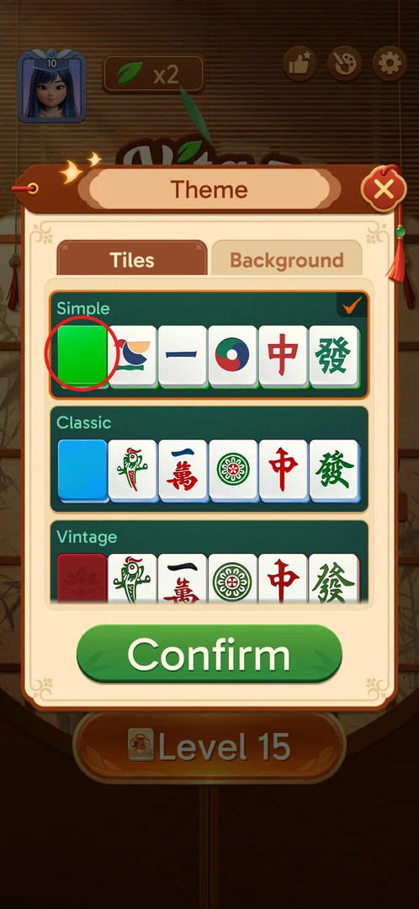

# Face-down green tiles

From level 11 on, some tiles on the board are dealt face down as plain green blanks with no symbol
[^s1]. The player does not know what a green is until they flip it. Tapping
a free green turns it face up in place without using a tray slot, and only one green stays face up at a
time [^s2]. The green is the tile back of the default "Simple" tile set
[^s3]. Apart from this, greens follow the normal [match rules](core-match.md).

## Where to find it

<!-- no-entry: face-down tiles have no button or menu; they are a tile type dealt on campaign boards from level 11 on, started with the usual Level button. -->

Play the campaign up to level 11, the first level after the [leagues](leagues.md) unlock. Its board is the
first one with green blanks (one is circled) [^s1].

 [^s1]

## What it looks like

<!-- no-screen: face-down tiles are played on the normal game board; the frames below show the board and what a tap on a green does. -->

A face-down tile is a bright green blank the size of a normal tile. Like any tile, it can be on top, half
under a neighbour or buried, and the usual free/locked rule applies. On level 17 there were nine greens on
the board at once, in several layers [^s4].

 [^s4]

## What you can do

| Tab or button | What it does |
|---|---|
| [Flip a green](#flip-a-green) | The first tap on a free green turns it face up in place; the tray is unchanged |
| [Only one face up](#only-one-face-up) | Flipping another green turns the previous one face down again |
| [Tap a green you have seen](#tap-a-green-you-have-seen) | Tapping a green whose face you already saw sends it straight into the tray |
| [Hint](#hint) | A Hint can highlight a green as half of a pair: the game knows its face |
| [Tile back](#tile-back) | The green is the tile back of the Simple tile set in Theme |

### Flip a green

On level 17, with an empty tray, one tap on a clearly free green (on top, with both neighbours drawn under
it) turned it face up in place as a 4-circle. Nothing went into the tray, and the flipped tile was then
matched like any face-up tile [^s5] [^s6].
So flipping gives information without using a tray slot. The same happened on levels 11, 12 (resumed), 13,
14 and 15 [^s1] [^s7]
[^s8] [^s9].

 [^s5]

### Only one face up

Only one flipped green stays face up. When you flip another green, the one flipped before it turns face
down again [^s10] [^s2]. In the frame, the
8-circle in the middle is the green that was just flipped. The circled green was flipped earlier, showed
the other 8-circle, and is blank again [^s11].

 [^s11]

### Tap a green you have seen

Tapping a face-down green whose face you already saw sends it straight into the tray, and it matches if
its twin is there [^s2]. In the frame, the player put the 8-circle into the
tray, then tapped the green they remembered as the other 8-circle once: it went in and the pair cleared
(Amazing, Combo x20) [^s2]. Tapping a green that is still face up after a
flip also takes it, so the second tap moves it to the tray [^s7]
[^s9].

 [^s2]

### Hint

A Hint can pair a face-down green with a face-up tile. On level 12 it highlighted a green and a 3-bamboo,
and the green turned out to be the 3-bamboo [^s12]
[^s13]. So the game knows the hidden face, and a hint is one way to find out
what a green is.

 [^s12]

### Tile back

In Theme > Tiles (the palette button on the main screen), the selected "Simple" set has a plain green
tile back. The "Classic" set has a blue back and "Vintage" has a red one
[^s3]. Inferred, not verified: with another tile set, the face-down tiles
take that set's back colour.

 [^s3]

## How it works

Version 3.39.1.

- The first level with face-down tiles is level 11 [^s1]. Every level
  played since, 12 to 18, had greens [^s14] [^s15]
  [^s16].
- Tapping a free green flips it face up in place and uses no tray slot [^s17].
- Only one green is face up at a time. Flipping another turns the previous one back
  [^s17].
- Tapping a green whose face was already seen sends it straight into the tray
  [^s17].
- A [Shuffle](boosters.md) moves the greens as well: after the shuffle on level 15, the greens and the
  face-up tiles were in a different arrangement [^s9].
- A player method that worked: end each batch of certain pairs with one green flip, then pair the revealed
  tile in the next batch. Flip only when the tray holds at most 1 tile
  [^s10] [^s15].

> ⚠️ Previously (v3.39.1, 2026-10-01): on level 12 a free green went straight into the tray on the first
> tap [^s18]. On level 16, 3 of 9 free greens did the same and the rest
> flipped in place [^s15]. The level 17 test settled the rule: the first tap
> flips a green, and a green already seen goes to the tray [^s17]. Inferred,
> not verified: the greens that went straight in had been flipped and seen earlier.

## Cases

| Case | What was done | Result | Source |
|---|---|---|---|
| First level with greens | Played levels 1–11 | Level 11 (the first after the leagues unlock) | ✅ [^s1] |
| Tap a free green, empty tray | One tap on a free green on level 17 | It flipped face up in place (a 4-circle) and used no tray slot | ✅ [^s5] |
| Flip a second green | Flipped another green | The first one turned face down again | ✅ [^s10] [^s2] |
| Tap a seen green | Tapped a face-down green seen earlier as the twin of a tray tile | It went straight into the tray and matched | ✅ [^s2] |
| Hint with greens | Used a Hint on level 12 | It highlighted a green and a 3-bamboo; the green was the 3-bamboo | ✅ [^s13] |
| Free green straight into the tray | Tapped free greens on levels 12 and 16 | Some went into the tray on the first tap (L16: 3 of 9) | ⚠️ unexplained [^s18] [^s15] |
| Tap a locked green | Tapped greens covered by other tiles on level 12 | Noted once as "ignores taps" and later as "shows its face and stays" | not verified [^s19] [^s18] |

## Not verified

- What tapping a locked green does: nothing, or a peek at its face [^s19]
  [^s18].
- Why some free greens went straight into the tray on the first tap (L12, L16), and whether they had been
  seen before.
- Whether the face-down tiles change colour with the Classic or Vintage tile set.

[^s1]: session 20260930-235817-chrono-2FYKPJ, step 51 — [video at 26:32](https://youtu.be/6yY68DCT4w0?t=1592)
[^s2]: session 20261001-110957-chrono-2FYKPJ, step 32
[^s3]: session 20261001-083725-chrono-2FYKPJ, step 17
[^s4]: session 20261001-110957-chrono-2FYKPJ, step 11
[^s5]: session 20261001-110957-chrono-2FYKPJ, step 12
[^s6]: session 20261001-110957-chrono-2FYKPJ, step 13
[^s7]: session 20261001-031723-chrono-2FYKPJ, step 41
[^s8]: session 20261001-031723-chrono-2FYKPJ, step 86
[^s9]: session 20261001-063226-chrono-2FYKPJ, step 64
[^s10]: session 20261001-083725-chrono-2FYKPJ, step 43
[^s11]: session 20261001-110957-chrono-2FYKPJ, step 31
[^s12]: session 20261001-010125-chrono-2FYKPJ, step 48 — [video at 21:17](https://youtu.be/vc6OylgqaTw?t=1277)
[^s13]: session 20261001-010125-chrono-2FYKPJ, step 49 — [video at 21:39](https://youtu.be/vc6OylgqaTw?t=1299)
[^s14]: session 20261001-010125-chrono-2FYKPJ, step 72 — [video at 31:29](https://youtu.be/vc6OylgqaTw?t=1889)
[^s15]: session 20261001-083725-chrono-2FYKPJ, step 73
[^s16]: session 20261001-110957-chrono-2FYKPJ, step 67
[^s17]: session 20261001-110957-chrono-2FYKPJ, step 71
[^s18]: session 20261001-010125-chrono-2FYKPJ, step 64 — [video at 27:48](https://youtu.be/vc6OylgqaTw?t=1668)
[^s19]: session 20261001-010125-chrono-2FYKPJ, step 29 — [video at 11:42](https://youtu.be/vc6OylgqaTw?t=702)
