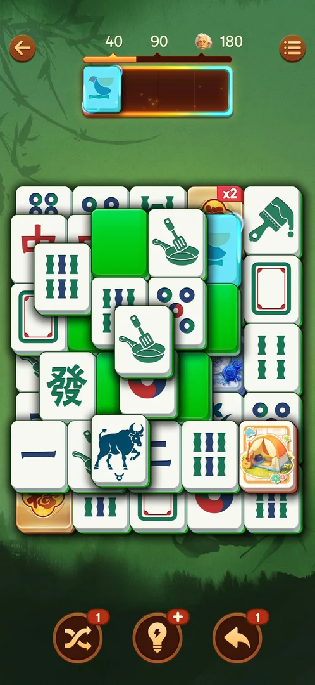

# Face-down green tiles

Face-down green tiles first appear on level 11 [s:20260930-235817-chrono-2FYKPJ#51]. Hints can pair a green with a face-up tile:
the game knows the hidden face [s:20261001-010125-chrono-2FYKPJ#49].

> ⚠️ Previously (v3.39.1, 2026-10-01): "a free green flips face up in place, no tray slot" [s:20260930-235817-chrono-2FYKPJ#51].
> On level 12 a free green went straight into the tray [s:20261001-010125-chrono-2FYKPJ#64], and on the resumed level 12 and on
> level 13 the first tap flipped it and the second took it [s:20261001-031723-chrono-2FYKPJ#41] [s:20261001-031723-chrono-2FYKPJ#86]. The rule is not settled.

## Cases
| Case | What was done | Result | Source |
|---|---|---|---|
| Locked green | Tapped | Shows its face (peek) and stays | [s:20261001-010125-chrono-2FYKPJ#64] |

## Not verified

- What one tap on a free green does (flip in place or straight into the tray).
