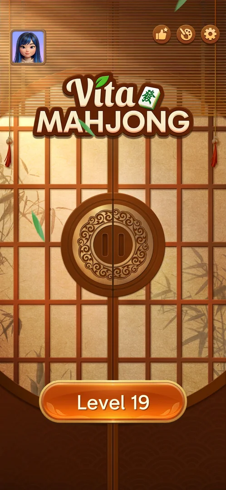
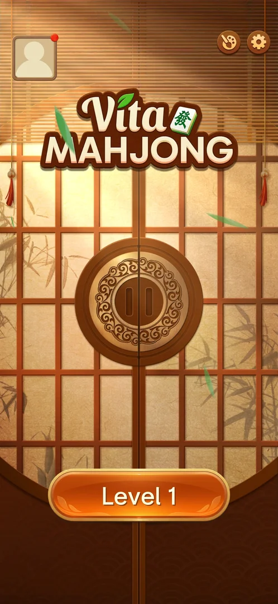
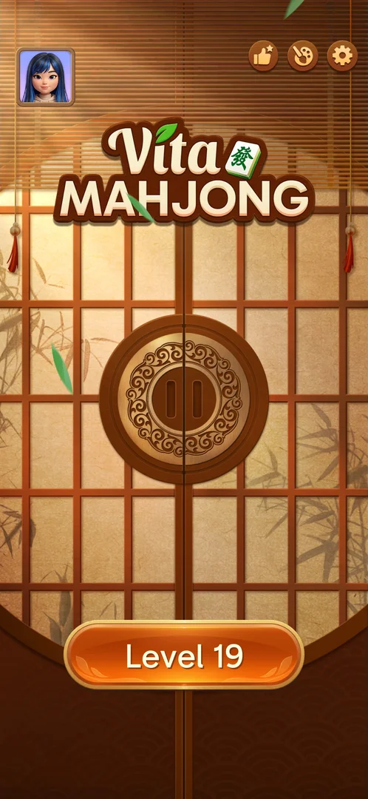

# Home screen

The game's hub: a single screen of closed sliding paper doors under the Vita Mahjong logo, with the
Level N button at the bottom and a few round buttons on top. At level 19 there is no shop, no coin
balance, no daily reward and no event button [^s2].

## Why it appeared

The first launch, after the consent, the loading screen, the age popup and the saved-game prompt [^s1].

## Where to find it

<!-- no-entry: the hub; the game opens on it after loading, and the level's back arrow returns to it -->
The game opens on it after the loading screen; the back arrow of a level and of Achievements return to it
[^s4] [^s2].

## What it looks like

 [^s2]
*Home at level 19 after a level visit: avatar, Achievements, Theme, Settings, Level 19*

- Top left: the player's avatar, which opens [Profile](profile.md) [^s3].
- Top right: the thumbs-up with a star ([Achievements](achievements.md), only after a level visit), the
  palette ([Theme](theme.md)) and the gear ([Settings](settings.md)) [^s4] [^s3].
- Centre: the logo and the closed doors [^s2].
- Bottom: the orange "Level N" button, which opens the next level ([Tray mahjong level](core-level.md))
  [^s2].

## What you can do

| Tab or button | What it does |
|---|---|
| [Avatar](#avatar) | Opens Profile |
| [Achievements button](#achievements-button) | Opens Achievements |
| [Palette](#palette) | Opens Theme |
| [Gear](#gear) | Opens Settings |
| [Level button](#level-button) | Opens the current level |

### Avatar

 [^s1]
*The avatar button top left, here with its red dot on the first visit*

Opens [Profile](profile.md). Its red dot disappeared once Profile had been opened [^s3].

### Achievements button

 [^s4]
*The thumbs-up-with-a-star button appeared after leaving a level*

Opens [Achievements](achievements.md) [^s4].

### Palette

 [^s3]
*The palette button with its red dot, left of the gear*

Opens [Theme](theme.md) [^s3].

### Gear

 [^s3]
*The gear, top right corner*

Opens [Settings](settings.md) [^s3].

### Level button

 [^s4]
*The Level 19 button*

Opens the level with a door-opening transition (see [Tray mahjong level](core-level.md)) [^s4].

## How it works

Version 3.40.1.

- Right after Sync Data the screen showed Level 1 and a grey placeholder avatar; a few seconds later it
  showed Level 19 and the restored avatar (see [Saved game sync](cloud-sync.md)) [^s1].
- Red dots: on the avatar until Profile was opened; on the palette after the sync [^s3]. On a later
  launch that reopened at Level 1, the avatar had a red dot and the palette none; once the save was
  restored both the avatar and the palette had red dots [^s5].
- On arrival at level 19 the top right had two buttons (palette, gear). After the player opened level 19
  and left it with the back arrow, a third (Achievements) was there [^s3] [^s4].

## Cases

| Case | What was done | Result | Source |
|---|---|---|---|
| Home: avatar, theme palette, settings gear, logo, shoji doors, Level N button <!-- case:chk-screen --> | Arrived after the sync | ✅ | [^s3] |
| The hub: the game opens on it after loading; the level back arrow returns to it <!-- case:chk-entry --> | Left level 19 with the back arrow | ✅ | [^s4] |
| Why it appeared: the trigger that brought it up (the first launch, a level won, a threshold, a timer, a loss): a fact with its frame, or a hypothesis to test <!-- case:chk-appeared --> | Fresh install | ✅ After the first-launch prompts | [^s1] |
| Every entry point on it: open (a feature), locked or unclear <!-- case:chk-entries --> | Opened every button | ✅ at level 19: Profile, Achievements, Theme, Settings, Level; nothing locked shown | [^s2] |
| Red dots after a restore <!-- case:badge-theme --> | Restored the save (Start Over > No) on a launch at Level 1 | ✅ The palette had no dot on the Level 1 home; after the restore the palette and the avatar both had red dots | [^s5] |
| Badges, timers and counters on it and what each points to <!-- case:chk-badges --> | Opened the avatar and the palette | partly: red dots on the avatar (Profile) and the palette (Theme); no timers or counters | [^s3] |
| What changes on it with progress (new buttons, a moving map, a theme) <!-- case:chk-changes --> | Level visit | partly: Achievements appears after a level visit; changes over further levels not seen | [^s4] |

## Not verified

- Badges: what the palette's red dot points to <!-- case:chk-badges -->
- What changes with progress: buttons that appear at later levels (shop, daily, events, leagues) <!-- case:chk-changes -->

[^s1]: session 20261003-195050-chrono-2FYKPJ, step 4 — [video at 1:18](https://youtu.be/KUKs3cQ-xqY?t=78)
[^s2]: session 20261003-195050-chrono-2FYKPJ, step 28 — [video at 7:53](https://youtu.be/KUKs3cQ-xqY?t=473)
[^s3]: session 20261003-195050-chrono-2FYKPJ, step 10 — [video at 3:07](https://youtu.be/KUKs3cQ-xqY?t=187)
[^s4]: session 20261003-195050-chrono-2FYKPJ, step 22 — [video at 6:03](https://youtu.be/KUKs3cQ-xqY?t=363)
[^s5]: session 20261003-231804-chrono-2FYKPJ, step 3 — [video at 0:59](https://youtu.be/ssTmhwls_uc?t=59)
