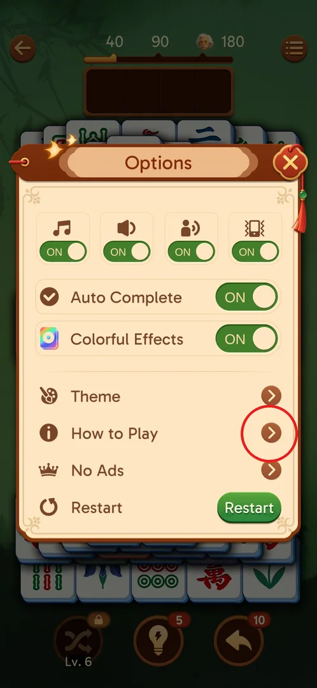
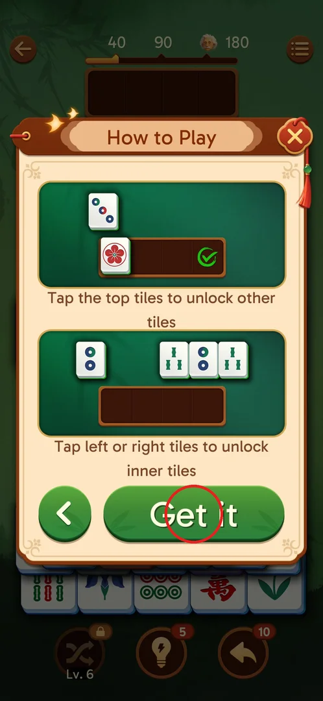

# How to Play

How to Play is the game's built-in rules card: a two-page popup that recaps the basics of a level —
identical tiles are matched through the 4-slot [tray](tray.md), and only free tiles (nothing on top,
an open left or right side) can be taken [^s2] [^s3]. It is a reference you can open at any time
during a level; it has no rewards and changes nothing in the game [^s3] [^s4].

## Where to find it

Inside a level: tap the menu button (three lines, top right of the level screen) to open
[Options](level-options.md), then tap the **How to Play** row (the "i" icon, between Theme and
No Ads) [^s1]. The main screen's [Settings](settings.md) popup (gear icon) has no How to Play row: it
lists Feedback, Join Facebook Group, About, Save your progress and Share with Friends [^s5].

 [^s1]

## What it looks like

A cream popup titled **How to Play** over the level board, with a close X in the top right corner.
Each page has two green illustrations with a caption under each, and a green button at the bottom:
**Next** on page 1, a back arrow and **Get it** on page 2 [^s2] [^s3].

 [^s2]

## What you can do

| Tab or button | What it does |
|---|---|
| [Page 1](#page-1) | Shows how matching through the tray works; **Next** opens page 2 |
| [Page 2](#page-2) | Shows which tiles are free to tap; the back arrow returns to page 1, **Get it** closes the popup |

### Page 1

Two illustrations [^s2]:

- "Match the same tiles!" — two identical tiles (two dots) above the empty 4-slot tray;
- "Non-adjacent tiles can be matched" — a two-dots tile waits in the tray next to a bamboo tile, and
  the second two-dots tile joins it: the pair does not have to be tapped one right after the other,
  the tray keeps unrelated tiles until the twin arrives (reading of the illustration).

**Next** opens page 2 [^s3].

 [^s2]

### Page 2

Two illustrations [^s3]:

- "Tap the top tiles to unlock other tiles" — a tile lying on top is tapped into the tray, with a
  green check mark in the tray;
- "Tap left or right tiles to unlock inner tiles" — in a row of three, the outer tiles are taken to
  free the middle one.

The green back arrow returns to page 1; **Get it** closes the popup and returns to the level board
[^s3] [^s4].

 [^s3]

## How it works

- Version 3.39.1: two pages, four rules [^s2] [^s3]. The same rules are taught by the level 1
  tutorial and are described in full on the [core loop](core-match.md) page.
- Get it returned to the same level 2 board as before Options was opened; the level was not
  restarted [^s4].

## Cases

| Case | What was done | Result | Source |
|---|---|---|---|
| Open How to Play | On level 2: menu button → Options → How to Play, then Next, then Get it | Page 1 and page 2 shown as above; Get it returned to the level board | ✅ [^s3] [^s4] |

## Not verified

- The close X and the back arrow on page 2 were not tapped.
- Whether How to Play opens by itself for new players (for example after the tutorial) was not seen.

[^s1]: session 20260930-211039-chrono-2FYKPJ, step 133
[^s2]: session 20260930-211039-chrono-2FYKPJ, step 134
[^s3]: session 20260930-211039-chrono-2FYKPJ, step 135
[^s4]: session 20260930-211039-chrono-2FYKPJ, step 136
[^s5]: session 20260930-211039-chrono-2FYKPJ, step 125
