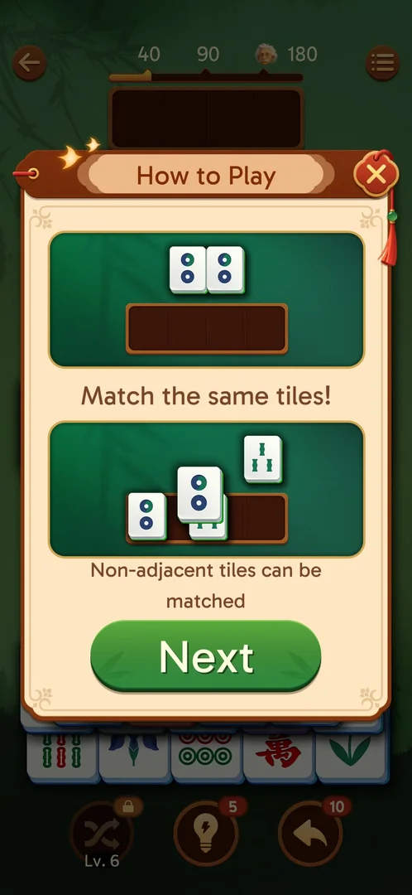

# How to Play

Options → How to Play, two pages: "Match the same tiles!", "Non-adjacent tiles can be matched"; "Tap the
top tiles to unlock other tiles", "Tap left or right tiles to unlock inner tiles"; Get it [s:20260930-211039-chrono-2FYKPJ#134] [s:20260930-211039-chrono-2FYKPJ#135].

