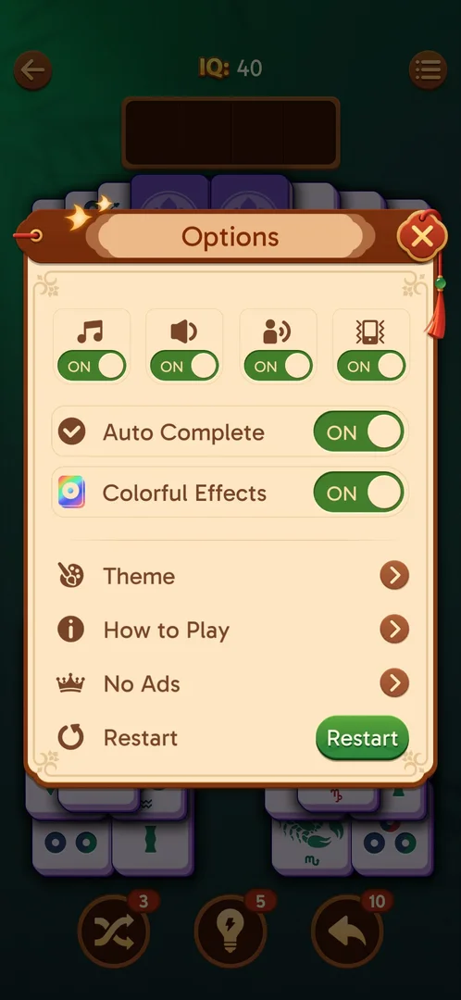
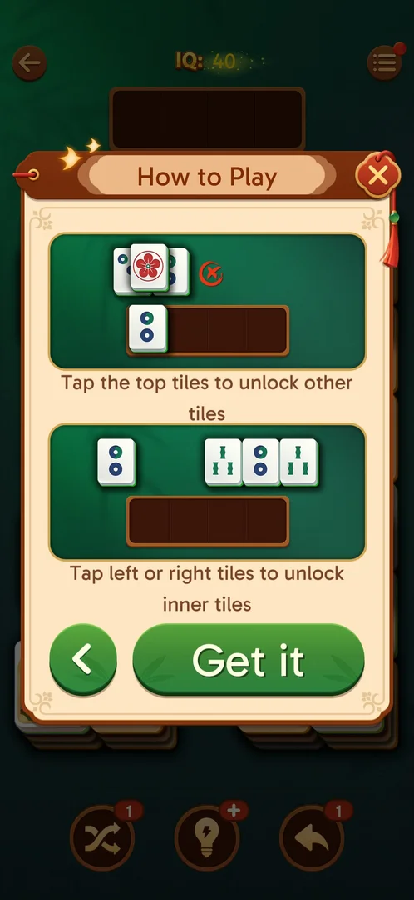

# How to Play

A two-page rules popup, opened from the level's Options. Each page has two illustrated panels with one
line of text each: how tiles match in the tray and how covered tiles are freed [^s1] [^s3]. The same two
pages were shown again on level 21 two days later [^s4] [^s5].

## Why it appeared

A row in the in-level Options menu, present when the menu was first opened at level 19 [^s1].

## Where to find it

Level screen > menu button (three lines, top right) > Options > the "How to Play" row (an "i" icon),
under Theme [^s2].

 [^s2]
*The "How to Play" row in the in-level Options*

## What it looks like

 [^s4]
*Page 1: matching in the tray; Next goes to page 2, the X closes the popup*

A popup over the level, titled "How to Play", with a red close X top right. Each page: two green panels,
each with a caption, and the buttons at the bottom [^s1] [^s4].

## What you can do

| Tab or button | What it does |
|---|---|
| [Page 1](#page-1) | Matching; Next opens page 2 |
| [Page 2](#page-2) | Freeing tiles; back arrow to page 1, Get it closes |
| [Close X](#close-x) | Closes the popup from either page, back to the level |

### Page 1

<!-- no-frame: page 1 is the frame above -->
- "Match the same tiles!": two identical tiles side by side in the tray [^s1].
- "Non-adjacent tiles can be matched": a row of alternating tiles above an empty tray [^s1].
- Next opens page 2 [^s3] [^s5].

### Page 2

 [^s5]
*Page 2: covered tiles and row ends; Get it closes the popup*

- "Tap the top tiles to unlock other tiles": a covered tile is marked as blocked [^s3].
- "Tap left or right tiles to unlock inner tiles": the end of a row is taken first [^s3].
- A back arrow returns to page 1; Get it closes the popup and returns to the level [^s3].

### Close X

<!-- no-frame: the X is on the frames above, top right of the popup -->
Tapped on page 2: the popup closed straight to the level 21 board, the same as Get it [^s6].

## How it works

Version 3.40.1. Two pages, no animation; neither page mentions face-down tiles (see
[Face-down tiles](face-down-tiles.md)) [^s3]. It can be opened again at any time from the level's Options:
it was opened at level 19 and again at level 21, with the same two pages [^s2] [^s4] [^s5]. Nothing is
required to close it: the X skips the rest [^s6].

## Cases

| Case | What was done | Result | Source |
|---|---|---|---|
| Level Options > How to Play <!-- case:chk-entry --> | Opened from the level 19 Options | ✅ | [^s1] |
| Two pages: matching via the tray; top and row-end tiles unlock others; Get it <!-- case:chk-screen --> | Read both pages | ✅ | [^s3] |
| Why it appeared: the trigger that brought it up (the first launch, a level won, a threshold, a timer, a loss): a fact with its frame, or a hypothesis to test <!-- case:chk-appeared --> | Opened the level's Options | ✅ A row there | [^s1] |
| Each step and what it teaches, with a frame (an animated hand is a clip) <!-- case:chk-steps --> | Next, then Get it | ✅ Two pages, two panels each, no animation | [^s3] [^s5] |
| Whether it can be skipped, and what happens when the app is left in the middle of it <!-- case:chk-skip --> | Tapped the close X on page 2 (level 21) | ✅ The popup closes straight to the level board; leaving the app in the middle not tried | [^s6] |
| Where it ends and what opens after it <!-- case:chk-end --> | Tapped Get it | ✅ The popup closes on the level | [^s3] |
| Whether it can be seen again (How to play, a help button) <!-- case:chk-replay --> | Opened it at level 19, then at level 21 | ✅ Always in the level's Options | [^s2] [^s4] |

## Not verified

- Leaving the app in the middle of the popup
- Whether the same pages are shown as a tutorial on level 1 of a new player

[^s1]: session 20261003-195050-chrono-2FYKPJ, step 19 — [video at 5:11](https://youtu.be/KUKs3cQ-xqY?t=311)
[^s2]: session 20261003-195050-chrono-2FYKPJ, step 18 — [video at 4:51](https://youtu.be/KUKs3cQ-xqY?t=291)
[^s3]: session 20261003-195050-chrono-2FYKPJ, step 20 — [video at 5:26](https://youtu.be/KUKs3cQ-xqY?t=326)
[^s4]: session 20261005-221108-chrono-2FYKPJ, step 7 — [video at 1:58](https://youtu.be/3FoFiC5gYbs?t=118)
[^s5]: session 20261005-221108-chrono-2FYKPJ, step 8 — [video at 2:07](https://youtu.be/3FoFiC5gYbs?t=127)
[^s6]: session 20261005-221108-chrono-2FYKPJ, step 9 — [video at 2:14](https://youtu.be/3FoFiC5gYbs?t=134)
