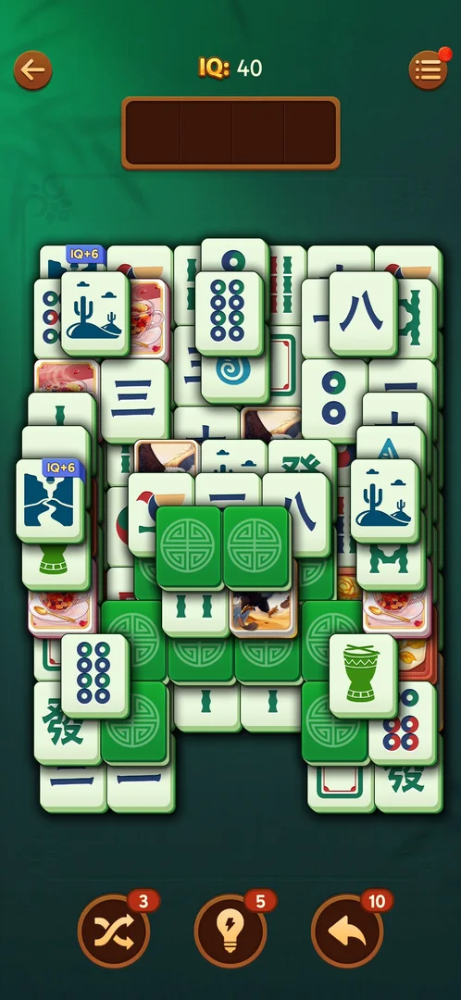

# IQ bonus tiles

Tiles on the level board that carry a small blue banner with "IQ+" and a number on their top edge. The
rest of the tile is an ordinary face, a mahjong symbol or a picture [^s3]. Inferred from the banner's
text: matching such a tile adds that many points to the level's IQ score (see [IQ score](iq-score.md)).
No banner tile has been matched yet, so what it gives is not verified.

## Why it appeared

Hypothesis: they are part of the board the game generates for a level, the way face-down and picture
tiles are. Two boards of level 19 on 3.40.1 had them: "IQ+9" on the first, "IQ+6" after the app was
reopened [^s1] [^s3]. An earlier session saw an "IQ+10" tile on level 8 [^s4]. The first level they show
on is not known. Not verified.

## Where to find it

Home screen > the orange "Level 19" button at the bottom. The tiles are on the board of the level it
opens. They have no control of their own [^s2].

 [^s2]
*The "Level 19" button opens a board with IQ bonus tiles*

## What it looks like

 [^s3]
*Two tiles with a blue "IQ+6" banner: one half covered at the top left, one free at the left edge*

- The banner is a blue tab with white text, "IQ+6" or "IQ+9", over the top left of the tile's face
  [^s1] [^s3].
- The banner is on mahjong faces and on picture tiles alike [^s3].
- Two tiles had the banner on each board: two "IQ+9" on the first board [^s1] and two "IQ+6" on the
  next [^s3]. Inferred: the banner is on both tiles of one pair. Not verified: the faces under the
  banners are partly covered.

## How it works

Version 3.40.1.

- The banner value differs per board: +9 on one board of level 19, +6 on another, +10 on level 8 in an
  earlier session [^s1] [^s3] [^s4].
- An ordinary pair adds +0.4 IQ on a fresh board (40 to 40.4) [^s5]. What a banner pair adds is not
  verified.
- Nothing else about these tiles has been seen yet: they are not tapped any differently, and the game
  did not introduce them on the boards seen.

## Outcomes

<!-- the map has no under-<outcome> cases for this feature yet -->

| Outcome | As the base or what differs | Frame |
|---|---|---|
| Win | not verified: no banner tile was matched before a win was recorded | — |
| Out of space (loss) | not verified | — |
| Restart, exit the app | As the base ([Tray mahjong level](core-level.md)): the board is new, with banner tiles again and a different value (+9, then +6) | — |

## Cases

| Case | What was done | Result | Source |
|---|---|---|---|
| Where to find it <!-- case:chk-entry --> | Opened Level 19 from the home screen | ✅ On the board of the level from the home Level button; no separate entry | [^s1] |
| What it looks like <!-- case:chk-screen --> | Opened level 19, then again after reopening the app | ✅ A blue "IQ+9" / "IQ+6" banner on the top edge of a tile, on mahjong faces and on picture tiles alike | [^s3] |
| Why it appeared <!-- case:chk-appeared --> | — | not verified: seen on level 19 and level 8 boards, trigger unknown | [^s1] |
| The first level it shows on and how the game introduces it <!-- case:chk-first-level --> | — | not verified | |
| What it does and how it is used <!-- case:chk-rules --> | — | not verified: no banner tile matched | |
| How it interacts with the other pieces <!-- case:chk-interactions --> | — | not verified | |
| Whether it adds a way to lose <!-- case:chk-loss --> | — | not verified | |

## Not verified

- Why it appeared: what puts banner tiles on a board <!-- case:chk-appeared -->
- The first level they show on and whether the game introduces them <!-- case:chk-first-level -->
- What matching a banner pair adds to the IQ, and whether the banner is on both tiles of the pair <!-- case:chk-rules -->
- How they interact with face-down tiles, the combo and the boosters <!-- case:chk-interactions -->
- Whether they add a way to lose <!-- case:chk-loss -->

[^s1]: session 20261005-002327-chrono-2FYKPJ, step 2 — [video at 0:53](https://youtu.be/2aQPmh7YksQ?t=53)
[^s2]: session 20261005-002327-chrono-2FYKPJ, step 1 — [video at 0:41](https://youtu.be/2aQPmh7YksQ?t=41)
[^s3]: session 20261005-002327-chrono-2FYKPJ, step 11 — [video at 3:46](https://youtu.be/2aQPmh7YksQ?t=226)
[^s4]: session 20260930-225122-chrono-2FYKPJ, step 76
[^s5]: session 20261005-002327-chrono-2FYKPJ, step 13 — [video at 4:31](https://youtu.be/2aQPmh7YksQ?t=271)
