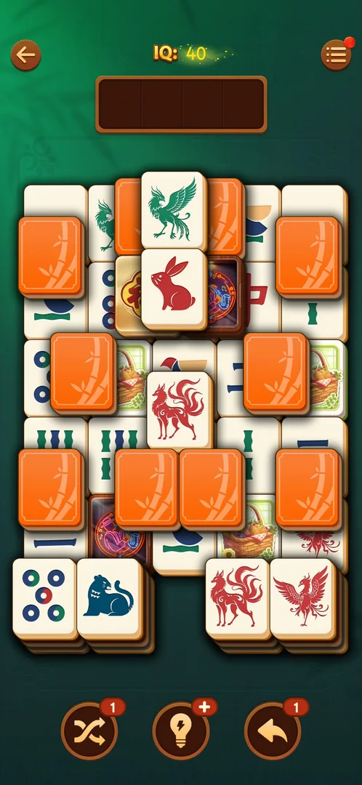
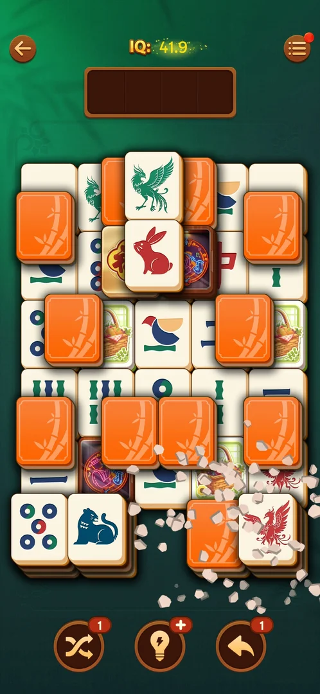

# IQ score

A number labelled "IQ" at the top of every level screen. It grows as pairs are matched: 40 at the start
of level 21, 41.9 after the first pair [^s2] [^s4]. It has no screen and no control of its own: a tap on
it does nothing [^s3].

## Why it appeared

On the level screen when level 19 was opened, "IQ: 40" [^s1]. Earlier sessions saw tiles marked "IQ+N"
on the board (see [IQ bonus tiles](iq-bonus-tiles.md)); that is from the map, not seen in these
sessions [^s1].

## Where to find it

Any level > the "IQ:" counter at the top centre of the level screen, between the back arrow and the menu
button [^s2].

 [^s2]
*The "IQ: 40" counter at the top centre of the level screen, between the back arrow and the menu*

## What it looks like

 [^s4]
*"IQ: 41.9" after the first pair; the sparkles show the counter changing*

The word "IQ:" in gold, then the number in yellow-green, with one decimal place once it is not whole
[^s2] [^s4]. There is no bar, goal or level shown next to it [^s4].

## How it works

Version 3.40.1.

- The counter was 40 at the start of level 19 and again at the start of level 21 [^s1] [^s2]. Inferred:
  it starts each level from the same value, or did not change between these sessions; not verified.
- Matching one ordinary pair (two red fox tiles, the first pair of level 21, no combo) raised it from 40
  to 41.9, +1.9 [^s2] [^s4].
- A tap on the counter opens nothing: the frame did not change [^s3].
- No tiers, rewards or completion were seen at any value (40 to 41.9) [^s4].
- Level 21 was left after that pair, so whether the IQ is kept after leaving a level is not known [^s5].

## Cases

| Case | What was done | Result | Source |
|---|---|---|---|
| Why it appeared: the trigger that brought it up (the first launch, a level won, a threshold, a timer, a loss): a fact with its frame, or a hypothesis to test <!-- case:chk-appeared --> | Opened level 19 | ✅ In the level HUD | [^s1] |
| Where to find it: the screen and the button that open it <!-- case:chk-entry --> | Opened level 21; tapped the counter | ✅ Level screen, top centre; a tap opens nothing | [^s2] [^s3] |
| What it looks like: its screen <!-- case:chk-screen --> | Opened level 21; matched a pair | ✅ Gold "IQ:" and a number with one decimal | [^s2] [^s4] |
| The progress: the bar, the album or the counter, what fills it and where it is now <!-- case:chk-progress --> | Matched the first pair on level 21 | ✅ A counter, 40 to 41.9; no bar or goal | [^s4] |
| The items: every set, skin or tier, which are owned and which are locked, with their condition <!-- case:chk-items --> | Looked at the counter | ✅ Not applicable: a single counter, no sets or tiers | [^s4] |
| How an item or a step is earned (wins, keys, a spin, a pack) <!-- case:chk-earn --> | Matched one pair of red foxes | ✅ +1.9 for the pair; IQ+N tiles give more by earlier notes | [^s4] |
| Using an item: equip a skin, open a chest, spin; what changes <!-- case:chk-use --> | Tapped the counter | ✅ Not applicable: nothing opens, nothing is spent | [^s3] |
| Completing a set or the bar: the reward <!-- case:chk-complete --> | Watched the counter from 40 to 41.9 | ✅ Not applicable: no goal or reward seen | [^s4] |

## Not verified

- How much a pair adds in general: whether +1.9 depends on the tile, the combo or the level
- What an IQ+N bonus tile pair adds (see [IQ bonus tiles](iq-bonus-tiles.md))
- Whether the IQ is kept when a level is won, lost or left, and what it is at the end of a level

[^s1]: session 20261003-195050-chrono-2FYKPJ, step 17 — [video at 4:17](https://youtu.be/KUKs3cQ-xqY?t=257)
[^s2]: session 20261006-001538-chrono-2FYKPJ, step 10 — [video at 2:22](https://youtu.be/urpt1SjTsek?t=142)
[^s3]: session 20261006-001538-chrono-2FYKPJ, step 11 — [video at 2:43](https://youtu.be/urpt1SjTsek?t=163)
[^s4]: session 20261006-001538-chrono-2FYKPJ, step 12 — [video at 2:55](https://youtu.be/urpt1SjTsek?t=175)
[^s5]: session 20261006-001538-chrono-2FYKPJ, step 13 — [video at 3:08](https://youtu.be/urpt1SjTsek?t=188)
