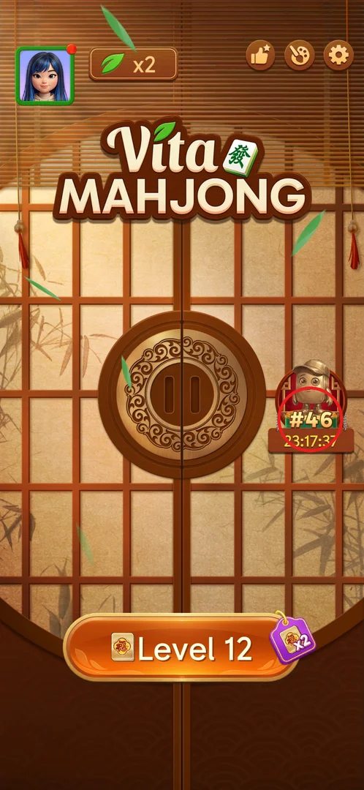
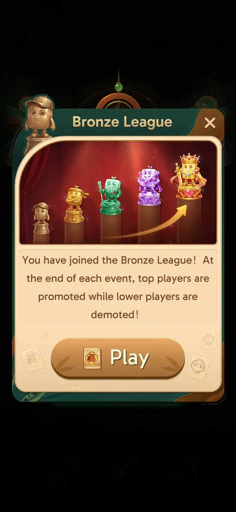
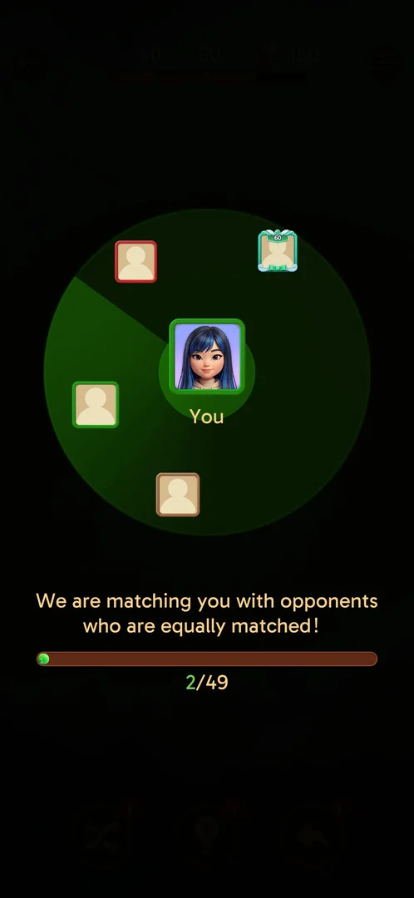
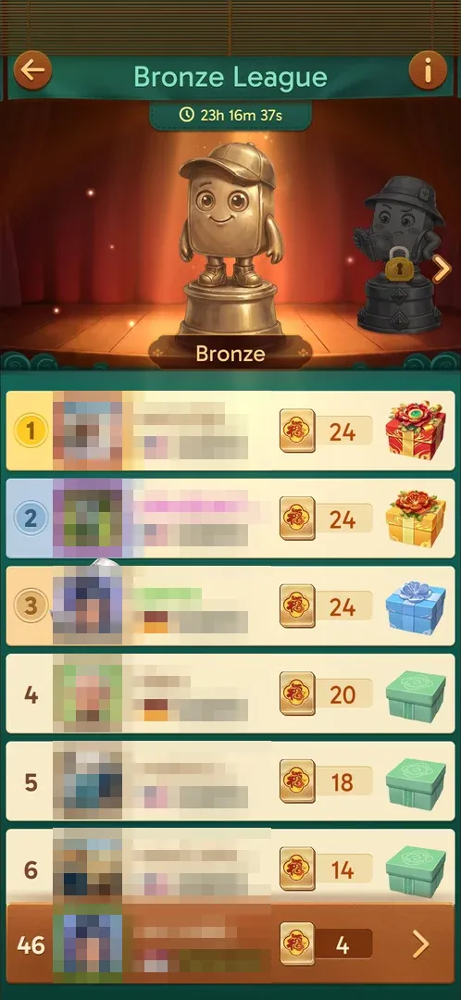
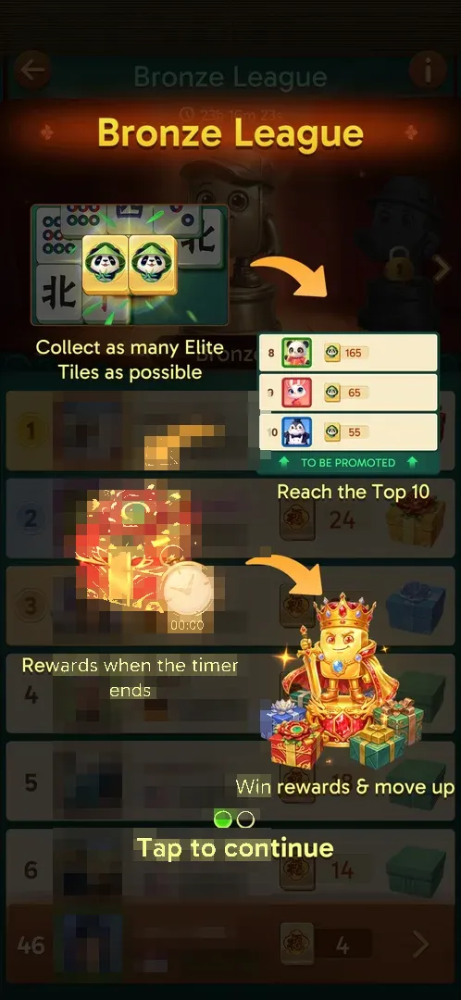
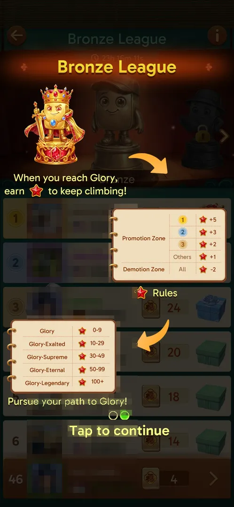
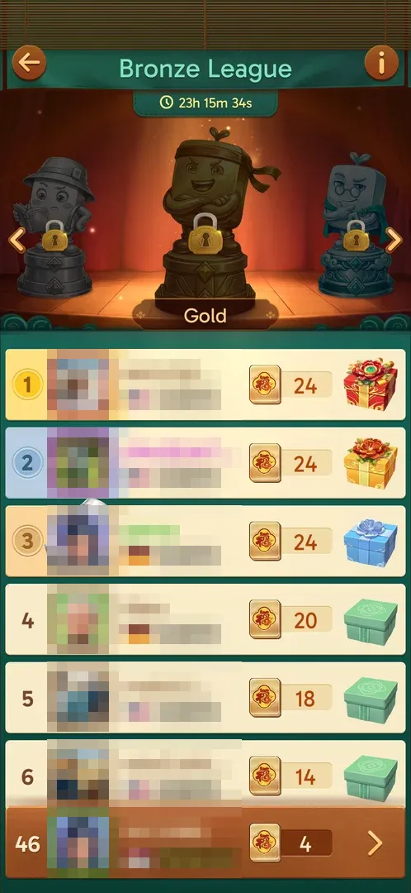
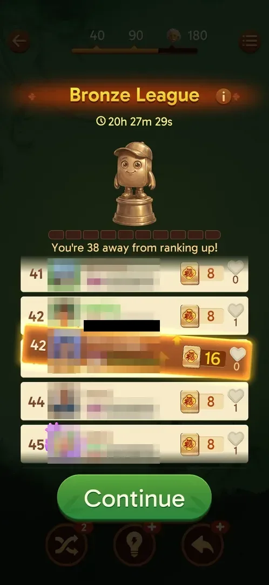
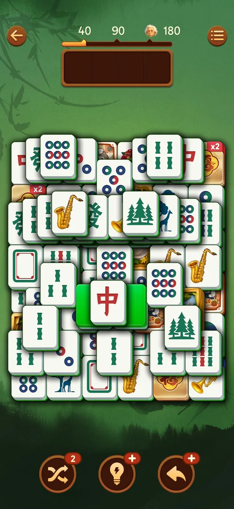

# Leagues

A competitive leaderboard event that opens after level 10. The player is put in a group of 50 and
earns league points by matching golden Elite Tiles (the 福 tile) in ordinary levels; when the event
timer (about 24 h) runs out, the top of the group is promoted to the next league and the bottom is
demoted, and ranks get reward boxes [^s8] [^s7] [^s3]. Above the named leagues is Glory, where stars
instead of points decide the rank [^s4].

## Where to find it

The league badge on the right side of the main screen: a statue of the current league with the
current rank (`#46`) and the event countdown under it. Tapping it opens the league board [^s1] [^s2].
Before level 10 the main screen has no league entry (checked after levels 3 and 6) [^s9]. The board
also opens by itself after each won level, before the win screen [^s6] [^s17].

 [^s1]

The first time, after the level-10 win, the next Level tap shows a Bronze League intro popup (five
statues in a row; "top players are promoted while lower players are demoted" at the end of each
event) with a Play button, then a matchmaking screen that fills a group ("2/49") [^s8] [^s7].

 [^s8]

 [^s7]

## What it looks like

The board has a title with the league name, the event timer, a statue carousel of the leagues and the
ranked list of the group. Each row shows the rank, the player's avatar, name and country flag, when
they last played ("20m ago" or "Playing now"), their Elite Tile points and a reward box: ranks 1–2
flowered gift boxes, rank 3 a blue gift, rank 4 and below green boxes. The own row is pinned at the
bottom. The info button (i) is at the top right, the back arrow at the top left [^s2]. Tapping a
reward box shows nothing [^s5]; the chevron on the own row starts the current level [^s12].

 [^s2]

## What you can do

| Tab or button | What it does |
|---|---|
| [Rules](#rules) | Info (i), page 1: how points, promotion and rewards work |
| [Glory stars](#glory-stars) | Info (i), page 2: the star rules and tiers of the top league |
| [League ladder](#league-ladder) | The arrows beside the statue walk through the leagues |
| [After a level](#after-a-level) | The board shown after each won level, with the rank change |

### Rules

The (i) button opens a two-page tutorial over the board. Page 1: collect as many Elite Tiles as
possible, reach the Top 10 to be promoted ("TO BE PROMOTED" under rank 10), rewards are given when the
timer ends, win rewards and move up. Tap to continue to page 2 [^s3]. The same tutorial pops up
mid-level right after the first Elite Tile pair is matched [^s10].

 [^s3]

### Glory stars

Page 2: once the player reaches Glory, stars decide the rank. Promotion zone: 1st +5, 2nd +3,
3rd +2, others +1 star; demotion zone: −2 stars. Tiers: Glory 0–9, Glory·Exalted 10–29,
Glory·Supreme 30–49, Glory·Eternal 50–99, Glory·Legendary 100+ stars [^s4].

 [^s4]

### League ladder

The arrows beside the statue scroll through the leagues: Bronze → Silver (a bucket-hat statue,
reading) → Gold (a headband) → a 4th league (glasses) whose name is not shown. Every league above the
current one is locked [^s5].

 [^s5]

### After a level

After each won level the board shows the points just earned, the new rank with a message ("You
climbed up 5 spots fast", "You're in the TOP 10! Keep your position!", "You have claimed the 2nd
place"), a 10-segment bar "You're N away from ranking up" and a Continue button; then the win screen
[^s10] [^s6] [^s15] [^s16] [^s17]. Rows here also carry a heart with a count [^s6] [^s16]. After the
first such board the game asked to turn on notifications "to stay on top of the leaderboard"; it was
closed with X [^s20].

 [^s6]

## How it works

Version 3.39.1.

- **Unlock:** winning level 10 [^s8].
- **Group:** 50 players, matched at the start ("2/49") [^s7].
- **Event:** about 24 h — the first board showed 23h45m53s [^s10]; the board keeps counting down
  (23h16m, 20h27m, 17h33m) [^s2] [^s6] [^s15].
- **Points:** golden 福 Elite Tiles appear in levels; a matched pair flies to a counter at the right
  edge of the tray [^s11]. Some level buttons carry a purple "x2" Elite tag (L11–L13, gone on L14),
  which doubles the points [^s14] [^s11].

 [^s14]

| After level | x2 tag | Points | Rank | Source |
|---|---|---|---|---|
| L11 | yes | 4 | 44 | [^s10] |
| L12 | yes | 8 (+4) | 48 | [^s13] |
| L13 | yes | 16 (+8) | 42 | [^s6] |
| L14 (one 福 pair) | no | 20 (+4) | 6 | [^s15] |
| L16 | no | 26 | 2 | [^s16] |

- **Rank moves without play:** the main badge showed #7 at the start of a session after rank 42 at the
  end of the previous one [^s19] (inferred: ranks are recomputed as the group plays).
- **Promotion:** Top 10 of the group [^s3]. Rewards are given when the timer ends [^s3].
- **Leagues:** Bronze, Silver, Gold, a locked 4th [^s5]; Glory with star tiers at the top [^s4]. The
  achievements screen has a "League Reached" row with 6 mascots [^s18].

> ⚠️ Previously (v3.39.1, 2026-09-30): "Five league tiers: Bronze, Gold, Jade, Amethyst, King" (from
> the intro statues [^s8]). The ladder arrows later showed Bronze, Silver, Gold and a locked 4th
> league [^s5].

## Cases

| Case | What was done | Result | Source |
|---|---|---|---|
| No league before level 10 | Checked the main screen after levels 3 and 6 | No league entry | [^s9] |
| Unlock | Won L10, tapped Level 11 | Bronze League intro popup, then matchmaking 2/49 | [^s8] [^s7] |
| First Elite pair | Matched the first 福 pair on L11 | Tutorial mid-level, then the board: rank 44, 4 points | [^s10] |
| Points over levels | Won L12, L13, L14, L16 | 8 → 16 → 20 → 26 points; rank 48 → 42 → 6 → 2 | [^s13] [^s6] [^s15] [^s16] |
| Rules | Tapped (i) | Two pages: Top 10 promoted, rewards at timer end; Glory stars and tiers | [^s3] [^s4] |
| Ladder | Tapped the statue arrows | Bronze, Silver, Gold, locked 4th | [^s5] |
| Reward box | Tapped the rank-1 gift | Nothing happened | [^s5] |
| Own-row chevron | Tapped the chevron on the pinned own row | The current level started | [^s12] |
| League names disagree | Compared the intro statues with the ladder | Intro: bronze, gold, jade, amethyst, crowned king; ladder: Bronze, Silver, Gold, locked 4th | [^s8] [^s5] |

## Not verified

- The end of a league event: promotion, demotion and the rewards (the first event ran from about
  2026-10-01 00:20 for about 24 h) [^s10].
- What the reward boxes contain.
- The names of the leagues after Gold and before Glory.
- What the heart counter on the rows is (likes from other players?) and what tapping it does [^s16].
- Tapping another player's row.
- What grants the x2 Elite tag and how long it lasts (L11–L13, after the Hard L10 win; gone on L14)
  [^s14]; the points per pair do not fit one rule: L11 gave 4 with x2, the player's later note says
  +4 per pair without x2 and +8 with it [^s10] [^s11].

[^s1]: session 20261001-010125-chrono-2FYKPJ, step 0 — [video at 0:00](https://youtu.be/vc6OylgqaTw?t=0)
[^s2]: session 20261001-010125-chrono-2FYKPJ, step 3 — [video at 1:08](https://youtu.be/vc6OylgqaTw?t=68)
[^s3]: session 20261001-010125-chrono-2FYKPJ, step 4 — [video at 1:27](https://youtu.be/vc6OylgqaTw?t=87)
[^s4]: session 20261001-010125-chrono-2FYKPJ, step 5 — [video at 1:38](https://youtu.be/vc6OylgqaTw?t=98)
[^s5]: session 20261001-010125-chrono-2FYKPJ, step 9 — [video at 2:16](https://youtu.be/vc6OylgqaTw?t=136)
[^s6]: session 20261001-031723-chrono-2FYKPJ, step 95
[^s7]: session 20260930-235817-chrono-2FYKPJ, step 44 — [video at 21:55](https://youtu.be/6yY68DCT4w0?t=1315)
[^s8]: session 20260930-235817-chrono-2FYKPJ, step 43 — [video at 21:33](https://youtu.be/6yY68DCT4w0?t=1293)
[^s9]: session 20260930-221457-chrono-2FYKPJ, step 93
[^s10]: session 20260930-235817-chrono-2FYKPJ, step 65 — [video at 34:45](https://youtu.be/6yY68DCT4w0?t=2085)
[^s11]: session 20261001-063226-chrono-2FYKPJ, step 64
[^s12]: session 20261001-110957-chrono-2FYKPJ, step 70
[^s13]: session 20261001-031723-chrono-2FYKPJ, step 52
[^s14]: session 20261001-031723-chrono-2FYKPJ, step 96
[^s15]: session 20261001-063226-chrono-2FYKPJ, step 30
[^s16]: session 20261001-083725-chrono-2FYKPJ, step 73
[^s17]: session 20261001-110957-chrono-2FYKPJ, step 41
[^s18]: session 20260930-221457-chrono-2FYKPJ, step 5
[^s19]: session 20261001-063226-chrono-2FYKPJ, step 0
[^s20]: session 20260930-235817-chrono-2FYKPJ, step 66
