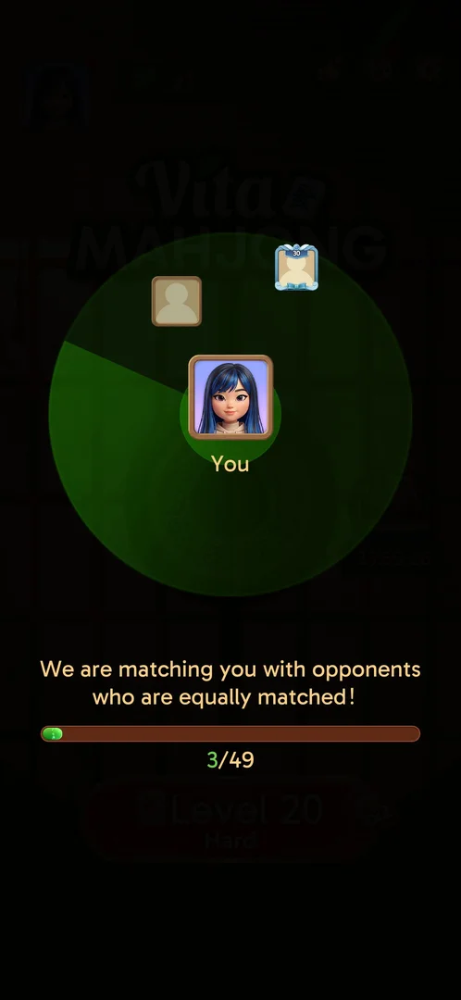
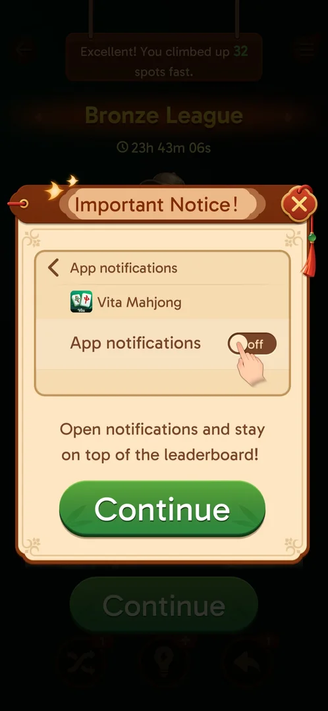

# Leagues

A competition between groups of players. The player is put into the Bronze League, matched with 49
opponents, and ranked by the 福 tiles collected on levels; at the end of each event the top 10 move up a
league, and the top ranks get gift boxes [^s1] [^s2] [^s12] [^s15].
The standing shows after each won level, and a badge on the home screen shows the rank and the time left
and opens the league screen [^s3] [^s4] [^s12].

## Why it appeared

A popup "You have joined the Bronze League!" on the first launch after level 19 was won, with the Hard
level 20 next [^s1]. At level 19 the home screen had no league button, while
Achievements already counted leagues reached and 1st places [^s5]
[^s6]. The lock was not read on any screen: it opened at level 20, after the
level 19 win.

## Where to find it

Home screen > the league badge at the right edge, halfway down: a bronze trophy figure, the rank and the
time left under it [^s4]. A tap on it opens the league screen after a short door transition [^s12].

 [^s4]
*The league badge right of the doors: rank #18, the time left*

## What it looks like

 [^s12]
*The league screen opened from the home badge; players' names, avatars and flags blacked out*

- Header: the back arrow (returns home [^s20]), the league's name, the info (i) button, the time left
  [^s12].
- A stage with the league's trophy figure and its name; the next league's trophy stands locked at the
  right, with an arrow [^s12].
- The list: rank, avatar, name and country flag, the 福 tile count, and a gift box on the rows that win
  one [^s12]. The player's own row is pinned at the bottom; a tap on it scrolls the list to the player's
  place [^s19].
- Gift boxes were seen on ranks 1 to 6: rank 1 red-gold, rank 2 orange, rank 3 blue, ranks 4 to 6
  green; ranks 15 to 20 and 23 to 31 had none [^s12] [^s13] [^s14]. Ranks 7 to 14 were scrolled past
  unseen.

### Standing after a won level

 [^s3]
*The standing after a won level; players' names and flags blacked out*

- Top: a line on the change ("You climbed up 32 spots fast"), the league's name and the time left
  [^s3].
- A bronze trophy figure (a tile mascot in a cap), a 10-segment bar and "You're 8 away from ranking up!"
  [^s3].
- The list: rank, avatar, name and country flag, the 福 tile count, a heart with a number (1 on the
  player's row, 0 on the others) [^s3]. What the hearts count was not seen.

### Matchmaking

 [^s2]
*Matchmaking: 3 of 49 opponents found*

After the join popup was closed the game opened the Profile popup by itself (avatar, name, country,
Save); closing it started the matchmaking, and when it finished the Hard level 20 opened straight away
[^s7] [^s2]. The Profile frame is not shown: it
holds the account's name (see [Profile](profile.md)).

## What you can do

| Tab or button | What it does |
|---|---|
| [Play](#play) | The join popup's button; the popup was closed with its X instead |
| [Info](#info) | The (i) button on the league screen: two pages of rules |
| [Trophy arrows](#trophy-arrows) | Steps the stage through the league trophies; the list stays the player's league |
| [Continue](#continue) | Closes the standing after a won level |
| [Notifications](#notifications) | A pitch to turn on the app's notifications; closed with X |

### Play

 [^s1]
*The join popup on the first launch at level 20*

Five leagues are drawn on the popup, from bronze to a crowned gold figure [^s1];
Achievements has six league badges on its League Reached shelf [^s5]. Play
was not tapped: the X closed the popup [^s7].

### Info

 [^s15]
*Rules page 1: tiles, rewards, the promotion line, higher leagues; names behind the overlay blacked out*

 [^s16]
*Rules page 2: stars in the Glory league*

A tap anywhere moves to page 2, a second tap closes the rules [^s16] [^s17]. Page 1 draws the points as
panda "Elite Tiles", while the board and the standing count 福 tiles [^s15] [^s12]. Inferred: the Elite
tile's art changes from event to event; not verified. In the page's sample the promotion line is under
rank 10 [^s15].

### Trophy arrows

 [^s18]
*The right arrow shows the next league, Silver, locked; names, avatars and flags blacked out*

The right arrow by the stage moves it to the next league: Silver, with a padlock; the next trophy at the
right is locked too [^s18]. The header and the list stay on the Bronze League [^s18]. Only Silver was
opened; the further trophies were not stepped through.

### Continue

<!-- no-frame: the button is on the standing frame above -->
Closed the standing; the notification pitch came next, then the Daily Victories panel and the win screen
[^s8] [^s9].

### Notifications

 [^s8]
*The notification pitch after the standing*

Continue would lead to the phone's settings; the X closed it without a change
[^s8] [^s9].

## How it works

Version 3.40.1.

- A group of 50: the matchmaking counts 49 opponents [^s2].
- Points are 福 tiles: gold tiles with the 福 character fly to a counter at the top right of the board when
  matched [^s10]. After the Hard level 20 the player had 8 and rank 18,
  having climbed 32 places [^s3]. The next day, with no level played in between, the player was rank 24
  with the same 8; rank 1 had 30 [^s12].
- The Hard level 20 button carried a purple "x2" tag with a 福 tile, and so does the Level 21 button, an
  ordinary (orange) level; on the level 21 board the 福 tiles carry a red "x2" badge [^s1]
  [^s11] [^s21]. Inferred: each 福 tile counts twice on these levels; not verified. The x2 tag is not
  limited to Hard levels [^s21].
- The event's timer: 23h 43m left right after the join, 13h 19m left about 10.5 hours later [^s3]
  [^s12]. Inferred: an event lasts about a day and this one ends about 24 hours after the join.
- Promotion: the top 10 of the group are "To be promoted" to the next league, by the rules page
  [^s15]. Leagues seen: Bronze, Silver, then a gold one (the trophy stage and rules page 1); the join
  popup draws five [^s1] [^s15] [^s18].
- Demotion: the join popup says lower players are demoted [^s1]; no demotion zone is shown on the Bronze
  list.
- Rewards: a gift box per rank, in four kinds: red-gold for rank 1, orange for 2, blue for 3, green from
  4 [^s12]. What the boxes hold was not seen.
- The Glory league (top): instead of moving up, players earn stars: rank 1 +5, rank 2 +3, rank 3 +2,
  others in the promotion zone +1; everyone in the demotion zone −2. Glory ranks by stars: Glory 0-9,
  Exalted 10-29, Supreme 30-49, Eternal 50-99, Legendary 100+ [^s16].

## Cases

| Case | What was done | Result | Source |
|---|---|---|---|
| Why it appeared <!-- case:chk-appeared --> | Launched the game after the level 19 win | ✅ The Bronze League join popup | [^s1] |
| Where to find it <!-- case:chk-entry --> | Tapped the league badge on the home screen | ✅ It opens the league screen | [^s4] [^s12] |
| What it looks like <!-- case:chk-screen --> | Won the Hard level 20; opened the league screen | ✅ The standing after a win and the league screen: trophy stage, timer, ranked list with gift boxes, own row pinned | [^s3] [^s12] |
| The board <!-- case:chk-board --> | Won the Hard level 20; scrolled the league list | ✅ A group of 50; rank 18 after one win, rank 24 the next day with the same 8 福 | [^s3] [^s12] |
| What earns points <!-- case:chk-points --> | Won the Hard level 20 | ✅ 福 tiles, 8 after one level with an x2 tag | [^s3] |
| The period and its timer <!-- case:chk-period --> | Read the timer after the join and the next day | ✅ 23h 43m, then 13h 19m left: about a day | [^s3] [^s12] |
| Rewards per rank, promotion and relegation <!-- case:chk-rewards --> | Opened the league screen and its rules | ✅ Gift boxes for ranks 1 (red-gold), 2 (orange), 3 (blue), 4+ (green); top 10 promoted; Glory stars +5/+3/+2/+1, −2 in the demotion zone; box contents not seen | [^s12] [^s15] [^s16] [^s19] |
| The end of a period <!-- case:chk-end --> | — | not verified | |

## Not verified

- The end of an event: the results screen, what the gift boxes hold, promotion to Silver <!-- case:chk-end -->
- Which ranks get a gift box (seen on 1-6, none on 15-20 and 23-31; 7-14 not seen)
- What the hearts on the standing count
- Whether the Bronze League demotes anyone (no demotion zone seen on its list)
- Whether the x2 tag doubles the 福 tiles counted

[^s1]: session 20261005-133525-chrono-2FYKPJ, step 0 — [video at 0:00](https://youtu.be/D10jI230Oks?t=0)
[^s2]: session 20261005-133525-chrono-2FYKPJ, step 2 — [video at 0:44](https://youtu.be/D10jI230Oks?t=44)
[^s3]: session 20261005-133525-chrono-2FYKPJ, step 41 — [video at 16:14](https://youtu.be/D10jI230Oks?t=974)
[^s4]: session 20261005-133525-chrono-2FYKPJ, step 49 — [video at 20:30](https://youtu.be/D10jI230Oks?t=1230)
[^s5]: session 20261003-195050-chrono-2FYKPJ, step 23 — [video at 6:19](https://youtu.be/KUKs3cQ-xqY?t=379)
[^s6]: session 20261003-195050-chrono-2FYKPJ, step 28 — [video at 7:46](https://youtu.be/KUKs3cQ-xqY?t=466)
[^s7]: session 20261005-133525-chrono-2FYKPJ, step 1 — [video at 0:34](https://youtu.be/D10jI230Oks?t=34)
[^s8]: session 20261005-133525-chrono-2FYKPJ, step 42 — [video at 16:54](https://youtu.be/D10jI230Oks?t=1014)
[^s9]: session 20261005-133525-chrono-2FYKPJ, step 43 — [video at 17:14](https://youtu.be/D10jI230Oks?t=1034)
[^s10]: session 20261005-133525-chrono-2FYKPJ, step 19 — [video at 7:49](https://youtu.be/D10jI230Oks?t=469)
[^s11]: session 20261005-133525-chrono-2FYKPJ, step 48 — [video at 19:41](https://youtu.be/D10jI230Oks?t=1181)
[^s12]: session 20261006-001538-chrono-2FYKPJ, step 1 — [video at 0:41](https://youtu.be/urpt1SjTsek?t=41)
[^s13]: session 20261006-001538-chrono-2FYKPJ, step 2 — [video at 1:01](https://youtu.be/urpt1SjTsek?t=61)
[^s14]: session 20261006-001538-chrono-2FYKPJ, step 3 — [video at 1:11](https://youtu.be/urpt1SjTsek?t=71)
[^s15]: session 20261006-001538-chrono-2FYKPJ, step 4 — [video at 1:21](https://youtu.be/urpt1SjTsek?t=81)
[^s16]: session 20261006-001538-chrono-2FYKPJ, step 5 — [video at 1:30](https://youtu.be/urpt1SjTsek?t=90)
[^s17]: session 20261006-001538-chrono-2FYKPJ, step 6 — [video at 1:41](https://youtu.be/urpt1SjTsek?t=101)
[^s18]: session 20261006-001538-chrono-2FYKPJ, step 7 — [video at 1:48](https://youtu.be/urpt1SjTsek?t=108)
[^s19]: session 20261006-001538-chrono-2FYKPJ, step 8 — [video at 1:58](https://youtu.be/urpt1SjTsek?t=118)
[^s20]: session 20261006-001538-chrono-2FYKPJ, step 9 — [video at 2:13](https://youtu.be/urpt1SjTsek?t=133)
[^s21]: session 20261006-001538-chrono-2FYKPJ, step 13 — [video at 3:08](https://youtu.be/urpt1SjTsek?t=188)
