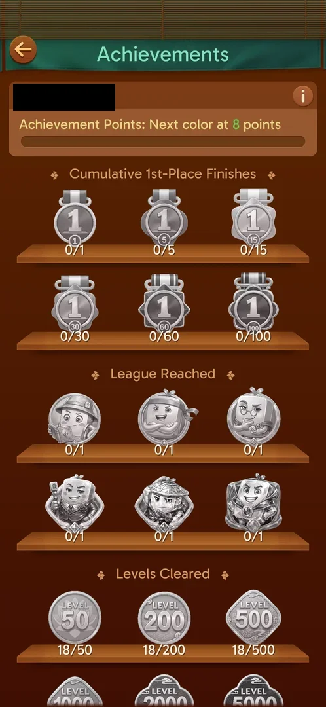

# Leagues

A competitive feature not yet open at level 19. The game shows it exists only indirectly: the
Achievements screen has a "League Reached" shelf with six league badges and a "Cumulative 1st-Place
Finishes" shelf [^s1]. No league screen or button was seen.

## Why it appeared

Hypothesis: leagues open at a level threshold after 19, about level 30; not verified. At level 19 the
home screen has no league button, while Achievements already counts leagues reached and 1st places [^s1]
[^s2].

## Where to find it

<!-- no-entry: no league button on the home screen at level 19 -->
Not seen: the home screen at level 19 has only the avatar, Achievements, Theme, Settings and the Level
button [^s2].

## What it looks like

<!-- no-screen: the feature was not open in this session; its only trace is the League Reached shelf below -->
Not seen. Its trace in Achievements:

 [^s1]
*The League Reached shelf: six league badges, none reached; above it the 1st-Place Finishes shelf*

## How it works

Not verified. Inferred from the Achievements shelves: there are at least six leagues, and a league period
ends with a place, as 1st-place finishes are counted (targets 1 to 100) [^s1].

## Cases

| Case | What was done | Result | Source |
|---|---|---|---|
| Why it appeared: the trigger that brought it up (the first launch, a level won, a threshold, a timer, a loss): a fact with its frame, or a hypothesis to test <!-- case:chk-appeared --> | — | not verified: hypothesis, a level threshold near 30 |  |
| Where to find it: the screen and the button that open it <!-- case:chk-entry --> | Looked at the home screen at level 19 | not verified: no button yet | [^s2] |
| What it looks like: its screen <!-- case:chk-screen --> | — | not verified |  |
| The board: ranks, the player's place, the number of players <!-- case:chk-board --> | — | not verified |  |
| What earns points (a level win, a score) and how many <!-- case:chk-points --> | — | not verified |  |
| The period and its timer: when it resets <!-- case:chk-period --> | — | not verified |  |
| Rewards per rank, promotion and relegation <!-- case:chk-rewards --> | Read Achievements | partly: six league badges in Achievements | [^s1] |
| The end of a period: the results screen and the reward (a follow-up) <!-- case:chk-end --> | — | not verified |  |

## Not verified

- Why it appeared: the level it opens at (hypothesis about 30) <!-- case:chk-appeared -->
- Where to find it: its button on the home screen <!-- case:chk-entry -->
- What it looks like: its screen <!-- case:chk-screen -->
- The board: ranks, the player's place, the number of players <!-- case:chk-board -->
- What earns points and how many <!-- case:chk-points -->
- The period and its timer <!-- case:chk-period -->
- Rewards per rank, promotion and relegation <!-- case:chk-rewards -->
- The end of a period <!-- case:chk-end -->

[^s1]: session 20261003-195050-chrono-2FYKPJ, step 23 — [video at 6:22](https://youtu.be/KUKs3cQ-xqY?t=382)
[^s2]: session 20261003-195050-chrono-2FYKPJ, step 28 — [video at 7:53](https://youtu.be/KUKs3cQ-xqY?t=473)
