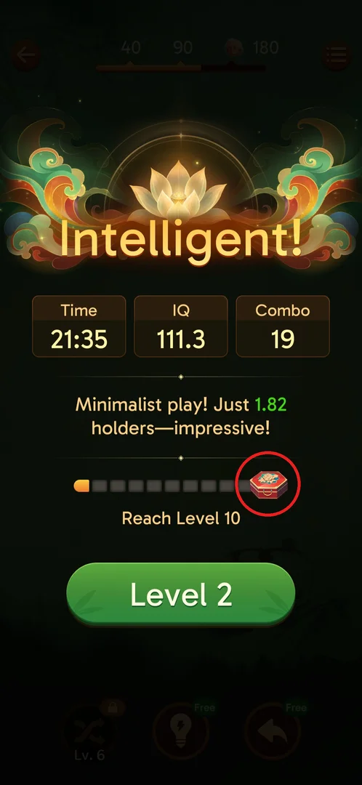
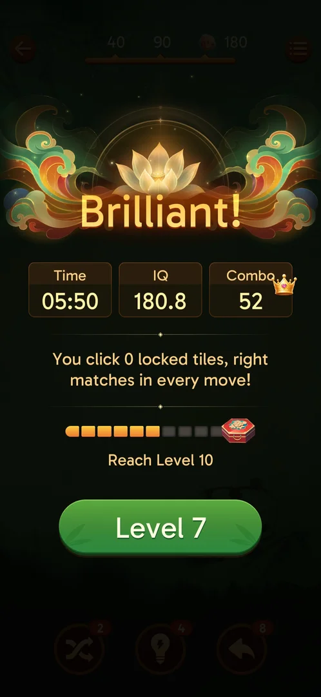
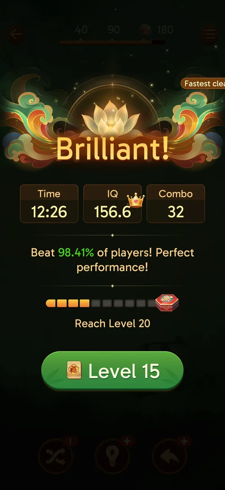
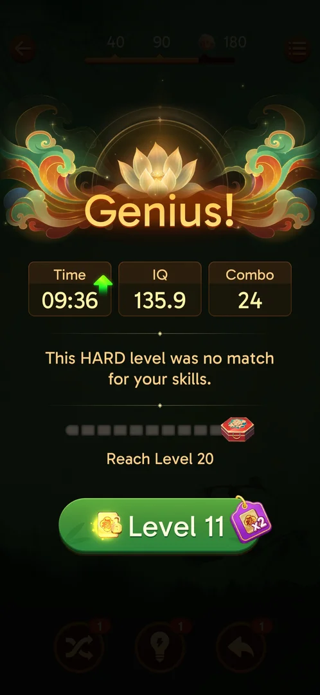

# Level milestone chest

A progress bar to a red chest on every level's win screen: each level won fills one of its 10 segments,
and at the milestone level ("Reach Level 10", then "Reach Level 20") the chest opens and gives
[boosters](boosters.md) [^s1] [^s2] [^s3]. The player does nothing to earn it besides winning levels.

## Where to find it

Clear a level: the win screen shows the title, the Time / IQ / Combo stats and a line of praise; under
them is the chest bar (the chest is circled) with the goal "Reach Level 10", and the next-level button
below it [^s1].

 [^s1]

## What it looks like

A row of 10 segments ending in a red hexagonal chest, with the goal written under it. Filled segments
are orange, empty ones grey. After level 1 one segment is filled [^s1], after level 3 three [^s4],
after level 4 four [^s5], after level 6 six [^s2].

 [^s2]

 [^s7]

## What you can do

| Tab or button | What it does |
|---|---|
| [Result](#result) | Win the milestone level: the chest opens on the win screen and the bar resets to the next goal |

Tapping the chest itself was not tried.

### Result

Winning Level 10 (the first [Hard level](hard-levels.md)) fills all 10 segments while the goal still
reads "Reach Level 10" [^s6]. Tapping the green "Level 11" button then opens the chest instead of
starting the level (the player skipped the opening animation with that tap). After it, the bar is empty
with the goal "Reach Level 20", and the booster counters went from Hint 0 / Undo 0 to Hint 1 / Undo 1
(Shuffle stayed 1) [^s3].

 [^s3]

## How it works

- One segment per level won; 10 segments per chest (v3.39.1) [^s1] [^s2]. After the Level 10 chest the
  bar counts levels won since L10: 4/10 after L14, 7/10 after L17, 8/10 after L18 [^s7] [^s8] [^s9].
- The milestones seen are Level 10 and then Level 20, so a chest every 10 levels (the Level 20 chest
  itself is inferred, not yet reached) [^s3].
- The Level 10 chest gave +1 Hint and +1 Undo, read from the booster counters before and after; the
  reward list itself was not seen (v3.39.1) [^s3].

## Cases

| Case | What was done | Result | Source |
|---|---|---|---|
| Progress | Won levels 1, 3, 4 and 6 | One segment per level won: 1, 3, 4, 6 of 10 | [^s1] [^s4] [^s5] [^s2] |
| Toward Level 20 | Won levels 14, 17 and 18 | 4, 7 and 8 of 10: one segment per level won since L10 | [^s7] [^s8] [^s9] |
| Level 10 | Won Level 10 (Hard), tapped "Level 11" | The chest opened: +1 Hint, +1 Undo (by the stock change); the bar reset to "Reach Level 20" | [^s3] |

## Not verified

- The exact contents of the chest: the opening animation was skipped. Watch it at Level 20 without
  tapping.
- Whether the Level 20 chest gives the same reward, and whether the interval stays 10 levels.
- What tapping the chest on the bar does.

[^s1]: session 20260930-211039-chrono-2FYKPJ, step 117
[^s2]: session 20260930-221457-chrono-2FYKPJ, step 90
[^s3]: session 20260930-235817-chrono-2FYKPJ, step 42 — [video at 21:12](https://youtu.be/6yY68DCT4w0?t=1272)
[^s4]: session 20260930-221457-chrono-2FYKPJ, step 39
[^s5]: session 20260930-221457-chrono-2FYKPJ, step 60
[^s6]: session 20260930-235817-chrono-2FYKPJ, step 41
[^s7]: session 20261001-063226-chrono-2FYKPJ, step 31
[^s8]: session 20261001-110957-chrono-2FYKPJ, step 41
[^s9]: session 20261001-205148-chrono-2FYKPJ, step 72
