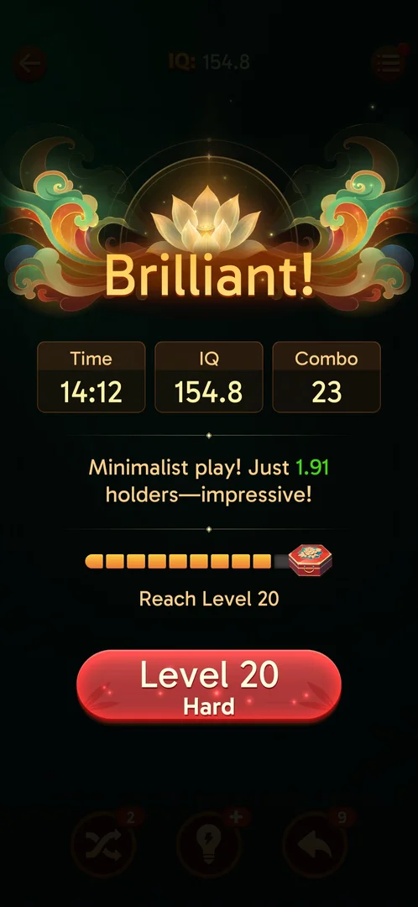
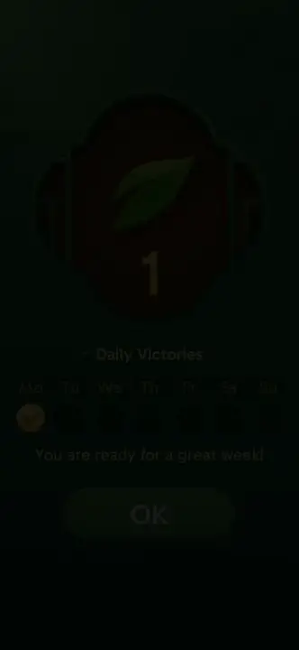
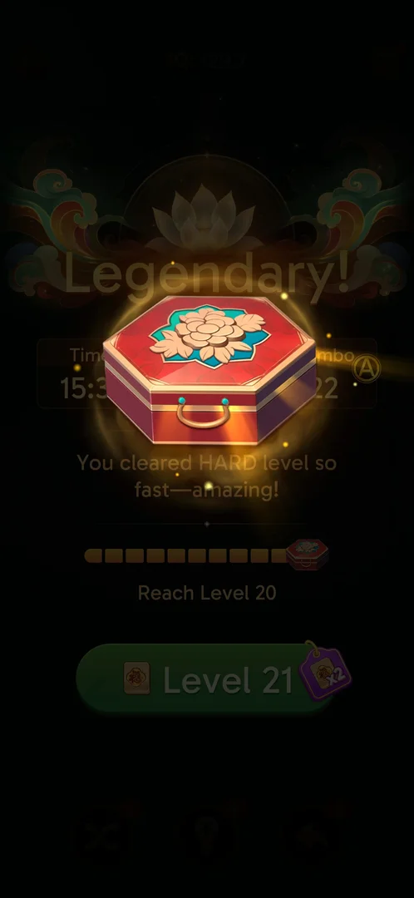
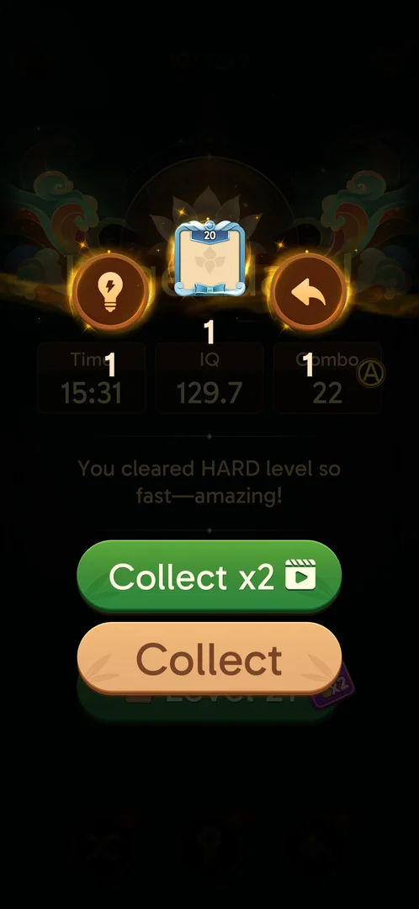

# Level progress chest

A progress bar on the level win screen: ten segments ending in a red chest, with a target under it
("Reach Level 20") [^s1]. The level 19 win took it to 9 of 10
[^s2]; the level 20 win filled it, the chest opened over the win screen and
gave a Hint, a "Level 20" avatar frame and an Undo, with an offer to double them for a video. The bar then
started again at "Reach Level 30" [^s3] [^s4]
[^s5].

## Why it appeared

Seen on the level 19 win screen: a 10-segment bar ending in a red chest, "Reach Level 20", 8 of 10 filled
[^s1]. Earlier sessions finished no level, so this was the first win screen seen.

## Where to find it

The win screen of a level (see [Tray mahjong level](core-level.md#outcomes)), under the line about the
tray ("holders") and above the next-level button [^s1]. No button on the
home screen for it was seen.

 [^s1]
*The chest bar under the holder line on the level 19 win screen, "Reach Level 20"*

## What it looks like

 [^s2]
*The bar after its animation: 9 of 10*

- Ten orange segments (grey when empty), a red hexagonal chest with a peony on its lid at the right end
  [^s1] [^s3].
- Under it the target, "Reach Level 20" [^s1].

The ninth segment fills as an animation shortly after the win screen appears; right after it a rating
popup came over the win screen (see [Rate Us popup](rate-us.md)) [^s1]:

 [^s1]
*Clip 3 s · [original on YouTube from 15:11](https://youtu.be/nmXrQmoLWlU?t=911)*

A tap on the next-level button while the bar was still animating did not open the level; the next tap
did [^s2] [^s6].

### Result

 [^s3]
*The full bar after the level 20 win: the chest flies to the middle*

After the Hard level 20 win (and the Rate Us popup) the tenth segment was filled and the chest flew from
the end of the bar to the middle of the screen [^s3]. A tap on it opened it
[^s4].

## What you can do

| Tab or button | What it does |
|---|---|
| [Collect x2](#collect-x2) | Doubles the chest's contents for a video; not tried |
| [Collect](#collect) | Takes the contents |

### Collect x2

 [^s4]
*The level 20 chest: Hint x1, a "Level 20" avatar frame, Undo x1*

The green button with a video icon; not tapped [^s4].

### Collect

 [^s5]
*After Collect: the bar starts again, "Reach Level 30"*

Took the contents without a video; the boosters then read Shuffle 1, Hint 1, Undo 2, and the bar under the
win screen was empty with "Reach Level 30" [^s5].

## How it works

Version 3.40.1.

- One segment per won level: 8 to 9 of 10 with the level 19 win, full with the level 20 win
  [^s1] [^s2] [^s3].
- The chest at level 20 held Hint x1, an avatar frame marked "Level 20" x1 and Undo x1; "Collect x2" with a
  rewarded video doubles them [^s4].
- After it, a new bar with the target "Reach Level 30": a chest every 10 levels
  [^s5]. The level 30 chest's contents are not known.

## Cases

| Case | What was done | Result | Source |
|---|---|---|---|
| Why it appeared <!-- case:chk-appeared --> | Won level 19 | ✅ On the win screen | [^s1] |
| Where to find it <!-- case:chk-entry --> | Won level 19 | ✅ No button: the bar shows on the level win screen only | [^s1] |
| What it looks like <!-- case:chk-screen --> | Won level 19 | ✅ A 10-segment bar ending in a red chest under the win stats, "Reach Level 20" | [^s1] |
| The progress <!-- case:chk-progress --> | Won level 19 | ✅ One segment per won level: 8 of 10, then 9 | [^s2] |
| The items <!-- case:chk-items --> | Won level 20 and opened the chest | Seen: Hint x1, a Level 20 avatar frame, Undo x1; still open in the map | [^s4] |
| How a step is earned <!-- case:chk-earn --> | Won levels 19 and 20 | Seen: one segment per won level; still open in the map | [^s3] |
| Using an item: open the chest <!-- case:chk-use --> | Tapped the chest, then Collect | Seen: the contents added (Hint 0 to 1, Undo 1 to 2); still open in the map | [^s5] |
| Completing the bar <!-- case:chk-complete --> | Won level 20 | Seen: the chest, then a new bar "Reach Level 30"; still open in the map | [^s5] |

## Not verified

- The items: the level 20 chest is seen; the contents of later chests, and where the avatar frame shows <!-- case:chk-items -->
- How a step is earned: whether a loss or a quit ever moves the bar <!-- case:chk-earn -->
- Using the chest: Collect x2 with the video <!-- case:chk-use -->
- Completing the bar: the level 30 chest <!-- case:chk-complete -->

[^s1]: session 20261005-073804-chrono-2FYKPJ, step 47 — [video at 15:43](https://youtu.be/nmXrQmoLWlU?t=943)
[^s2]: session 20261005-073804-chrono-2FYKPJ, step 48 — [video at 16:29](https://youtu.be/nmXrQmoLWlU?t=989)
[^s3]: session 20261005-133525-chrono-2FYKPJ, step 45 — [video at 18:05](https://youtu.be/D10jI230Oks?t=1085)
[^s4]: session 20261005-133525-chrono-2FYKPJ, step 46 — [video at 18:23](https://youtu.be/D10jI230Oks?t=1103)
[^s5]: session 20261005-133525-chrono-2FYKPJ, step 47 — [video at 18:42](https://youtu.be/D10jI230Oks?t=1122)
[^s6]: session 20261005-073804-chrono-2FYKPJ, step 49 — [video at 16:48](https://youtu.be/nmXrQmoLWlU?t=1008)
