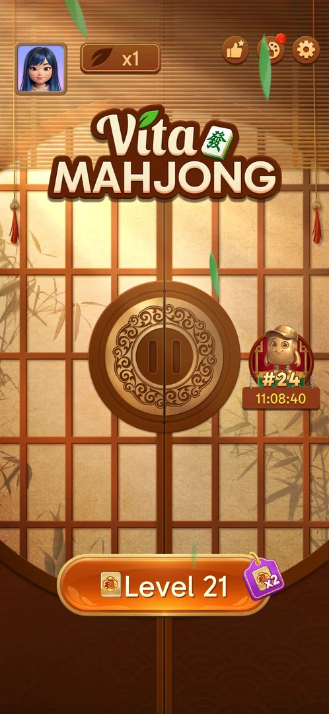
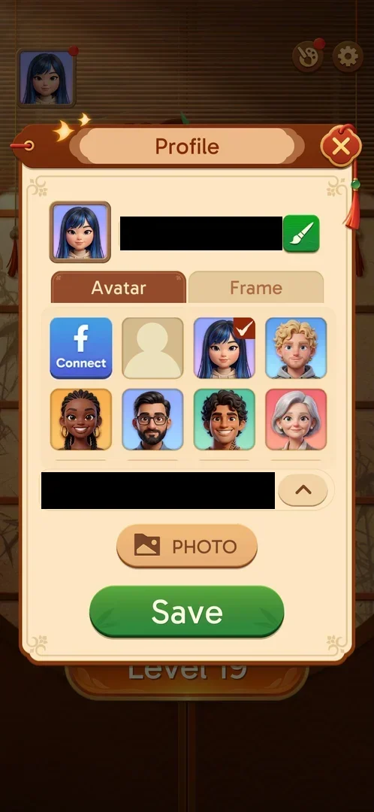
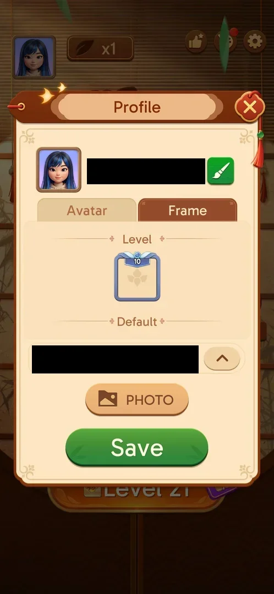
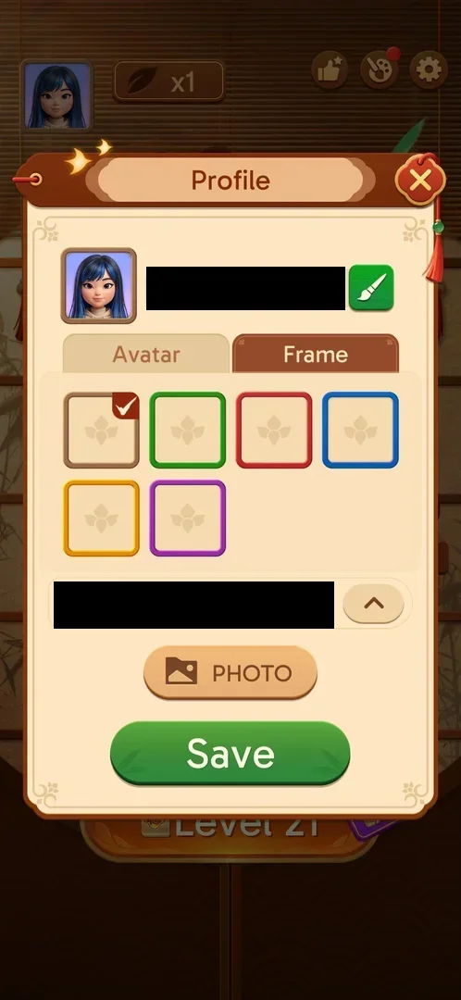
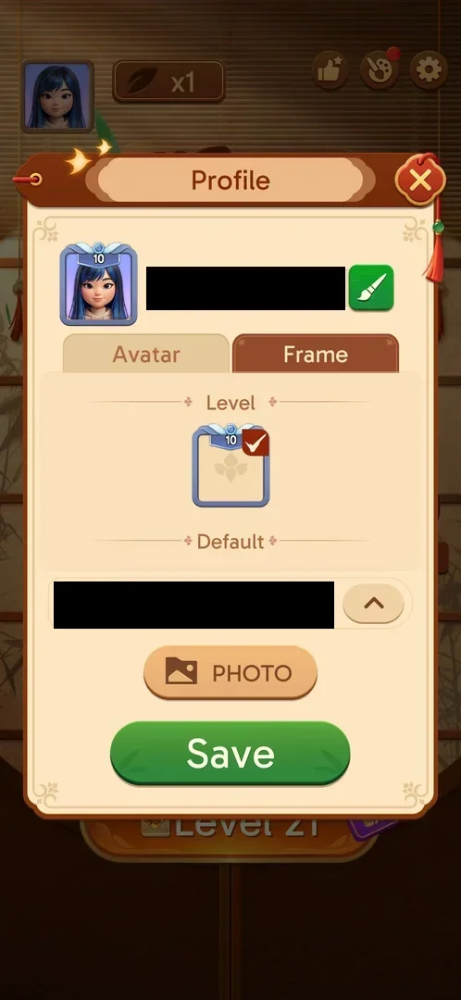

# Level avatar frames

Frames around the player's avatar, chosen in Profile on the "Frame" tab. The tab lists two groups: "Level"
frames, earned with level progress, and six free "Default" frames in plain colours [^s1]
[^s2]. At level 21 the Level group holds one frame, badged 10
[^s3].

## Why it appeared

The [level progress chest](level-chest.md) brings them: the chest opened on the level 20 win held a Hint,
an Undo and a blue avatar frame marked "20" [^s4]. The frame owned at
level 19 is badged 10 [^s5]; inferred: it came from the level 10 chest, one
frame per 10-level chest. The "20" frame was not listed in the Frame tab at level 21 (see Not verified)
[^s3].

## Where to find it

Home screen > the avatar picture (top left) > Profile > the "Frame" tab, right of "Avatar"
[^s6] [^s7].

 [^s6]
*The avatar picture, top left of the home screen, opens Profile*

 [^s7]
*The "Frame" tab, right of "Avatar" in Profile*

## What it looks like

 [^s1]
*The Frame tab at level 21: the Level frame badged 10, the Default heading below it*

The Profile popup keeps the avatar picture, the name and the country above the tabs, and PHOTO and Save
below them; the tab's list scrolls between them [^s1]. The list has two
headings: "Level", with one blue-grey frame topped by a ribbon reading 10, and "Default"; the Default
frames are below the fold and show after a swipe up [^s2]. Frames not owned
are not listed: there is no locked frame, bar or counter [^s3].

## What you can do

| Tab or button | What it does |
|---|---|
| [Default](#default) | Six free plain frames; the worn one is ticked |
| [Level frame](#level-frame) | Tapping a frame tries it on the avatar at the top of Profile |

### Default

 [^s2]
*The Default group: six colour frames, brown ticked*

Six plain square frames: brown, green, red, blue, yellow and purple. All are free; the brown one carries
a red tick: it is the frame worn now [^s2].

### Level frame

 [^s8]
*The Level 10 frame tried on: ticked in the list and shown on the Profile avatar*

Tapping the Level frame puts the tick on it and shows it at once on the avatar at the top of Profile
[^s8]. Closing Profile with the X, without Save, drops the choice: the
home avatar keeps its old frame [^s3]. Save was not tapped.

## How it works

Version 3.40.1. Level frames come from the level progress chest: the level 20 chest gave one "Level 20"
frame (x1), together with Hint x1 and Undo x1; Collect x2 with a rewarded video was offered and not taken
[^s4]. At level 21 the Level group lists only the frame badged 10
[^s3]. The six Default frames cost nothing [^s2].
A frame tried on is kept only with Save; the X discards it [^s3].

 [^s4]
*The level 20 chest: the "20" avatar frame between Hint and Undo*

## Cases

| Case | What was done | Result | Source |
|---|---|---|---|
| Why it appeared: the level 20 chest gave a "Level 20" avatar frame <!-- case:chk-appeared --> | Won level 20, opened the level chest | ✅ frames come from the 10-level chests | [^s4] |
| Home avatar button (top left) opens Profile, then the Frame tab <!-- case:chk-entry --> | Tapped the home avatar, then Frame | ✅ | [^s3] |
| Frame tab: sections Level (one frame, badge 10) and Default (six plain colour frames) <!-- case:chk-screen --> | Opened the Frame tab, swiped the list | ✅ | [^s3] |
| Progress: no bar or counter; only owned Level frames are listed <!-- case:chk-progress --> | Looked through the whole list | ✅ none shown; owned: the frame badged 10 | [^s3] |
| Items: Level section 10 owned; Default six colour frames, all free, brown worn <!-- case:chk-items --> | Swiped the list down and back | ✅ | [^s3] |
| Earned from the level chest: the L20 chest gave a "Level 20" avatar frame <!-- case:chk-earn --> | Won level 20, opened the chest, Collect | ✅ one frame, with Hint x1 and Undo x1 | [^s4] |
| Using a frame: tap previews it on the avatar with a tick; X without Save discards it <!-- case:chk-use --> | Tapped the Level 10 frame, closed with X | ✅ home avatar unchanged; Save not tried | [^s3] |
| Completing a set or bar <!-- case:chk-complete --> | — | ✅ does not apply: no set or bar | [^s3] |
| The Level 20 frame from the L20 chest is not in the Level section <!-- case:lvl20-missing --> | Opened the Frame tab at level 21 | not verified: only the frame badged 10 listed | [^s3] |

## Not verified

- Where the Level 20 frame from the level 20 chest went: at level 21 the Level group lists only the frame
  badged 10; whether it shows later or the chest gave something else <!-- case:lvl20-missing -->
- Save: whether a saved frame shows on the home avatar and elsewhere (league list)

[^s1]: session 20261006-022624-chrono-2FYKPJ, step 2 — [video at 0:58](https://youtu.be/D6M-84xYVJM?t=58)
[^s2]: session 20261006-022624-chrono-2FYKPJ, step 3 — [video at 1:11](https://youtu.be/D6M-84xYVJM?t=71)
[^s3]: session 20261006-022624-chrono-2FYKPJ, step 6 — [video at 1:50](https://youtu.be/D6M-84xYVJM?t=110)
[^s4]: session 20261005-133525-chrono-2FYKPJ, step 46 — [video at 19:00](https://youtu.be/D10jI230Oks?t=1140)
[^s5]: session 20261003-195050-chrono-2FYKPJ, step 6 — [video at 1:46](https://youtu.be/KUKs3cQ-xqY?t=106)
[^s6]: session 20261006-022624-chrono-2FYKPJ, step 1 — [video at 0:47](https://youtu.be/D6M-84xYVJM?t=47)
[^s7]: session 20261003-195050-chrono-2FYKPJ, step 5 — [video at 1:31](https://youtu.be/KUKs3cQ-xqY?t=91)
[^s8]: session 20261006-022624-chrono-2FYKPJ, step 5 — [video at 1:34](https://youtu.be/D6M-84xYVJM?t=94)
