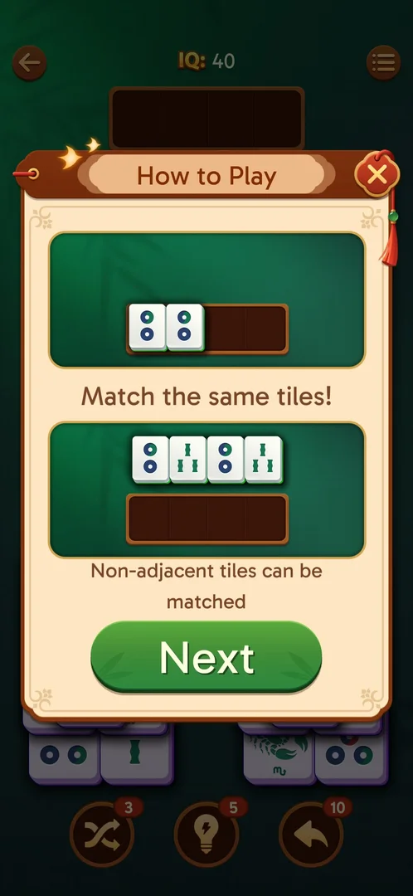

# In-level Options

The settings popup of the level screen. Besides the sound toggles of the home Settings it has two game
toggles (Auto Complete, Colorful Effects), links to Theme, How to Play and No Ads, and a Restart button
[^s1].

## Why it appeared

The menu button top right of the level screen, when level 19 was opened [^s1].

## Where to find it

Level screen > the round menu button with three lines, top right, opposite the back arrow [^s2].

 [^s2]
*The three-line menu button, top right of the level screen*

## What it looks like

 [^s1]
*Options: four sound toggles, two game toggles, three links and Restart*

## What you can do

| Tab or button | What it does |
|---|---|
| [Sound toggles](#sound-toggles) | Music, sound, voice, vibration |
| [Auto Complete](#auto-complete) | A toggle, ON |
| [Colorful Effects](#colorful-effects) | A toggle, ON |
| [Theme](#theme) | Tile sets and backgrounds |
| [How to Play](#how-to-play) | The two-page rules |
| [No Ads](#no-ads) | A purchase; not opened |
| [Restart](#restart) | Restarts the level; not tapped |

### Sound toggles

<!-- no-frame: the toggles are on the Options frame above -->
Four toggles with icons: a note (music), a speaker (sound), a person speaking (voice) and a vibrating
phone (vibration); all ON. The same four are in the home [Settings](settings.md) [^s1]. None was switched.

### Auto Complete

<!-- no-frame: on the Options frame above -->
ON by default; see [Auto Complete](auto-complete.md) [^s1].

### Colorful Effects

<!-- no-frame: on the Options frame above -->
A toggle with a rainbow-square icon, ON. Not switched; what it changes is not verified [^s1].

### Theme

<!-- no-frame: on the Options frame above; the Theme popup is on its own page -->
A row that leads to Theme (see [Theme](theme.md)); not opened from here [^s1].

### How to Play

 [^s3]
*How to Play opens its first page over the level*

See [How to Play](how-to-play.md) [^s3].

### No Ads

<!-- no-frame: on the Options frame above; not opened -->
A row with a crown; see [No Ads purchase](no-ads.md) [^s1].

### Restart

<!-- no-frame: on the Options frame above -->
A green Restart button. Not tapped [^s1].

## How it works

Version 3.40.1. The popup covers the board and has a close X top right [^s1]. The home screen opens a
different popup, Settings, from its gear [^s1].

## Cases

| Case | What was done | Result | Source |
|---|---|---|---|
| Options: sound toggles, Auto Complete, Colorful Effects, Theme, How to Play, No Ads, Restart <!-- case:chk-screen --> | Opened the menu on level 19 | ✅ | [^s1] |
| Menu button (three lines), level screen top right <!-- case:chk-entry --> | Tapped it | ✅ | [^s1] |
| Why it appeared: the trigger that brought it up (the first launch, a level won, a threshold, a timer, a loss): a fact with its frame, or a hypothesis to test <!-- case:chk-appeared --> | Opened level 19 | ✅ | [^s1] |
| Every option or button and what it changes (each toggle once, set back after) <!-- case:chk-options --> | Opened How to Play | partly: How to Play opens the rules; toggles, Theme, No Ads and Restart not tried | [^s3] |
| For a prompt (consent, rate us, notifications): what each answer does and whether it comes back <!-- case:chk-answers --> | — | does not apply: not a prompt |  |
| Links out (privacy, terms, help): where they lead (back to the game at once) <!-- case:chk-links --> | — | does not apply: no links out of the game on it | [^s1] |

## Not verified

- Every option: the toggles (Colorful Effects, Auto Complete), Theme from here, No Ads and Restart <!-- case:chk-options -->

[^s1]: session 20261003-195050-chrono-2FYKPJ, step 18 — [video at 4:55](https://youtu.be/KUKs3cQ-xqY?t=295)
[^s2]: session 20261003-195050-chrono-2FYKPJ, step 17 — [video at 4:21](https://youtu.be/KUKs3cQ-xqY?t=261)
[^s3]: session 20261003-195050-chrono-2FYKPJ, step 19 — [video at 5:15](https://youtu.be/KUKs3cQ-xqY?t=315)
