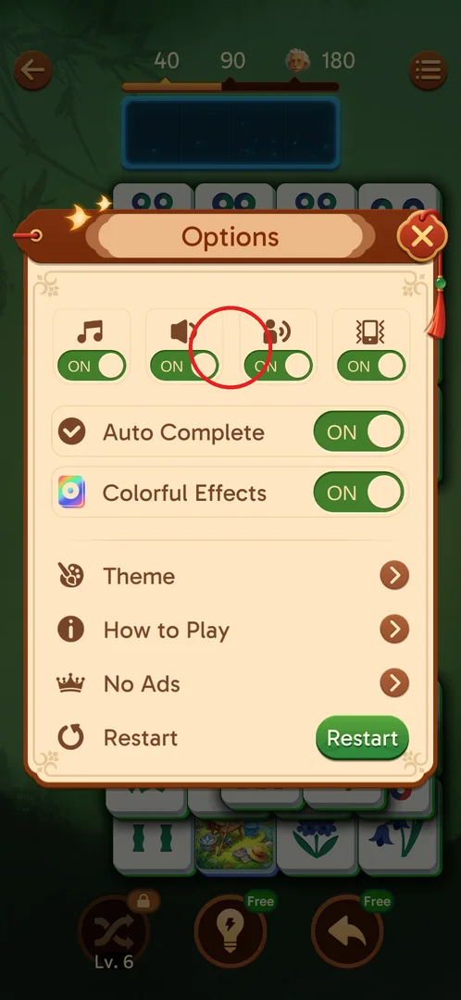
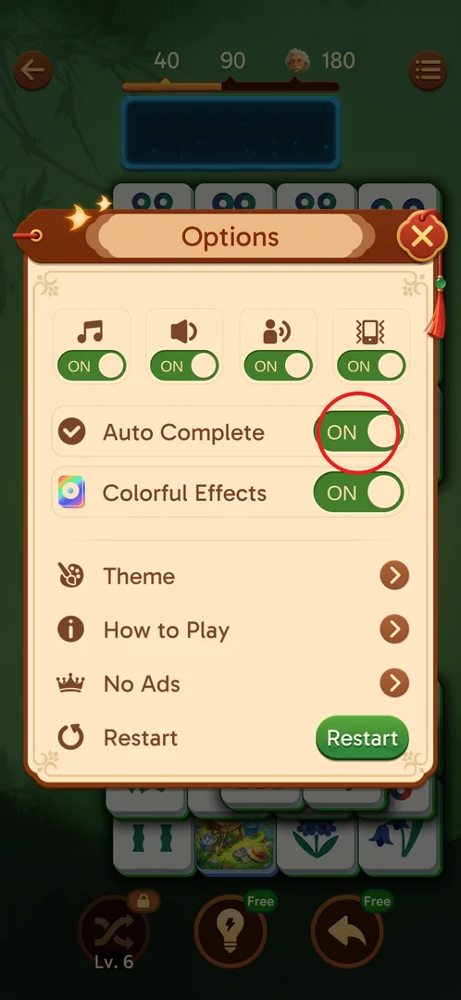
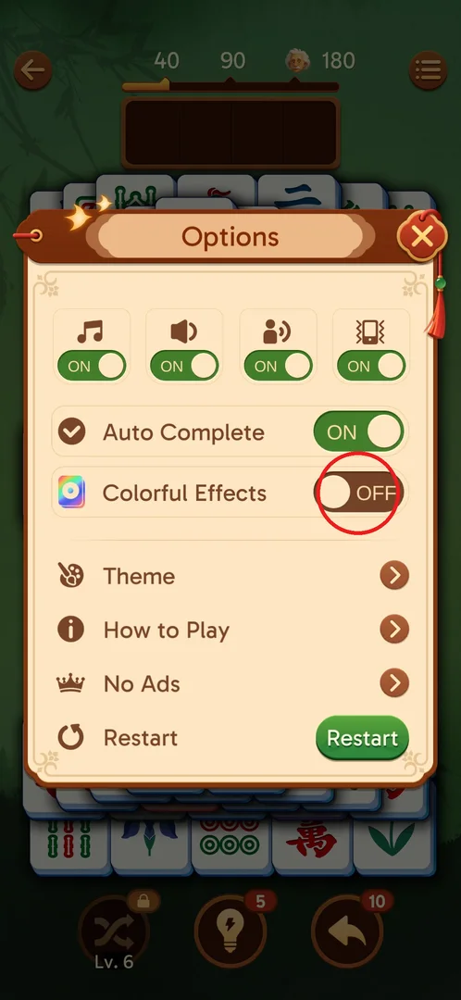
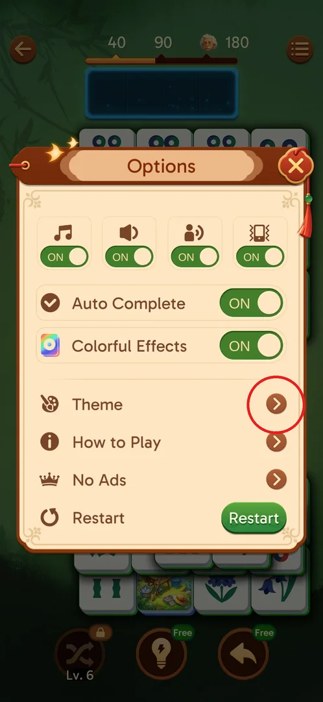
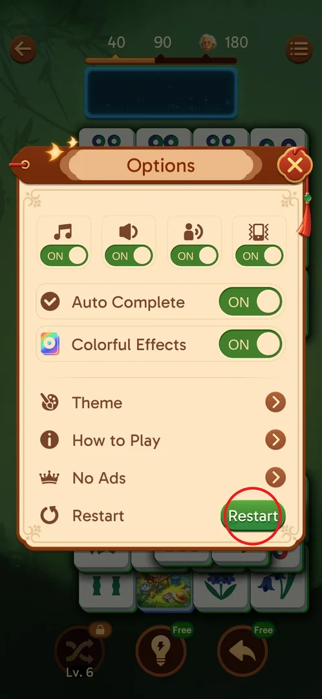
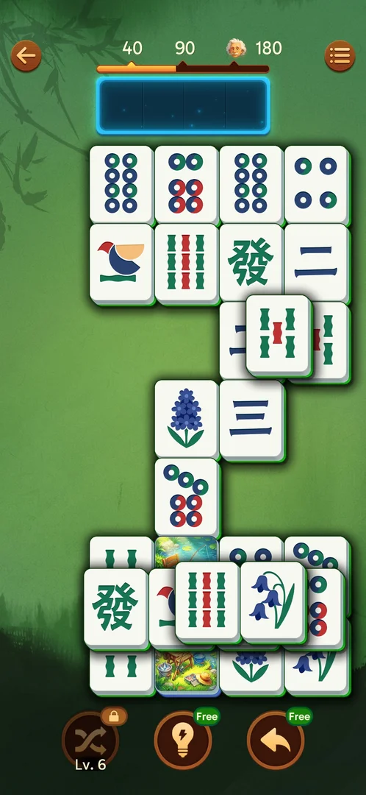

# In-level Options menu

Options is the menu a player opens while inside a level. It holds the sound and vibration toggles, two gameplay switches (Auto Complete and Colorful Effects), links to Theme, How to Play and the No Ads offer, and a Restart button for the current level [^s2] [^s8].

## Where to find it

Inside any level: tap the round button with three lines at the top right of the level screen. Options opens as a popup over the board [^s2] [^s8].

 [^s1]

## What it looks like

A cream popup titled "Options" covers the middle of the board. A red X at its top right closes it. From top to bottom it shows:

- a row of four toggles;
- the Auto Complete and Colorful Effects switches, both green "ON" by default;
- the rows Theme, How to Play and No Ads (crown icon), each with an arrow;
- the Restart row with a green Restart button [^s2] [^s8].

 [^s2]

## What you can do

| Tab or button | What it does |
|---|---|
| [Sound toggles](#sound-toggles) | Switch music, sound effects, voice and vibration ON or OFF |
| [Auto Complete](#auto-complete) | Switch Auto Complete ON or OFF; ON by default |
| [Colorful Effects](#colorful-effects) | Switch Colorful Effects ON or OFF; ON by default |
| [Theme](#theme) | Opens the theme choice (not opened from here) |
| [How to Play](#how-to-play) | Opens the rules popup |
| [No Ads](#no-ads) | Opens the No Ads purchase offer |
| [Restart](#restart) | Restarts the level (by its name; never tapped) |

### Sound toggles

Four toggles in a row, with the icons of a music note, a speaker, a talking head and a vibrating phone. The labels are inferred from the icons. All four were ON when first seen [^s2]. None of them was switched.

 [^s2]

### Auto Complete

A row with a checkmark icon and an ON/OFF switch. It is ON by default [^s2] [^s8]. What it does and when it fires is on its own page: [Auto Complete option](auto-complete.md).

 [^s2]

### Colorful Effects

A row with a rainbow-square icon and an ON/OFF switch. It is ON by default [^s8]. Tapping the switch turns it brown "OFF" right away, without closing the popup [^s5]. With it OFF, a matched pair still burst into white shards, and no visual difference was seen on a single match [^s10]. It was then switched back ON [^s11].

 [^s5]

### Theme

A row with a palette icon and an arrow [^s2]. It was not opened from Options. Themes were only chosen from the main screen: [Themes](themes.md).

 [^s2]

### How to Play

Opens the "How to Play" popup over the board. Its first page shows "Match the same tiles!" and "Non-adjacent tiles can be matched", with a Next button [^s4]. Closing it with "Get it" goes straight back to the board, not to Options [^s9]. The full contents: [How to Play](how-to-play.md).

 [^s4]

### No Ads

Opens the "No Ads" popup. It has one orange button labelled "Forever Super Offer", priced RSD 849 (Serbian store), a Restore link, a paragraph about managing a subscription in Google Play, and Terms of Service and Privacy Policy links [^s3]. Nothing was bought. More: [No Ads](no-ads.md).

 [^s3]

### Restart

The last row has a circular-arrow icon and a green Restart button [^s2]. It was never tapped, so it is not known whether it asks for confirmation or costs anything.

 [^s2]

### Result

Closing a sub-popup closes the whole menu. After the No Ads popup was closed with its X, the board came back with Options closed too [^s6] [^s7]. The next tap, aimed at How to Play, therefore landed on the board [^s7].

 [^s6]

## How it works

Version 3.39.1.

- The same popup opened on level 1 and on level 2, with the same rows [^s2] [^s8].
- Defaults: all four sound/vibration toggles ON, Auto Complete ON, Colorful Effects ON [^s2] [^s8].
- A switch changes in place; the popup stays open until its X is tapped [^s5].
- Closing No Ads or How to Play returns to the board, not to Options [^s7] [^s9].

## Cases

| Case | What was done | Result | Source |
|---|---|---|---|
| Open | Tapped the three-line button at the top right of a level | Options with the toggles, Theme, How to Play, No Ads, Restart | [^s2] |
| Closing a sub-popup | Opened No Ads, closed it with its X | The whole Options menu closed and the board came back | [^s7] |
| How to Play from Options | Opened How to Play, Next, then "Get it" | Back on the board, Options closed | [^s4] [^s9] |
| Colorful Effects OFF and back | Switched it OFF, matched a pair, switched it back ON | No visible difference on one match | [^s5] [^s10] [^s11] |

## Not verified

- Restart: whether it asks for confirmation, what it costs, whether the level stays the same.
- What each of the four sound/vibration toggles turns off (never switched), and whether they are the same switches as in the main-screen settings.
- Theme opened from inside a level: whether it is the same screen as on the main screen and whether it applies to the running level.
- What Colorful Effects OFF changes (combos and the tray colours were not compared).

[^s1]: session 20260930-203959-chrono-2FYKPJ, step 82 — [video at 14:36](https://youtu.be/2yK_ch59JAg?t=876)
[^s2]: session 20260930-203959-chrono-2FYKPJ, step 83 — [video at 14:53](https://youtu.be/2yK_ch59JAg?t=893)
[^s3]: session 20260930-203959-chrono-2FYKPJ, step 84 — [video at 15:12](https://youtu.be/2yK_ch59JAg?t=912)
[^s4]: session 20260930-211039-chrono-2FYKPJ, step 134
[^s5]: session 20260930-211039-chrono-2FYKPJ, step 138
[^s6]: session 20260930-203959-chrono-2FYKPJ, step 85 — [video at 15:31](https://youtu.be/2yK_ch59JAg?t=931)
[^s7]: session 20260930-203959-chrono-2FYKPJ, step 86 — [video at 15:36](https://youtu.be/2yK_ch59JAg?t=936)
[^s8]: session 20260930-211039-chrono-2FYKPJ, step 133
[^s9]: session 20260930-211039-chrono-2FYKPJ, step 136
[^s10]: session 20260930-211039-chrono-2FYKPJ, step 141
[^s11]: session 20260930-211039-chrono-2FYKPJ, step 143
