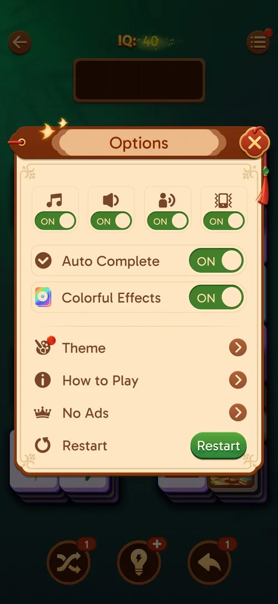
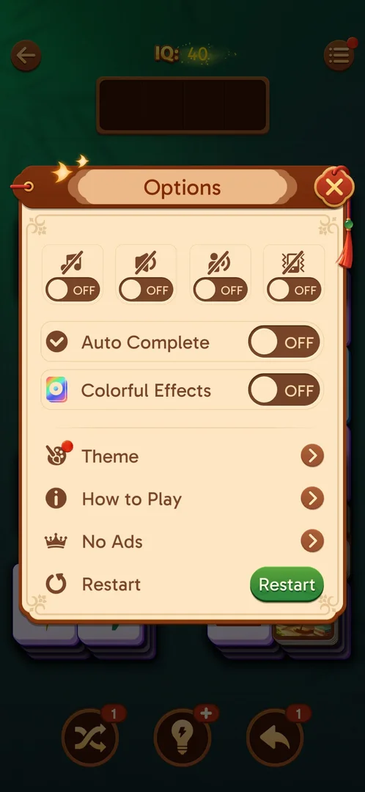
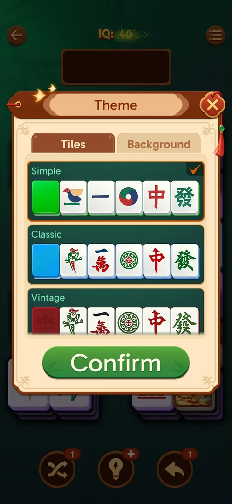
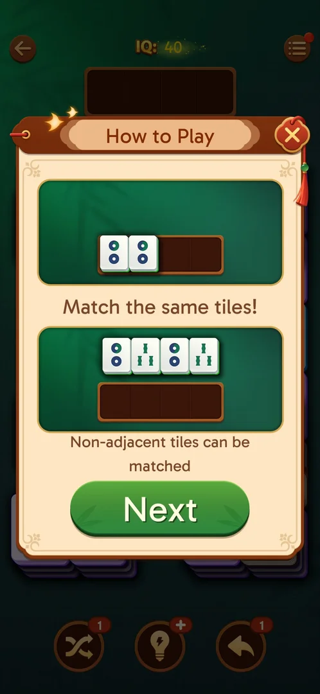
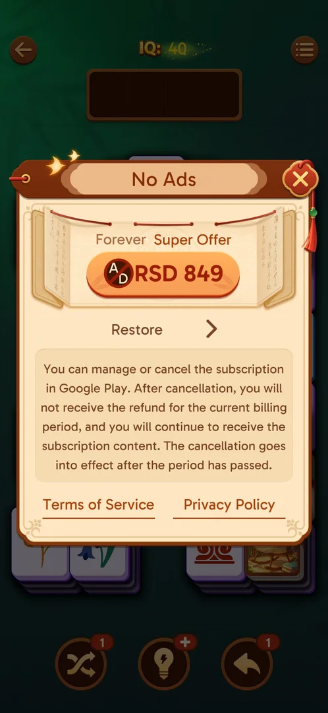
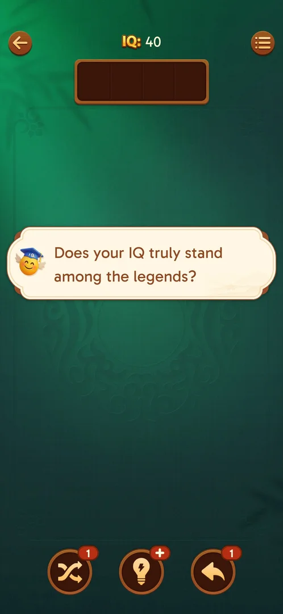

# In-level Options

The settings popup of the level screen. Besides the four sound toggles of the home Settings it has two
game toggles (Auto Complete, Colorful Effects), rows that open Theme, How to Play and No Ads, and a Restart
button that redeals the level [^s1] [^s2].

## Why it appeared

The menu button top right of the level screen, when level 19 was opened [^s3].

## Where to find it

Level screen > the round menu button with three lines, top right, opposite the back arrow
[^s4]. A red dot sat on the button until the Theme row was visited; inferred:
it mirrors the red dot on the Theme row [^s5] [^s6].

 [^s4]
*The three-line menu button, top right of the level screen*

## What it looks like

 [^s1]
*Options: four sound toggles, two game toggles, three rows and Restart*

The popup covers the board and has a close X top right. From the top: four icon toggles in a row, the Auto
Complete and Colorful Effects toggles, the Theme, How to Play and No Ads rows with arrows, and the Restart
row with a green button [^s1].

## What you can do

| Tab or button | What it does |
|---|---|
| [Sound toggles](#sound-toggles) | Music, sound, voice, vibration; each switches ON and OFF |
| [Auto Complete](#auto-complete) | A toggle; switches ON and OFF |
| [Colorful Effects](#colorful-effects) | A toggle; switches ON and OFF |
| [Theme](#theme) | Opens the Theme popup (tile sets and backgrounds) |
| [How to Play](#how-to-play) | Opens the two-page rules |
| [No Ads](#no-ads) | Opens the No Ads offer |
| [Restart](#restart) | Redeals the level at once, no confirmation |

### Sound toggles

 [^s7]
*All toggles switched OFF: the icons get a slash, the switches turn brown with OFF*

Four toggles with icons: a note (music), a speaker (sound), a person speaking (voice) and a vibrating
phone (vibration); the same four are in the home [Settings](settings.md) [^s3].
Each was switched OFF: its icon gets a slash and the switch turns brown with OFF
[^s7]. All were switched back ON, and were still ON when Options was
opened again [^s8] [^s9]. What each changes
in sound was not checked (the frames carry no sound).

### Auto Complete

<!-- no-frame: on the Sound toggles frame above, switched OFF -->
ON by default. Switched OFF and back ON; the switch behaves as the sound toggles
[^s7] [^s8]. No level was finished with it OFF:
see [Auto Complete](auto-complete.md) for what it does.

### Colorful Effects

<!-- no-frame: on the Sound toggles frame above, switched OFF -->
A toggle with a rainbow-square icon, ON by default. Switched OFF and back ON
[^s7] [^s8]; no tile was matched with it OFF,
so what it changes is not verified.

### Theme

 [^s10]
*The Theme row opens the Theme popup over the level*

The row opens the same Theme popup as the home screen: Tiles and Background tabs, tile sets Simple
(ticked), Classic and Vintage, and Confirm (see [Theme](theme.md)) [^s10].
Closed with its X, nothing changed: the popup closes to the level, Options closes with it
[^s11]. After the visit the red dot on the Theme row is gone
[^s12].

### How to Play

 [^s13]
*How to Play opens its first page over the level*

Opens the first rules page with Next (see [How to Play](how-to-play.md)) [^s13].
Its X closes straight to the board: Options does not come back [^s5].

### No Ads

 [^s14]
*The No Ads row opens the offer popup*

A row with a crown; it opens the offer described on [No Ads purchase](no-ads.md)
[^s14]. Closing the offer with its X closes Options too: the next tap, meant
for Restart, landed on the board and picked a tile into the tray [^s15]
[^s6].

### Restart

 [^s2]
*Restart: no confirmation, the level redeals behind an IQ banner*

The green Restart button closes Options at once, with no confirmation: the board clears and redeals behind
a one-line IQ banner, and the tray is empty again (the tile picked before went back) [^s2].
The IQ counter reads 40, as at the start [^s2].

## How it works

Version 3.40.1. Toggle states are kept when Options closes and opens again [^s9].
Every popup opened from a row (Theme, How to Play, No Ads) returns to the board, not to Options, when closed
[^s5] [^s11] [^s15].
Restart starts the same level over with no prompt and no cost seen [^s2].
Options itself has no links out of the game; the only links (Terms of Service, Privacy Policy) are in the
No Ads popup [^s14]. The home screen opens a different popup, Settings, from
its gear [^s3].

## Cases

| Case | What was done | Result | Source |
|---|---|---|---|
| Options: sound toggles, Auto Complete, Colorful Effects, Theme, How to Play, No Ads, Restart <!-- case:chk-screen --> | Opened the menu on level 19 and level 21 | ✅ | [^s3] |
| Menu button (three lines), level screen top right <!-- case:chk-entry --> | Tapped it | ✅ | [^s3] |
| Why it appeared: the menu button of the level screen <!-- case:chk-appeared --> | Opened level 19 | ✅ | [^s3] |
| Every option: six toggles OFF and back ON (kept after reopening); Theme, How to Play and No Ads open their popups; Restart redeals; closing a sub-popup also closes Options <!-- case:chk-options --> | Tried every toggle and row on level 21 | ✅ | [^s2] |
| No prompt in Options; Restart has no confirmation, No Ads offer closed with X <!-- case:chk-answers --> | Tapped Restart, closed No Ads | ✅ | [^s2] |
| No links out in Options itself; Terms of Service and Privacy Policy are inside the No Ads popup <!-- case:chk-links --> | Opened every row | ✅ links not followed | [^s14] |
| Restart redeals the same level at once, no confirm, tray emptied <!-- case:restart-no-confirm --> | Tapped Restart with one tile in the tray | ✅ | [^s2] |

## Not verified

- What Colorful Effects and Auto Complete change when OFF (no tile matched, no level finished with them OFF)
- Whether Restart costs anything or counts as a loss later in the level (tapped right after the start, with one tile in the tray)

[^s1]: session 20261006-022624-chrono-2FYKPJ, step 8 — [video at 2:42](https://youtu.be/D6M-84xYVJM?t=162)
[^s2]: session 20261006-022624-chrono-2FYKPJ, step 21 — [video at 4:54](https://youtu.be/D6M-84xYVJM?t=294)
[^s3]: session 20261003-195050-chrono-2FYKPJ, step 18 — [video at 4:51](https://youtu.be/KUKs3cQ-xqY?t=291)
[^s4]: session 20261003-195050-chrono-2FYKPJ, step 17 — [video at 4:17](https://youtu.be/KUKs3cQ-xqY?t=257)
[^s5]: session 20261006-022624-chrono-2FYKPJ, step 12 — [video at 3:25](https://youtu.be/D6M-84xYVJM?t=205)
[^s6]: session 20261006-022624-chrono-2FYKPJ, step 19 — [video at 4:36](https://youtu.be/D6M-84xYVJM?t=276)
[^s7]: session 20261006-022624-chrono-2FYKPJ, step 9 — [video at 2:57](https://youtu.be/D6M-84xYVJM?t=177)
[^s8]: session 20261006-022624-chrono-2FYKPJ, step 10 — [video at 3:04](https://youtu.be/D6M-84xYVJM?t=184)
[^s9]: session 20261006-022624-chrono-2FYKPJ, step 20 — [video at 4:49](https://youtu.be/D6M-84xYVJM?t=289)
[^s10]: session 20261006-022624-chrono-2FYKPJ, step 14 — [video at 3:46](https://youtu.be/D6M-84xYVJM?t=226)
[^s11]: session 20261006-022624-chrono-2FYKPJ, step 15 — [video at 3:59](https://youtu.be/D6M-84xYVJM?t=239)
[^s12]: session 20261006-022624-chrono-2FYKPJ, step 16 — [video at 4:11](https://youtu.be/D6M-84xYVJM?t=251)
[^s13]: session 20261006-022624-chrono-2FYKPJ, step 11 — [video at 3:12](https://youtu.be/D6M-84xYVJM?t=192)
[^s14]: session 20261006-022624-chrono-2FYKPJ, step 17 — [video at 4:15](https://youtu.be/D6M-84xYVJM?t=255)
[^s15]: session 20261006-022624-chrono-2FYKPJ, step 18 — [video at 4:31](https://youtu.be/D6M-84xYVJM?t=271)
