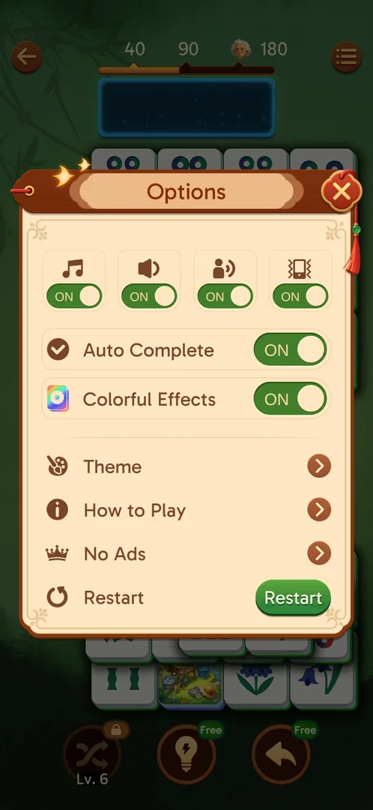

# In-level Options menu

The hamburger in a level (677,110): the four toggles, Auto Complete (ON), Colorful Effects (ON), Theme,
How to Play, No Ads, Restart. Closing a sub-popup closes the whole menu [s:20260930-203959-chrono-2FYKPJ#83] [s:20260930-203959-chrono-2FYKPJ#86] [s:20260930-211039-chrono-2FYKPJ#133].

