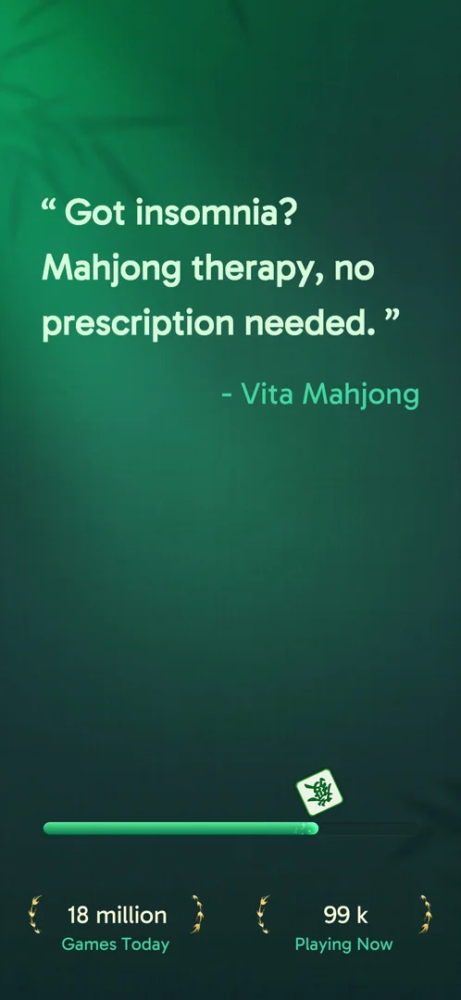
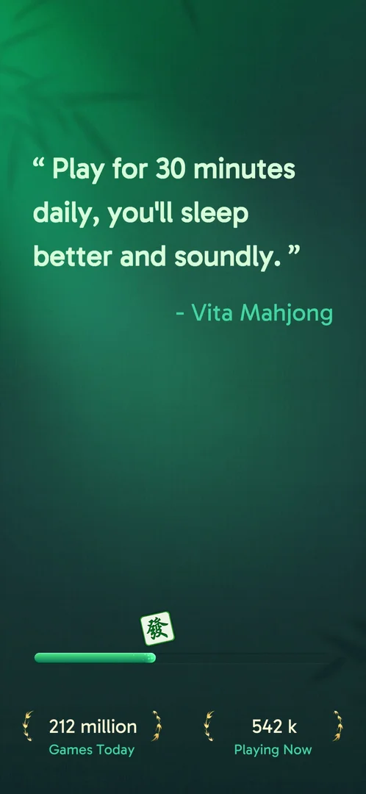

# Loading screen

A dark green screen shown while the game loads: a tagline, a progress bar and two counters of how many
people play [^s1] [^s2].

## Why it appeared

Every launch, after the consent on the first one [^s1]
[^s2].

## Where to find it

<!-- no-entry: no control opens it; it shows on every launch -->
It shows by itself when the game starts [^s1].

## What it looks like

 [^s2]
*Tagline, progress bar, and the Games Today and Playing Now counters (2026-10-06)*

- A tagline in quotes, credited to Vita Mahjong. It differs between launches: on 2026-10-03 a claim that
  playing 30 minutes a day helps sleep (about a dozen words) [^s1]; on
  2026-10-06 a quip offering mahjong as a cure for insomnia (about ten words)
  [^s2].
- A green progress bar with a tile riding on its end [^s2].
- Two counters in laurel wreaths, "Games Today" and "Playing Now" [^s2].

 [^s1]
*The same screen on 2026-10-03: another tagline, other counters*

## How it works

Version 3.40.1. No buttons; it gives way to the home screen by itself (on 2026-10-06 within an 8 s wait)
[^s2]. The counters change between launches: "212 million Games Today" and
"542 k Playing Now" on 2026-10-03 [^s1], "18 million" and "99 k" on
2026-10-06 [^s2]. Their source is not known; inferred from the drop: Games
Today may count from the start of a day.

## Cases

| Case | What was done | Result | Source |
|---|---|---|---|
| Loading bar, tagline, counters for games today and players now <!-- case:chk-screen --> | Waited through the loading, twice | ✅ | [^s1] |
| No entry: shown on every launch <!-- case:chk-entry --> | Launched the game | ✅ | [^s1] |
| No options: a loading bar only <!-- case:chk-options --> | — | ✅ | [^s1] |
| Not a prompt <!-- case:chk-answers --> | — | ✅ | [^s1] |
| No links on the loading screen <!-- case:chk-links --> | — | ✅ | [^s1] |
| Why it appeared: every launch <!-- case:chk-appeared --> | Launched the game | ✅ | [^s1] |

## Not verified

- How many taglines there are, and what the counters count

[^s1]: session 20261003-195050-chrono-2FYKPJ, step 2 — [video at 0:35](https://youtu.be/KUKs3cQ-xqY?t=35)
[^s2]: session 20261006-022624-chrono-2FYKPJ, step 0 — [video at 0:00](https://youtu.be/D6M-84xYVJM?t=0)
