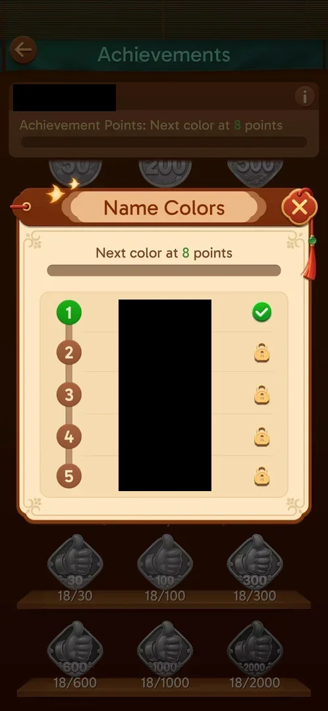

# Name colors

Five colours for the player's name, unlocked with Achievement Points. Colour 1 is owned from the start;
the next one needs 8 points [^s1].

## Why it appeared

The info (i) button of Achievements opens it; colour 1 was owned at level 19 with no achievement earned
[^s1] [^s2].

## Where to find it

Home screen > thumbs-up-with-a-star button > Achievements > the (i) button on the right of the header card
[^s2].

 [^s2]
*The (i) button on the right of the Achievements header opens Name Colors*

## What it looks like

 [^s1]
*Name Colors: colour 1 owned, 2 to 5 locked (the name itself is blacked out)*

- "Next color at 8 points" over an empty bar [^s1].
- Five rows, numbered 1 to 5 on a vertical track, each the player's name in one colour: 1 brown, 2 green,
  3 blue, 4 magenta, 5 orange [^s1].
- A green check on row 1; a lock on rows 2 to 5 [^s1].
- A close X top right [^s1].

## How it works

Version 3.40.1. Colour 2 needs 8 Achievement Points [^s1]. The points for colours 3 to 5, the points one
achievement gives, and where the coloured name shows (a league board is likely, inferred) are not
verified.

## Cases

| Case | What was done | Result | Source |
|---|---|---|---|
| Why it appeared: the trigger that brought it up (the first launch, a level won, a threshold, a timer, a loss): a fact with its frame, or a hypothesis to test <!-- case:chk-appeared --> | Tapped the (i) in Achievements | ✅ Colour 1 owned from the start | [^s1] |
| Where to find it: the screen and the button that open it <!-- case:chk-entry --> | Tapped the (i) | not verified in the map: Achievements > (i) | [^s2] |
| What it looks like: its screen <!-- case:chk-screen --> | Opened the popup | not verified in the map: the Name Colors popup above | [^s1] |
| The progress: the bar, the album or the counter, what fills it and where it is now <!-- case:chk-progress --> | Opened the popup | partly: empty bar, next colour at 8 points | [^s1] |
| The items: every set, skin or tier, which are owned and which are locked, with their condition <!-- case:chk-items --> | Opened the popup | partly: 5 colours, 1 owned; only colour 2's condition shown | [^s1] |
| How an item or a step is earned (wins, keys, a spin, a pack) <!-- case:chk-earn --> | — | partly: Achievement Points; points per achievement not seen | [^s1] |
| Using an item: equip a skin, open a chest, spin; what changes <!-- case:chk-use --> | — | not verified |  |
| Completing a set or the bar: the reward <!-- case:chk-complete --> | — | not verified |  |

## Not verified

- Where to find it <!-- case:chk-entry -->: the frames show Achievements > (i) opening the popup [^s2] [^s1],
  but no frame was marked for this feature as its entry, and the map keeps the case open.
- What it looks like <!-- case:chk-screen -->: the popup frame above [^s1] was marked for Achievements, not
  as this feature's screen; the map keeps the case open.

  > ⚠️ **Previously** (corrected 2026-10-06): the Cases table showed both cases as verified (✅
  > "Achievements > (i)" and the popup). The map has no source closing them.

- The progress: the points for colours 3 to 5 <!-- case:chk-progress -->
- The items: the condition of each locked colour <!-- case:chk-items -->
- How many points one achievement gives <!-- case:chk-earn -->
- Choosing a colour and where the name shows in it <!-- case:chk-use -->
- A reward for all five colours <!-- case:chk-complete -->

[^s1]: session 20261003-195050-chrono-2FYKPJ, step 26 — [video at 7:27](https://youtu.be/KUKs3cQ-xqY?t=447)
[^s2]: session 20261003-195050-chrono-2FYKPJ, step 23 — [video at 6:22](https://youtu.be/KUKs3cQ-xqY?t=382)
