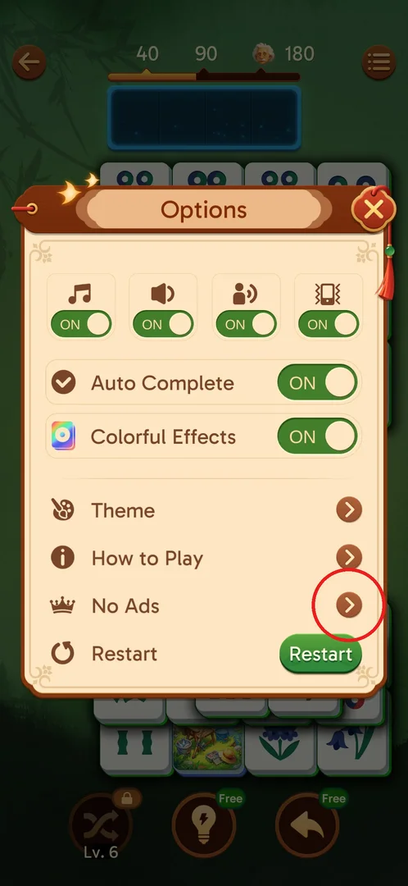
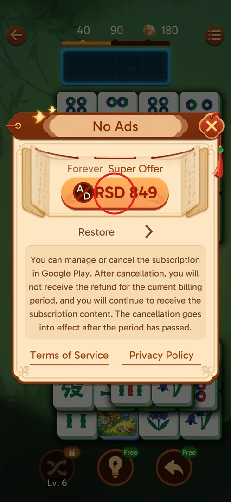
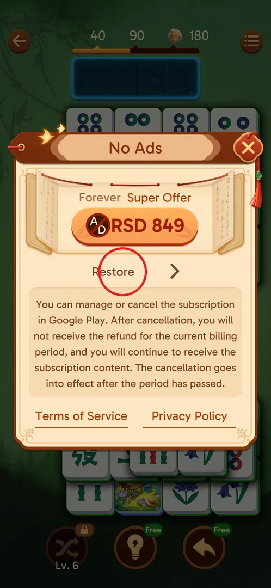
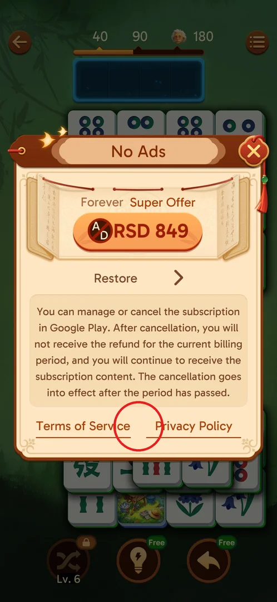
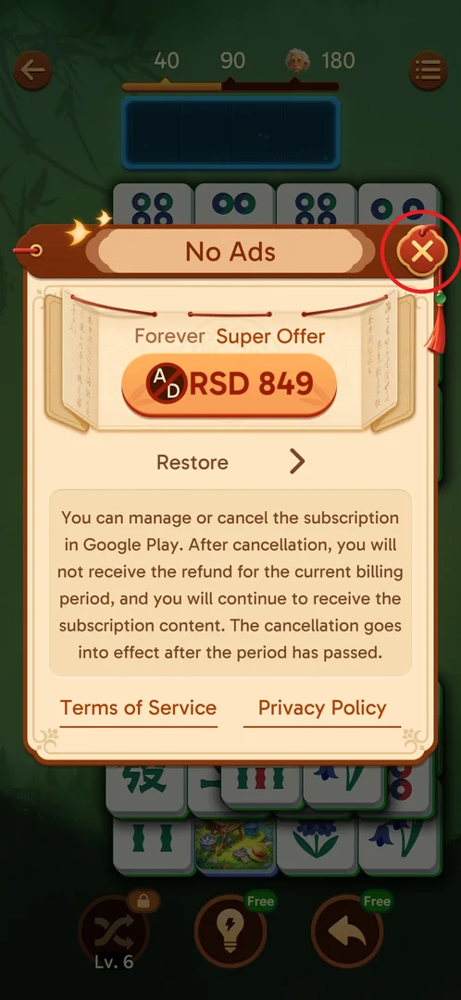

# No Ads purchase

No Ads is the game's real-money offer to remove advertising: a popup with one price button, labelled
"Forever Super Offer", for RSD 849 in the Serbian store, plus a Restore row for earlier purchases[^s2].
Nothing was bought: real-money purchases are off limits for the agent.

## Where to find it

During a level, tap the menu button (three lines, top right) to open **Options**; **No Ads** is the
row with a crown icon, third in the list after Theme and How to Play, above Restart[^s1].

 [^s1]

## What it looks like

A popup titled "No Ads" over the board. At the top, on a paper scroll, the label "Forever Super Offer"
and a large orange price button with a crossed-out "AD" icon and "RSD 849". Below it a Restore row
with an arrow, then a block of small print about managing or cancelling a subscription in Google Play
(no refund for the current billing period, access continues until the period ends), and at the bottom
two links, Terms of Service and Privacy Policy. The red X in the top-right corner closes it[^s2].

 [^s2]

## What you can do

| Tab or button | What it does |
|---|---|
| [Price button](#price-button) | The price button, RSD 849: starts the purchase (not tapped) |
| [Restore](#restore) | Restore row: presumably restores an earlier purchase (not tapped) |
| [Terms of Service and Privacy Policy](#terms-of-service-and-privacy-policy) | Links to Terms of Service and Privacy Policy (not tapped) |
| [Close X](#close-x) | Red X: closes the popup and the whole Options menu |

### Price button

The orange button under "Forever Super Offer" shows the price, RSD 849 (Serbian dinars; the price
follows the store's country)[^s2]. It was not tapped: it would open a Google Play payment sheet.

 [^s2]

### Restore

The Restore row with an arrow, directly under the price button[^s2]. By its name it restores a No Ads
purchase made earlier on the same Google account (inferred; not tapped).

 [^s2]

### Terms of Service and Privacy Policy

Two underlined links at the bottom of the popup, Terms of Service and Privacy Policy[^s2]. Not tapped.

 [^s2]

### Close X

The red X in the top-right corner of the popup[^s3]. Closing the No Ads popup does not return to the
Options menu: the whole menu closes and the board comes back[^s4].

 [^s3]

### Result

The red X closes the No Ads popup together with the Options menu, and the level board comes back [^s3].

 [^s3]

## How it works

- Version 3.39.1: a single offer, "Forever Super Offer", RSD 849 in the Serbian store[^s2].
- "Forever" reads as a one-time purchase, yet the small print in the same popup talks about a
  subscription and billing periods[^s2]; which one it is was not checked.
- No Ads sits in the in-level Options menu; it was not looked for on the main screen.

## Cases

| Case | What was done | Result | Source |
|---|---|---|---|
| Open the offer | Options → No Ads during a level | Popup: "Forever Super Offer" RSD 849, Restore, subscription small print, Terms of Service and Privacy Policy | ✅ [^s2] |
| Close the offer | Red X on the No Ads popup | The popup and the whole Options menu close, the board is back | ✅ [^s4] |
| Buy No Ads | — | Real money: needs a human | not verified |

## Not verified

- Whether No Ads is a one-time purchase ("Forever") or a subscription, as the small print suggests.
- What Restore does.
- Which ads it removes (interstitials only, or rewarded ads too) — nothing was bought.
- Whether No Ads can also be reached from the main screen or the shop.

[^s1]: session 20260930-203959-chrono-2FYKPJ, step 83 — [video at 14:53](https://youtu.be/2yK_ch59JAg?t=893)
[^s2]: session 20260930-203959-chrono-2FYKPJ, step 84 — [video at 15:12](https://youtu.be/2yK_ch59JAg?t=912)
[^s3]: session 20260930-203959-chrono-2FYKPJ, step 85 — [video at 15:31](https://youtu.be/2yK_ch59JAg?t=931)
[^s4]: session 20260930-203959-chrono-2FYKPJ, step 86 — [video at 15:36](https://youtu.be/2yK_ch59JAg?t=936)
