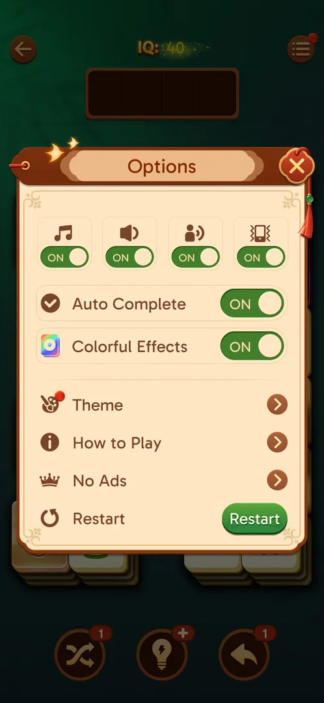

# No Ads purchase

A real-money offer to remove ads, opened from a row in the level's Options. Its popup holds one price
button labelled "Forever Super Offer", a Restore row and the store's subscription terms [^s3] [^s4].

## Why it appeared

A row in the in-level Options, present when the menu was first opened at level 19 [^s1]. It never came
up by itself in any session: the popup opens only when the Options row is tapped [^s5].

## Where to find it

Level screen > menu button (three lines, top right) > Options > the "No Ads" row with a crown, under How
to Play and above Restart [^s1] [^s2].

 [^s2]
*The "No Ads" row with a crown, third of the four rows in the in-level Options*

## What it looks like

 [^s3]
*The No Ads popup: one price button, Restore, the subscription terms and two links*

- A scroll with "Forever Super Offer" and an orange price button: a crossed-out AD icon and RSD 849
  [^s3].
- A "Restore" row with an arrow [^s3].
- A paragraph of five lines: the subscription is managed or cancelled in Google Play, with no refund for the
  running period [^s3].
- Two links, "Terms of Service" and "Privacy Policy" [^s3].

## What you can do

| Tab or button | What it does |
|---|---|
| [Price button (RSD 849)](#price-button-rsd-849) | Not tapped: it opens the store's payment sheet |
| [Restore](#restore) | No visible change |
| [Close X](#close-x) | Back to the board |

### Price button (RSD 849)

<!-- no-frame: the button is on the popup frame above; it was never tapped -->

The only offer on the popup, shown on the frame above. It was not tapped in any session (a real-money purchase) [^s4].

### Restore

<!-- no-frame: the frame after the tap is identical to the popup frame above -->

Tapped on level 21: the frame after the tap is the same as before it, no toast, the popup stays open
[^s5].

### Close X

<!-- no-frame: the frame after the X is the plain level board -->

The X top right closes the popup and the Options menu with it; the level board is under it [^s6].

## How it works

Version 3.40.1. One tier: RSD 849 (the price is shown in the store's local currency) [^s4]. The button
is labelled "Forever", while the paragraph under it speaks of a subscription and its billing period;
which applies was not checked (the price was not tapped) [^s4]. The popup shows no timer, countdown or
limit [^s4]. It does not come up by itself: in this session (level 21) and the earlier ones it opened
only from the Options row [^s5].

## Cases

| Case | What was done | Result | Source |
|---|---|---|---|
| No Ads row (crown) in the in-level Options <!-- case:chk-entry --> | Opened the in-level Options | ✅ | [^s1] |
| Why it appeared: a row in the in-level Options <!-- case:chk-appeared --> | Opened the in-level Options | ✅ A row there | [^s1] |
| What it looks like: its screen <!-- case:chk-screen --> | Tapped the No Ads row | ✅ One price button with a crossed-out AD icon (RSD 849), Restore, the Google Play subscription paragraph, two links | [^s4] |
| Contents and price of every pack or tier <!-- case:chk-contents --> | Read the popup | ✅ One tier, "Forever Super Offer", RSD 849; the paragraph speaks of a subscription (not checked: price not tapped) | [^s4] |
| How often it comes up by itself <!-- case:chk-frequency --> | Played level 21 and earlier levels | ✅ Never by itself; only from the Options row | [^s5] |
| Its timer or limit, if any <!-- case:chk-timer --> | Read the popup | ✅ No timer, countdown or limit | [^s4] |
| The way to buy <!-- case:chk-buy-path --> | Options > No Ads | ✅ In a level: menu > Options > No Ads > the RSD 849 button (not tapped) | [^s4] |
| Closing it <!-- case:chk-close --> | Tapped the X | ✅ The popup and Options close, back to the board | [^s6] |
| Restore <!-- case:restore-tap --> | Tapped the Restore row | ✅ No visible change, no toast, the popup stays | [^s5] |

## Not verified

- Whether the price buys a one-time removal ("Forever") or a subscription (the paragraph): the price was
  not tapped
- Terms of Service and Privacy Policy links: not followed

[^s1]: session 20261003-195050-chrono-2FYKPJ, step 18 — [video at 4:51](https://youtu.be/KUKs3cQ-xqY?t=291)
[^s2]: session 20261006-044557-chrono-2FYKPJ, step 2 — [video at 1:00](https://youtu.be/zbXLEc-sGlk?t=60)
[^s3]: session 20261006-044557-chrono-2FYKPJ, step 3 — [video at 1:10](https://youtu.be/zbXLEc-sGlk?t=70)
[^s4]: session 20261006-022624-chrono-2FYKPJ, step 17 — [video at 4:21](https://youtu.be/D6M-84xYVJM?t=261)
[^s5]: session 20261006-044557-chrono-2FYKPJ, step 4 — [video at 1:22](https://youtu.be/zbXLEc-sGlk?t=82)
[^s6]: session 20261006-022624-chrono-2FYKPJ, step 18 — [video at 4:36](https://youtu.be/D6M-84xYVJM?t=276)
