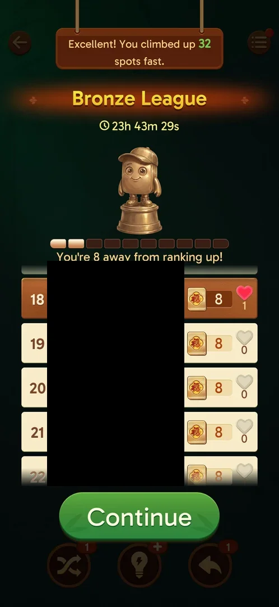

# Notification prompt

A popup headed "Important Notice!" that asks the player to turn on the app's notifications, with the
League leaderboard as the reason ("Open notifications and stay on top of the leaderboard!"). It has two
controls: a green Continue and a red X [^s1].

## Why it appeared

It came up once, right after the first [League](leagues.md) standing screen, which itself followed the
win of Hard level 20 (the first won level after joining the Bronze League) [^s2] [^s1]. Inferred from its
text and its place in the chain: the prompt is tied to the league standing; whether it shows after every
standing or only the first is not verified.

## Where to find it

There is no button for it. After a won level the league standing comes first; its green Continue at the
bottom brings up the notice over the dimmed standing [^s2].

 [^s2]
*The green Continue under the league standing: the notice comes up after it*

## What it looks like

 [^s1]
*The notice: the settings picture, the leaderboard line, Continue and the red X*

A cream card under a brown "Important Notice!" header. Inside, a drawing of the phone's notification
settings: "App notifications", the Vita Mahjong icon and name, and an "App notifications" switch set to
off with a pointing hand on it. Below: "Open notifications and stay on top of the leaderboard!", then a
large green Continue. A red round X sits on the header's right corner [^s1].

## What you can do

| Tab or button | What it does |
|---|---|
| [Continue](#continue) | Not tapped; by the picture, leads to the phone's notification settings |
| [Close (X)](#close-x) | Closes the notice; the post-win chain goes on |

### Continue

<!-- no-frame: the button is on the notice frame above; it was not tapped -->

Not tapped in this session. The picture on the card shows the system's App notifications switch, so
Continue is expected to open the phone's notification settings for the game (inferred, not verified) [^s1].

### Close (X)

<!-- no-frame: the X is on the notice frame above; the next screen belongs to Daily Victories -->

The red X closed the notice without changing anything; the next screen was the Daily Victories panel,
then the level's win screen [^s3].

## How it works

Version 3.40.1. The order after the Hard level 20 win: league standing, this notice, Daily Victories
panel, the win screen, the Rate Us popup, the level chest [^s2] [^s1] [^s3]. No reward is offered on the
card for turning notifications on [^s1].

## Cases

| Case | What was done | Result | Source |
|---|---|---|---|
| The screen: popup "Important Notice!" with the App notifications picture, "Open notifications and stay on top of the leaderboard!", Continue and X <!-- case:chk-screen --> | Tapped Continue on the league standing after the Hard level 20 win | ✅ the notice came up over the standing | [^s1] |
| Why it appeared: after the first league standing screen (Hard level 20 win) <!-- case:chk-appeared --> | Won Hard level 20 with the league joined | ✅ shown after the standing | [^s1] |
| Where to find it: no button; it follows the league standing's Continue <!-- case:chk-entry --> | — | not verified: seen once, no way to open it by hand found |  |
| Every option or button and what it changes <!-- case:chk-options --> | Closed with X | partly: X closes it; Continue not tapped | [^s3] |
| What each answer does and whether it comes back <!-- case:chk-answers --> | Closed with X | partly: X leads on to Daily Victories; whether it comes back after the next standing not seen | [^s3] |
| Links out: where Continue leads <!-- case:chk-links --> | — | not verified: Continue not tapped |  |

## Not verified

- Where to find it: whether it can be opened from anywhere but the post-win chain, and how often it comes
  up <!-- case:chk-entry -->
- Every option: what Continue does <!-- case:chk-options -->
- Each answer: whether the notice comes back after X, and after Continue <!-- case:chk-answers -->
- Links out: Continue presumably opens the phone's notification settings for the game <!-- case:chk-links -->

[^s1]: session 20261005-133525-chrono-2FYKPJ, step 42 — [video at 16:24](https://youtu.be/D10jI230Oks?t=984)
[^s2]: session 20261005-133525-chrono-2FYKPJ, step 41 — [video at 15:43](https://youtu.be/D10jI230Oks?t=943)
[^s3]: session 20261005-133525-chrono-2FYKPJ, step 43 — [video at 16:43](https://youtu.be/D10jI230Oks?t=1003)
