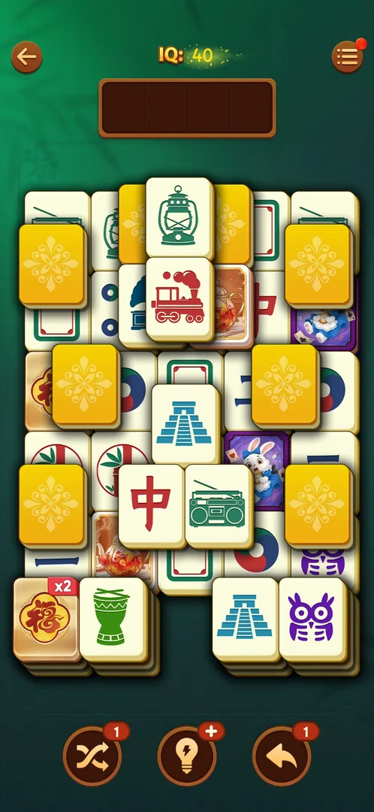
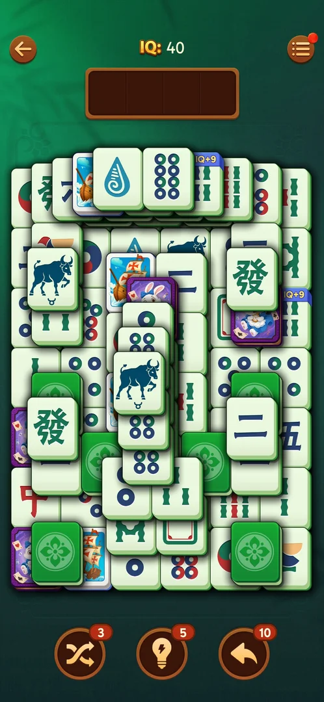

# Picture tiles

Tiles on the level board whose face is a drawing instead of a mahjong symbol: framed illustrations (a
ship, a rabbit on a purple playing card, a tea cup, an eagle), zodiac signs, and a blank card. They lie
among the ordinary tiles, and the notes of earlier sessions record them as ordinary pairs: two equal
pictures match like two equal mahjong tiles [^s4]. This page collects what was seen of them; their
rules were not studied on their own.

## Why it appeared

They are ordinary tile faces dealt on the board itself, with no intro and no trigger of their own: the
level 21 board opened from the home Level button had framed teapots and a rabbit card among the symbol
tiles [^s9]. Framed pictures were first noted between levels 12 and 19 [^s1], and every level 19, 20 and
21 board seen on 3.40.1 had some [^s3] [^s5] [^s6] [^s10]. The first level they show on is not known.

## Where to find it

Home screen > the orange "Level 19" button at the bottom. The tiles are on the board of the level it
opens. They have no control of their own [^s2] [^s9].

 [^s2]
*The "Level 19" button opens a board with picture tiles*

## What it looks like

 [^s10]
*Picture tiles on level 21: two teapots and a rabbit card, the same size as the symbol tiles*

 [^s3]
*Picture tiles on level 19: ships, rabbits on purple cards, the zodiac ox*

The faces seen so far, per board:

| Board | Picture faces | Source |
|---|---|---|
| Level 19, 3.40.1, session 20261003-195050 | zodiac tiles (Pisces, Gemini, Aries, Capricorn and others) | [^s5] |
| Level 19, 3.40.1, session 20261005-002327, first board | a sailing ship, a rabbit on a purple card, the zodiac ox | [^s3] |
| Level 19, 3.40.1, session 20261005-002327, after a reopen | a tea cup, an eagle | [^s7] |
| Level 20 (Hard), 3.40.1, session 20261005-073804 | a lilac bouquet, a clover, a window | [^s6] |
| Level 21, 3.40.1, session 20261006-044557 | a teapot (two tiles), a white rabbit on a purple playing card | [^s10] |
| Earlier version | framed roses, a gazebo, graffiti; a blank card (white face, green frame, red inner border) | [^s4] [^s8] |

- A picture tile is the same size as a symbol tile and lies in the same stacks [^s9].
- The picture fills the face inside a frame; the framed art tiles have a coloured border (blue for the
  ship, purple for the rabbit card) [^s3].
- The zodiac tiles are white with a dark blue drawing of the animal and its sign below [^s3].
- The blank card is not a face-down tile: it is face up, white, with a green frame and a red inner
  border [^s4].
- A picture tile can carry an "IQ+N" banner like any other tile (see [IQ bonus tiles](iq-bonus-tiles.md))
  [^s7].

## How it works

Version 3.40.1, from notes, not a study of its own:

- Earlier sessions' notes: the special faces (blank card, gold 福 tiles, framed pictures, IQ+N tiles)
  are ordinary pairs [^s4] [^s8].

## Outcomes

<!-- the map has no under-<outcome> cases for this feature yet -->

| Outcome | As the base or what differs | Frame |
|---|---|---|
| Win | not verified for this feature: the Hard level 20 board with picture tiles was won, but what the pictures changed was not recorded ([Hard level](hard-level.md)) | — |
| Out of space (loss) | As the base ([Tray mahjong level](core-level.md)): a ship was the fourth unmatched tile that filled the tray | — |
| Restart, exit the app | As the base: the new board has other pictures (ships and rabbits, then tea cups and eagles) | — |

## Cases

| Case | What was done | Result | Source |
|---|---|---|---|
| Why it appeared <!-- case:chk-appeared --> | Opened level 21 from the home Level button | ✅ Ordinary faces on the board, no intro or trigger | [^s9] |
| Where to find it <!-- case:chk-entry --> | Opened level 21 from the home Level button | ✅ On the level board itself, no button | [^s9] |
| What it looks like <!-- case:chk-screen --> | Opened level 21 | ✅ Framed teapots and a rabbit card among the symbol tiles, the same size | [^s9] |
| The first level it shows on and how the game introduces it <!-- case:chk-first-level --> | — | not verified | |
| What it does and how it is used <!-- case:chk-rules --> | — | not verified: ordinary pairs by earlier notes only | [^s4] |
| How it interacts with the other pieces <!-- case:chk-interactions --> | — | not verified | |
| Whether it adds a way to lose <!-- case:chk-loss --> | — | not verified | |

## Not verified

- The first level they show on and whether the game introduces them <!-- case:chk-first-level -->
- Whether two equal pictures match like ordinary tiles on 3.40.1, and what IQ a picture pair gives <!-- case:chk-rules -->
- How they interact with face-down tiles and the boosters <!-- case:chk-interactions -->
- Whether they add a way to lose <!-- case:chk-loss -->

[^s1]: session 20261005-133404-chrono-2FYKPJ, step 0 — [video at 0:00](https://youtu.be/mXyVOrOTPyg?t=0)
[^s2]: session 20261005-002327-chrono-2FYKPJ, step 1 — [video at 0:41](https://youtu.be/2aQPmh7YksQ?t=41)
[^s3]: session 20261005-002327-chrono-2FYKPJ, step 2 — [video at 0:53](https://youtu.be/2aQPmh7YksQ?t=53)
[^s4]: session 20261001-211823-chrono-2FYKPJ, step 6
[^s5]: session 20261003-195050-chrono-2FYKPJ, step 17 — [video at 4:17](https://youtu.be/KUKs3cQ-xqY?t=257)
[^s6]: session 20261005-073804-chrono-2FYKPJ, step 49 — [video at 16:48](https://youtu.be/nmXrQmoLWlU?t=1008)
[^s7]: session 20261005-002327-chrono-2FYKPJ, step 11 — [video at 3:46](https://youtu.be/2aQPmh7YksQ?t=226)
[^s8]: session 20260930-225122-chrono-2FYKPJ, step 76
[^s9]: session 20261006-044557-chrono-2FYKPJ, step 5 — [video at 1:36](https://youtu.be/zbXLEc-sGlk?t=96)
[^s10]: session 20261006-044557-chrono-2FYKPJ, step 1 — [video at 0:35](https://youtu.be/zbXLEc-sGlk?t=35)
