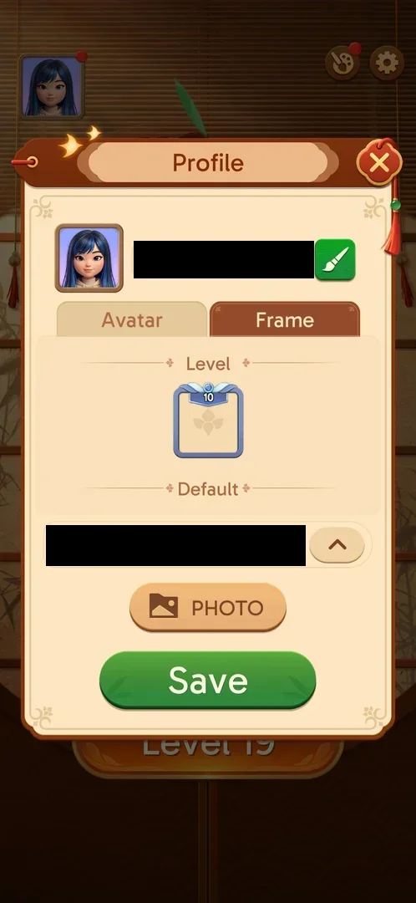

# Profile

The player's profile popup: the avatar, the player name with a rename button, an Avatar tab of preset
pictures and a Frame tab of avatar frames, a country selector and a PHOTO button [^s1] [^s2].

## Why it appeared

Open from the start: the avatar button on the home screen, with a red dot until the first visit [^s1].

## Where to find it

Home screen > the avatar picture in the top left corner [^s1].

 [^s1]
*The avatar button top left of the home screen, with its red dot*

## What it looks like

 [^s1]
*Profile, Avatar tab: name and rename brush, the avatar grid, country, PHOTO, Save*

- Top: the current avatar and the player name, which is an auto-generated ID; a green brush button
  beside it [^s1].
- Two tabs: Avatar and Frame [^s1].
- Under the tabs: a country selector with a flag and a drop-down arrow, a PHOTO button and a green Save
  button [^s1].
- A close X top right [^s1].

## What you can do

| Tab or button | What it does |
|---|---|
| [Avatar](#avatar) | Pick a preset picture or connect Facebook |
| [Frame](#frame) | Pick an avatar frame |
| [Rename brush](#rename-brush) | Not tried |
| [Country, PHOTO, Save](#country-photo-save) | Not tried |

### Avatar

 [^s1]
*The Avatar tab: Facebook Connect, a blank silhouette, six illustrated faces; the current one checked*

Eight tiles: "Facebook Connect", a blank silhouette, and six illustrated faces. The selected face has a
check mark [^s1].

### Frame

 [^s2]
*The Frame tab at level 19*

See [Level avatar frames](level-frames.md) [^s2].

### Rename brush

<!-- no-frame: on the Avatar tab frame above -->
A green brush button beside the name. Not tapped [^s1].

### Country, PHOTO, Save

<!-- no-frame: on the Avatar tab frame above -->
A country selector with a flag and a drop-down arrow, already set to a country, a PHOTO button and Save. None was tapped [^s1].

## How it works

Version 3.40.1. Sync Data brought back the avatar chosen in the earlier install [^s1]. The player name is
the same as the one shown in Achievements [^s1].

## Cases

| Case | What was done | Result | Source |
|---|---|---|---|
| Avatar button, home top left <!-- case:chk-entry --> | Tapped it | ✅ | [^s1] |
| Profile popup: Avatar and Frame tabs, player ID, rename, Facebook Connect, country, photo <!-- case:chk-screen --> | Opened both tabs | ✅ | [^s2] |
| Why it appeared: the trigger that brought it up (the first launch, a level won, a threshold, a timer, a loss): a fact with its frame, or a hypothesis to test <!-- case:chk-appeared --> | — | ✅ Open from the start | [^s1] |
| Every option or button and what it changes (each toggle once, set back after) <!-- case:chk-options --> | Switched to the Frame tab | partly: the tabs; rename, avatar pick, country, PHOTO and Save not tried | [^s2] |
| For a prompt (consent, rate us, notifications): what each answer does and whether it comes back <!-- case:chk-answers --> | — | does not apply: not a prompt |  |
| Links out (privacy, terms, help): where they lead (back to the game at once) <!-- case:chk-links --> | — | not verified: Facebook Connect not tapped |  |

## Not verified

- Every option: rename, a new avatar, country, PHOTO, Save <!-- case:chk-options -->
- Links out: Facebook Connect <!-- case:chk-links -->

[^s1]: session 20261003-195050-chrono-2FYKPJ, step 5 — [video at 1:31](https://youtu.be/KUKs3cQ-xqY?t=91)
[^s2]: session 20261003-195050-chrono-2FYKPJ, step 6 — [video at 1:46](https://youtu.be/KUKs3cQ-xqY?t=106)
