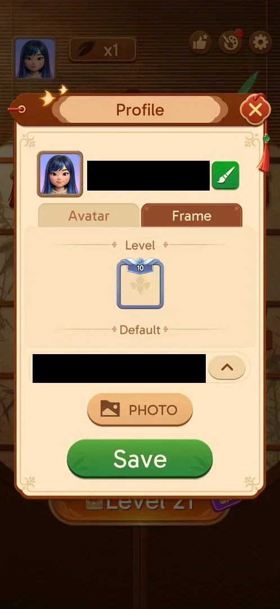
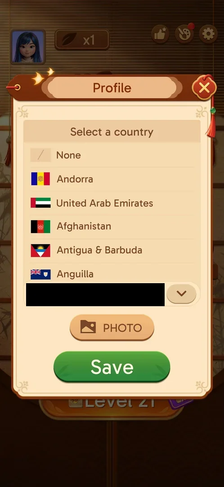

# Profile

The player's profile popup: the avatar, the player name with a rename button, an Avatar tab of preset
pictures and a Frame tab of avatar frames, a country selector, a PHOTO button and Save [^s1] [^s2].

## Why it appeared

Open from the start: the avatar button on the home screen, with a red dot until the first visit [^s1].

## Where to find it

Home screen > the avatar picture in the top left corner [^s1].

 [^s1]
*The avatar button top left of the home screen, with its red dot*

## What it looks like

 [^s2]
*Profile, Avatar tab: name and rename brush, the avatar grid, country, PHOTO, Save*

- Top: the current avatar and the player name, which is an auto-generated ID; a green brush button
  beside it [^s1].
- Two tabs: Avatar and Frame [^s1].
- Under the tabs: a country selector with a flag and an arrow button, a PHOTO button and a green Save
  button [^s1].
- A close X top right [^s1].

## What you can do

| Tab or button | What it does |
|---|---|
| [Avatar](#avatar) | Pick a preset picture or connect Facebook |
| [Frame](#frame) | Pick an avatar frame |
| [Rename brush](#rename-brush) | Opens a text field to edit the name |
| [Country](#country) | Opens the "Select a country" list |
| [PHOTO](#photo) | Opens the phone's photo picker |
| [Save and the close X](#save-and-the-close-x) | Keep or drop the changes |

### Avatar

 [^s1]
*The Avatar tab: Facebook Connect, a blank silhouette, six illustrated faces; the current one checked*

Eight tiles: "Facebook Connect", a blank silhouette, and six illustrated faces. The selected face has a
check mark [^s1]. Facebook Connect was not tapped (it signs in to Facebook) [^s8].

### Frame

 [^s4]
*The Frame tab at level 21: the same single Level frame as at level 19*

The tab lists the frames by section: Level (one frame badged 10) and Default [^s3] [^s4]. See
[Level avatar frames](level-frames.md).

### Rename brush

<!-- no-frame: the text field frame shows the player name, so it is described in words -->
The green brush opens a plain text field across the screen, above the keyboard, holding the current name,
with OK at its right end. A character typed by mistake was removed with backspace and the name came back
unchanged; no new name was saved [^s9] [^s6].

### Country

 [^s5]
*The country list, opened with the arrow right of the country*

The arrow right of the country opens a scrolling list headed "Select a country": "None" first, then
countries with their flags in the order of their two-letter codes (AD Andorra, AE United Arab Emirates,
AF Afghanistan, …; the order is inferred from the names). The arrow, now pointing down, closes the list
[^s5].

### PHOTO

<!-- no-frame: the photo picker is the phone's own screen, not the game's -->
PHOTO opens the phone's system photo picker (Photos and Collections; empty on the test phone). Back
returns to the Profile popup with nothing changed [^s10] [^s6].

### Save and the close X

<!-- no-frame: both are on the Profile frame above -->
The close X shuts the popup without a confirmation and without saving [^s7]. Save was not pressed with a
change pending [^s6].

## How it works

Version 3.40.1. Sync Data brought back the avatar chosen in the earlier install [^s1]. The player name is
the same as the one shown in Achievements [^s1].

## Cases

| Case | What was done | Result | Source |
|---|---|---|---|
| Avatar button, home top left <!-- case:chk-entry --> | Tapped it | ✅ | [^s1] |
| Profile popup: Avatar and Frame tabs, player ID, rename, Facebook Connect, country, photo <!-- case:chk-screen --> | Opened both tabs | ✅ | [^s3] |
| Why it appeared: the trigger that brought it up (the first launch, a level won, a threshold, a timer, a loss): a fact with its frame, or a hypothesis to test <!-- case:chk-appeared --> | — | ✅ Open from the start | [^s1] |
| Every option or button and what it changes <!-- case:chk-options --> | Rename brush (a character typed and removed, OK), the country list, PHOTO, the Avatar and Frame tabs, X | ✅ Rename opens a system text field; the country list starts with None; PHOTO opens the photo picker; nothing was saved. Facebook Connect not tapped | [^s6] |
| Prompts and their answers <!-- case:chk-answers --> | Closed with X | ✅ No prompt in Profile; X closes without saving and without a confirmation | [^s7] |
| Links out <!-- case:chk-links --> | PHOTO, then Back | ✅ PHOTO leads to the phone's photo picker, Back returns to Profile; Facebook Connect not tapped (sign-in) | [^s8] |

## Not verified

- Facebook Connect (a sign-in, avoided)
- Saving a new name, avatar, country or photo with Save

[^s1]: session 20261003-195050-chrono-2FYKPJ, step 5 — [video at 1:31](https://youtu.be/KUKs3cQ-xqY?t=91)
[^s2]: session 20261006-071736-chrono-2FYKPJ, step 1 — [video at 0:37](https://youtu.be/E5MtJUwuItk?t=37)
[^s3]: session 20261003-195050-chrono-2FYKPJ, step 6 — [video at 1:46](https://youtu.be/KUKs3cQ-xqY?t=106)
[^s4]: session 20261006-071736-chrono-2FYKPJ, step 11 — [video at 1:56](https://youtu.be/E5MtJUwuItk?t=116)
[^s5]: session 20261006-071736-chrono-2FYKPJ, step 7 — [video at 1:25](https://youtu.be/E5MtJUwuItk?t=85)
[^s6]: session 20261006-071736-chrono-2FYKPJ, step 10 — [video at 1:52](https://youtu.be/E5MtJUwuItk?t=112)
[^s7]: session 20261006-071736-chrono-2FYKPJ, step 34 — [video at 5:50](https://youtu.be/E5MtJUwuItk?t=350)
[^s8]: session 20261006-071736-chrono-2FYKPJ, step 13 — [video at 2:12](https://youtu.be/E5MtJUwuItk?t=132)
[^s9]: session 20261006-071736-chrono-2FYKPJ, step 2 — [video at 0:49](https://youtu.be/E5MtJUwuItk?t=49)
[^s10]: session 20261006-071736-chrono-2FYKPJ, step 9 — [video at 1:38](https://youtu.be/E5MtJUwuItk?t=98)
