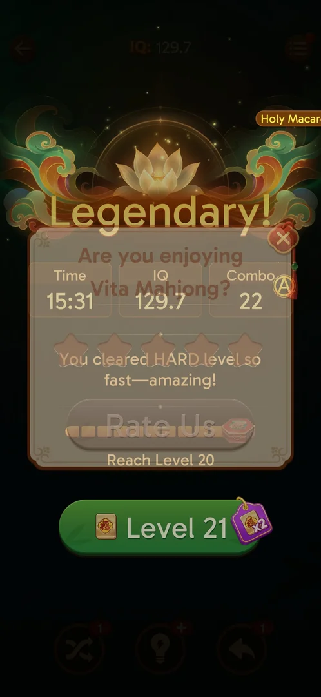
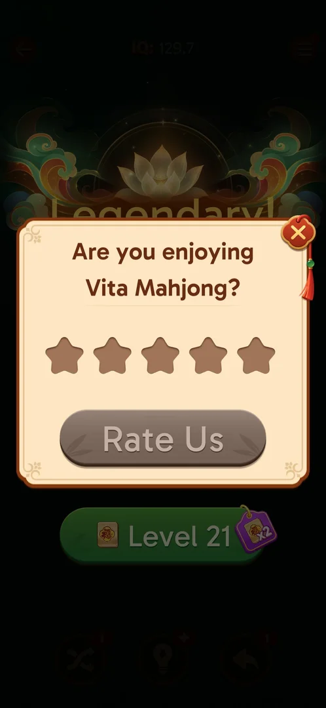
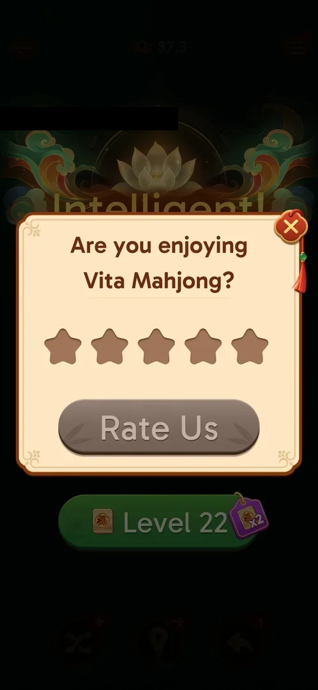
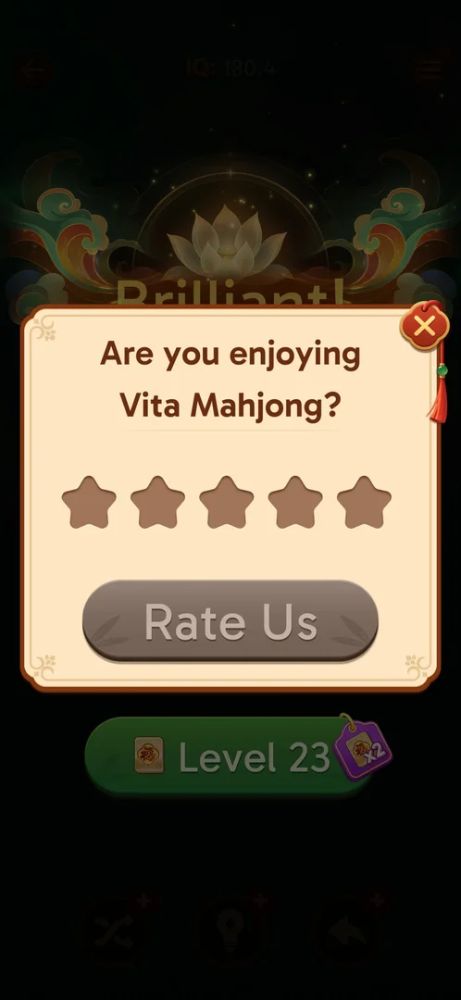

# Rate Us popup

A rating prompt over a level's win screen: "Are you enjoying Vita Mahjong?", five stars, a Rate Us button
and a close X [^s1]. It came after the level 19 win and after the Hard level
20 win [^s2] [^s1]. The thumbs-up button on
the home screen, first taken for a rate button, opens [Achievements](achievements.md)
[^s3].

## Why it appeared

Over the win screen after a won level: after the level 19 win, right after the chest bar's segment filled
[^s2], and after the Hard level 20 win, once the win screen ("Legendary!")
was up and before the level chest opened [^s1]. Hypothesis: it comes
after every won level from level 19 on; not verified (four wins seen, all with it).

## Where to find it

It has no button: it comes up by itself over the level win screen [^s1].

 [^s1]
*The win screen the popup comes up over*

## What it looks like

 [^s1]
*The Rate Us popup after the Hard level 20 win*

- The title on two lines, five brown empty stars, Rate Us in grey [^s1].
- The close X at the top right corner of the popup [^s1].

## What you can do

| Tab or button | What it does |
|---|---|
| [Stars](#stars) | Not tried |
| [Rate Us](#rate-us) | Grey: not tried |
| [Close](#close) | Closes the popup; the win screen goes on |

### Stars

<!-- no-frame: the stars are on the popup frame above -->
Not tried. Inferred from the grey button: Rate Us becomes active once a star is chosen; not verified.

### Rate Us

<!-- no-frame: the button is on the popup frame above -->
Not tried; grey while no star is chosen [^s1].

### Close

<!-- no-frame: the X is on the popup frame above -->
The X closed the popup; next the level chest flew to the middle of the win screen (see
[Level progress chest](level-chest.md)) [^s4].

## How it works

Version 3.40.1.

- Shown after the level 19 win and the level 20 win, on the same day; no reward is shown on it
  [^s2] [^s1].
- Closing it costs nothing and the post-win chain goes on [^s4].
- Shown again after the level 21 win on the next day, the third won level in a row with the popup,
  over the win screen and after the Daily Victories panel; closed with the X again [^s6].

 [^s6]
*The rating popup after the level 21 win: five empty stars, Rate Us grey, the X*

- Shown again after the level 22 win, later the same day (12:43 on 2026-10-06): after the league standing,
  the notification notice and the Daily Victories panel, over the "Brilliant!" win screen with the Level
  23 button; closed with the X, the win screen stayed [^s7] [^s8].

 [^s7]
*The rating popup after the level 22 win, the fourth won level in a row with it*

## Cases

| Case | What was done | Result | Source |
|---|---|---|---|
| The thumbs-up button on home <!-- case:chk-entry --> | Tapped it | ✅ It is the Achievements entry, not a rate button | [^s3] |
| The screen that button opens <!-- case:chk-screen --> | Tapped it | ✅ Achievements | [^s3] |
| Options of the button <!-- case:chk-options --> | — | ✅ None of its own: the button belongs to Achievements | [^s3] |
| Answers <!-- case:chk-answers --> | — | ✅ The button gives no rating prompt; the prompt is the popup below | [^s3] |
| Links out <!-- case:chk-links --> | — | ✅ None from the button | [^s3] |
| Why it appeared <!-- case:chk-appeared --> | Left level 19 with the back arrow | ✅ The thumbs-up button was on the home screen (later found to be Achievements) | [^s5] |
| The real rating prompt <!-- case:real-prompt --> | Won the Hard level 20 | ✅ "Are you enjoying Vita Mahjong?", five stars, Rate Us grey until a star is chosen, X | [^s1] |
| Whether it returns after X <!-- case:returns-after-x --> | Closed it with the X after the level 19 and level 20 wins, then won level 21 and level 22 | ✅ It came again over the level 21 and level 22 win screens | [^s6] [^s7] |
| After the level 22 win <!-- case:after-l22 --> | Won level 22, went through the standing, the notice and Daily Victories | ✅ The popup over the win screen again; closed with the X | [^s7] [^s8] |

## Not verified

- A star tapped, Rate Us tapped, where it leads (the store), and whether the popup stops coming after
  an answer
- What brings the popup up: so far it came after every won level from 19 to 22, each time closed with
  the X; whether it comes after every win or stops after a number of closes

[^s1]: session 20261005-133525-chrono-2FYKPJ, step 44 — [video at 17:24](https://youtu.be/D10jI230Oks?t=1044)
[^s2]: session 20261005-073804-chrono-2FYKPJ, step 47 — [video at 15:43](https://youtu.be/nmXrQmoLWlU?t=943)
[^s3]: session 20261003-195050-chrono-2FYKPJ, step 23 — [video at 6:19](https://youtu.be/KUKs3cQ-xqY?t=379)
[^s4]: session 20261005-133525-chrono-2FYKPJ, step 45 — [video at 18:05](https://youtu.be/D10jI230Oks?t=1085)
[^s5]: session 20261003-195050-chrono-2FYKPJ, step 22 — [video at 6:00](https://youtu.be/KUKs3cQ-xqY?t=360)
[^s6]: session 20261006-072809-chrono-2FYKPJ, step 54 — [video at 22:52](https://youtu.be/lmyXziDOcNk?t=1372)

[^s7]: session 20261006-122751-chrono-2FYKPJ, step 43 — [video at 12:39](https://youtu.be/B2PSO6tOKeQ?t=759)
[^s8]: session 20261006-122751-chrono-2FYKPJ, step 44 — [video at 12:53](https://youtu.be/B2PSO6tOKeQ?t=773)
