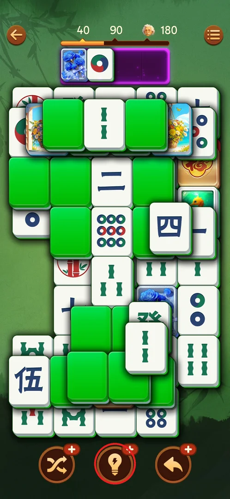
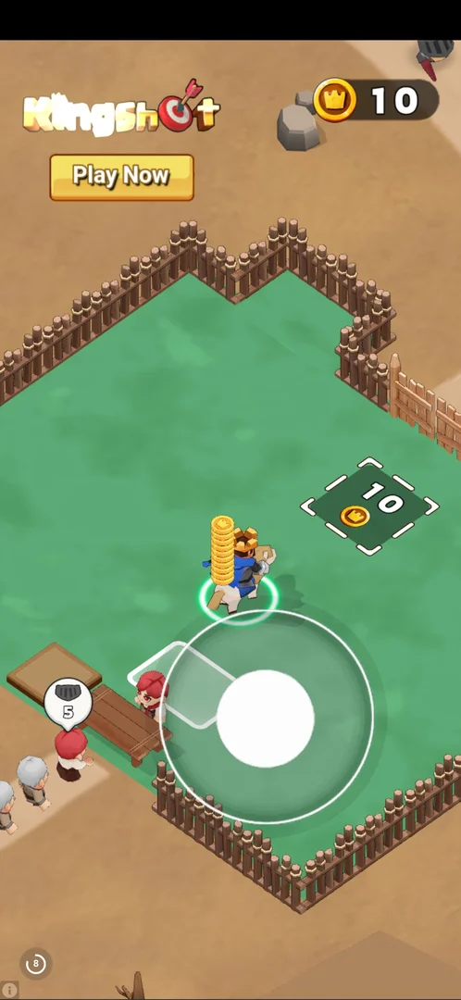
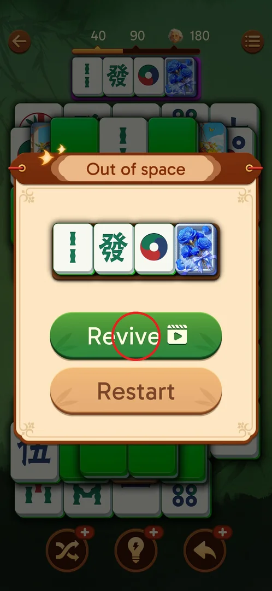
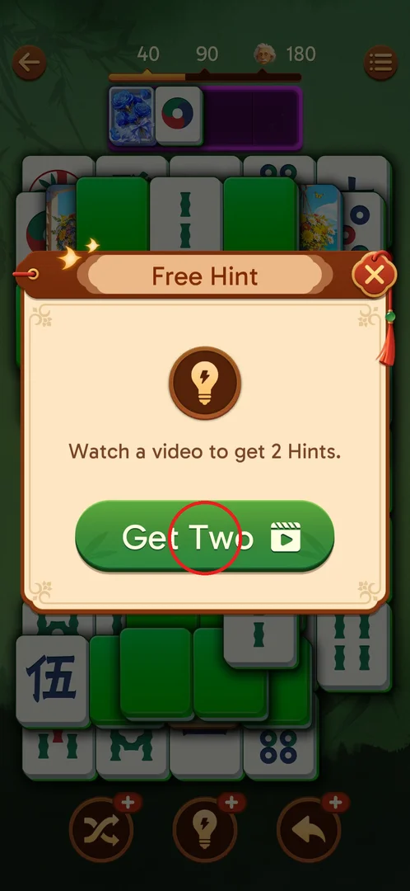
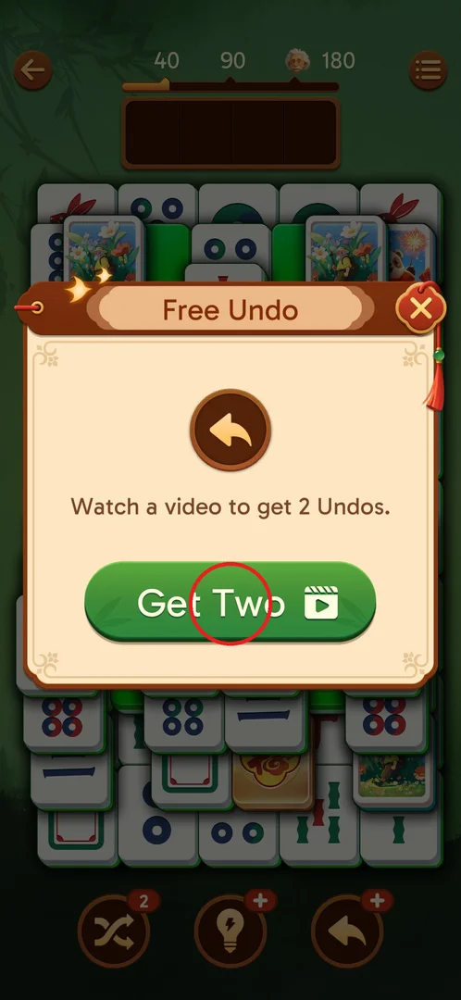
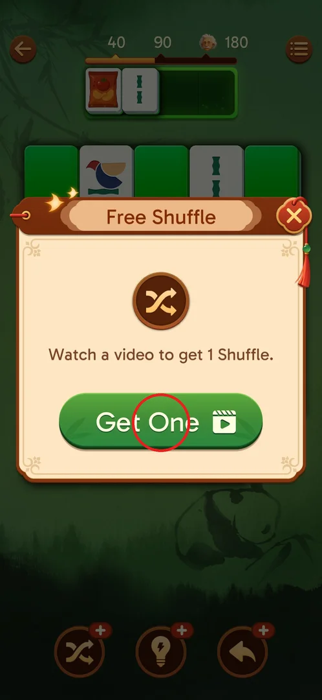
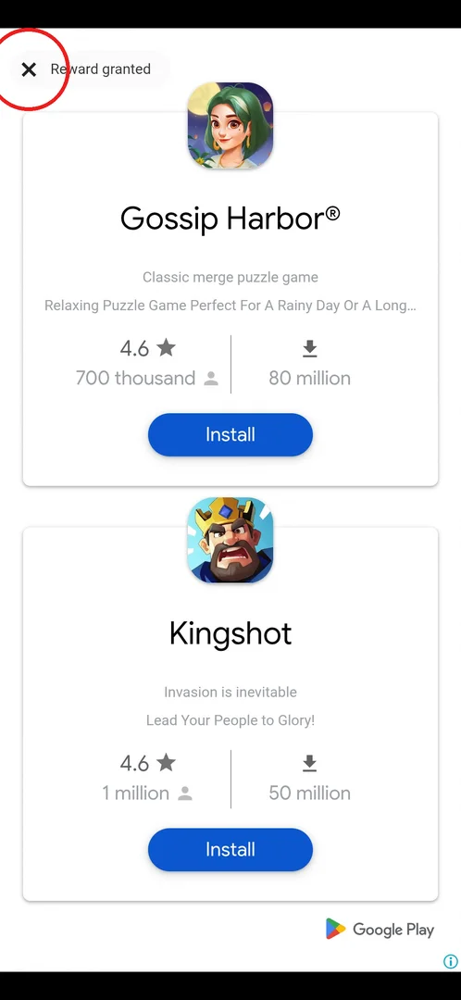
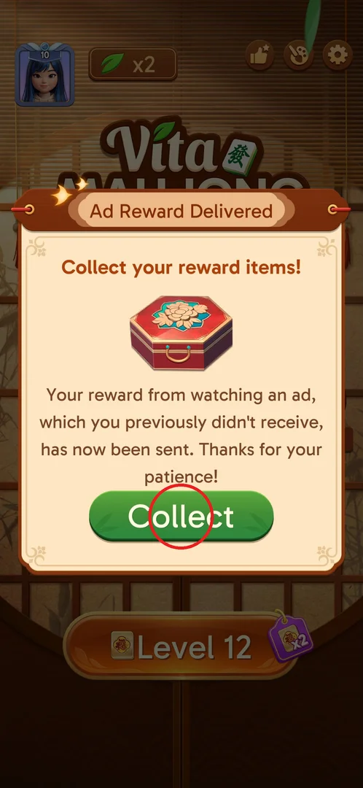
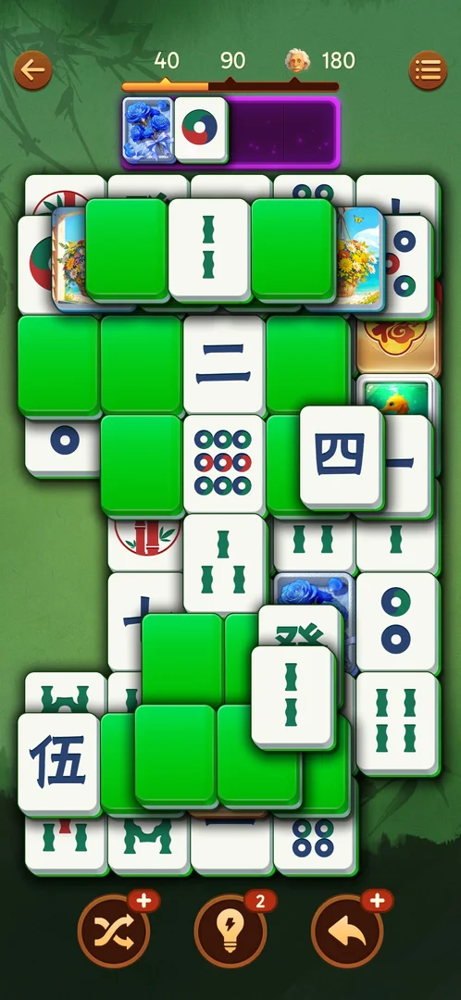

# Rewarded ads

Rewarded ads are the game's free way to refill boosters and to get out of a lost level: when a booster
(Hint, Undo, Shuffle) or a Revive runs out, its button offers a video instead, and watching the video to
the end grants the item [^s4] [^s9]. The ads are for other games, often playable mini-games [^s2] [^s10];
the player never pays anything. If an ad is cut off, the game sends the reward on the next launch [^s6].

## Where to find it

Inside a level, the booster bar at the bottom holds Shuffle, Hint and Undo. A booster at stock 0 shows a
red "+" instead of its count; tapping it opens that booster's free-video popup (Free Hint below)[^s1].
The other entry is the "Out of space" popup that comes up when the tray is full: with Revive stock 0,
its Revive button carries a video icon ([Revive](#revive))[^s3].

 [^s1]

## What it looks like

Each offer is a cream popup with the booster's icon, the line "Watch a video to get N …" and a green
button with a film-clapper icon[^s4]. The video then runs full screen over the game. Some are plain
videos with a "Reward granted" end card[^s5]; others are playable ads for another game, with a
countdown and no close button at all[^s2][^s10].

 [^s2]

## What you can do

| Tab or button | What it does |
|---|---|
| [Revive](#revive) | Out of space with Revive stock 0: a video puts the tray tiles back on the board |
| [Free Hint](#free-hint) | Hint "+" at stock 0: a video gives 2 Hints |
| [Free Undo](#free-undo) | Undo "+" at stock 0: a video gives 2 Undos |
| [Free Shuffle](#free-shuffle) | Shuffle "+" at stock 0: a video gives 1 Shuffle |
| [Reward granted](#reward-granted) | The ad's end card; its X returns to the level with the reward |
| [Ad Reward Delivered](#ad-reward-delivered) | On launch: the reward of an ad that was cut off, as a chest |

### Revive

When the 4-slot tray fills up with no match, the "Out of space" popup shows the stuck tiles with Revive
and Restart. With Revive stock 0 the Revive button has a video icon: tapping it plays a rewarded ad,
and after it the tray tiles go back to the board and the level goes on[^s3][^s10].

 [^s3]

### Free Hint

Hint "+" at stock 0 opens "Free Hint": watch a video to get 2 Hints, button Get Two; the X top right
closes it with nothing[^s4]. After the video the Hint button shows 2[^s9].

 [^s4]

### Free Undo

Undo "+" at stock 0 opens "Free Undo" in the same layout: one video gives 2 Undos, button Get Two[^s7].

 [^s7]

### Free Shuffle

Shuffle "+" at stock 0 opens "Free Shuffle": one video gives only 1 Shuffle, button Get One[^s8].

 [^s8]

### Reward granted

A plain video ad ends on a Google Play card for the advertised games with "Reward granted" and an X at
the top left; the X returns to the level with the reward already added[^s5][^s9].

 [^s5]

### Ad Reward Delivered

If an ad was cut off (the game was brought back to the front while the ad still ran), the next launch
opens "Ad Reward Delivered": a chest and Collect. The chest held Hint x2 and Shuffle x2[^s6][^s12],
and the same chest came again on a later launch[^s11][^s13].

 [^s6]

### Result

After the video the level comes back and the Hint button shows 2 [^s9].

 [^s9]

## How it works

Version 3.39.1.

| Placement | Offered when | Reward per video |
|---|---|---|
| Revive | Out of space, Revive stock 0 | tray tiles back on the board[^s10] |
| Free Hint | Hint stock 0 | 2 Hints[^s9] |
| Free Undo | Undo stock 0 | 2 Undos[^s7] |
| Free Shuffle | Shuffle stock 0 | 1 Shuffle[^s8] |

- No daily cap seen: 8 Free Hint videos in about 2.5 h, all paid out[^s9][^s14];
  the 9th that day still gave 2 Hints[^s15][^s16].
- An ad takes 40–150 s; the videos took about 6 minutes of one session[^s17].
- Playable ads may have no close button: Back and taps do nothing. Bringing the game back to the front
  returns to the level, and the reward is granted[^s10][^s17][^s18].
  An ad's skip arrow once opened the Play Store; returning to the game still granted the reward[^s15].
- No interstitial (unrequested) ad was seen between levels, e.g. between L17 and L18[^s18].

## Cases

| Case | What was done | Result | Source |
|---|---|---|---|
| Revive | Revive (video) with stock 0 | Tray tiles back on the board | [^s10] |
| Free Hint | Hint "+" → Get Two | 2 hints per video; 8 videos in about 2.5 h, no cap seen | [^s9] [^s14] |
| Free Undo | Undo "+" at stock 0 | "Free Undo": 1 video = 2 Undos (popup only, no video watched) | [^s7] |
| Free Shuffle | Shuffle "+" at stock 0 | "Free Shuffle": 1 video = 1 Shuffle (popup only, no video watched) | [^s8] |
| No cap | 9th Free Hint video in a day | Still 2 Hints | [^s15] |
| Playable with no close | Back, taps | Nothing; bringing the game to the front returns to the level and the reward is granted | [^s10] [^s17] |
| Lost reward | An ad cut off by a relaunch | Next launch: "Ad Reward Delivered", a chest with Hint x2 and Shuffle x2 | [^s6] [^s12] |
| Lost reward again | Next launch of a later session | "Ad Reward Delivered" again, chest Hint x2 and Shuffle x2 | [^s11] [^s13] |

## Not verified

- Undo and Shuffle videos actually watched: only the popups were seen, not the reward landing.
- A daily cap above 9 videos.
- Which interrupted ad the second "Ad Reward Delivered" paid for (inferred: another ad left via a relaunch).
- Interstitial ads between levels: none recorded so far.

[^s1]: session 20261001-010125-chrono-2FYKPJ, step 44 — [video at 19:20](https://youtu.be/vc6OylgqaTw?t=1160)
[^s2]: session 20261001-010125-chrono-2FYKPJ, step 36 — [video at 14:26](https://youtu.be/vc6OylgqaTw?t=866)
[^s3]: session 20261001-010125-chrono-2FYKPJ, step 35 — [video at 14:08](https://youtu.be/vc6OylgqaTw?t=848)
[^s4]: session 20261001-010125-chrono-2FYKPJ, step 45 — [video at 19:47](https://youtu.be/vc6OylgqaTw?t=1187)
[^s5]: session 20261001-010125-chrono-2FYKPJ, step 46 — [video at 20:06](https://youtu.be/vc6OylgqaTw?t=1206)
[^s6]: session 20261001-031723-chrono-2FYKPJ, step 0
[^s7]: session 20261001-063226-chrono-2FYKPJ, step 2
[^s8]: session 20261001-063226-chrono-2FYKPJ, step 63
[^s9]: session 20261001-010125-chrono-2FYKPJ, step 47 — [video at 20:55](https://youtu.be/vc6OylgqaTw?t=1255)
[^s10]: session 20261001-010125-chrono-2FYKPJ, step 43 — [video at 18:52](https://youtu.be/vc6OylgqaTw?t=1132)
[^s11]: session 20261001-083725-chrono-2FYKPJ, step 0

[^s12]: session 20261001-031723-chrono-2FYKPJ, step 2
[^s13]: session 20261001-083725-chrono-2FYKPJ, step 2
[^s14]: session 20261001-031723-chrono-2FYKPJ, step 80
[^s15]: session 20261001-063226-chrono-2FYKPJ, step 52
[^s16]: session 20261001-063226-chrono-2FYKPJ, step 64
[^s17]: session 20261001-031723-chrono-2FYKPJ, step 82
[^s18]: session 20261001-110957-chrono-2FYKPJ, step 59
