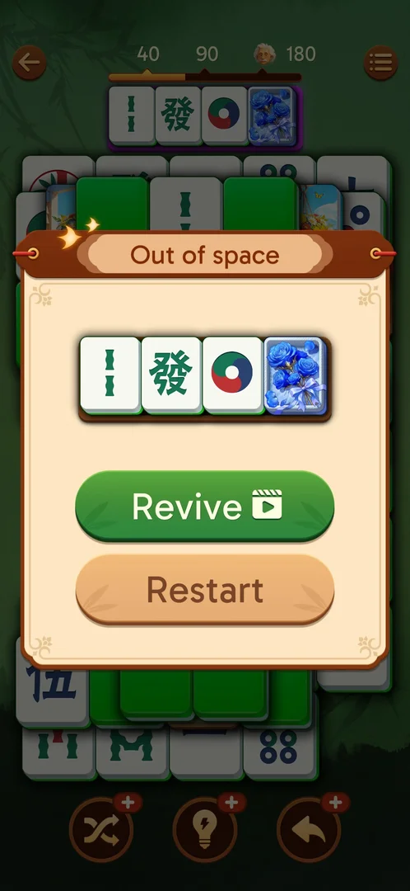

# Rewarded ads

## Cases
| Case | What was done | Result | Source |
|---|---|---|---|
| Revive | Revive (video) with stock 0 | Tray tiles back on the board | [s:20261001-010125-chrono-2FYKPJ#43] |
| Free Hint | Hint "+" → Get Two | 2 hints per video; 8 videos in about 2.5 h, no cap seen | [s:20261001-010125-chrono-2FYKPJ#47] [s:20261001-031723-chrono-2FYKPJ#80] |
| Playable with no close | Back, taps | Nothing; `launch` returns to the level and the reward is granted | [s:20261001-010125-chrono-2FYKPJ#43] [s:20261001-031723-chrono-2FYKPJ#82] |
| Lost reward | An ad cut off by a relaunch | Next launch: "Ad Reward Delivered", a chest with Hint x2 and Shuffle x2 | [s:20261001-031723-chrono-2FYKPJ#0] [s:20261001-031723-chrono-2FYKPJ#2] |

Ads take 40–150 s each: about 6 minutes in session 20261001-031723-chrono-2FYKPJ [s:20261001-031723-chrono-2FYKPJ#82].

## Not verified
- Undo and Shuffle "+"; a daily cap; interstitials between levels (none recorded).
