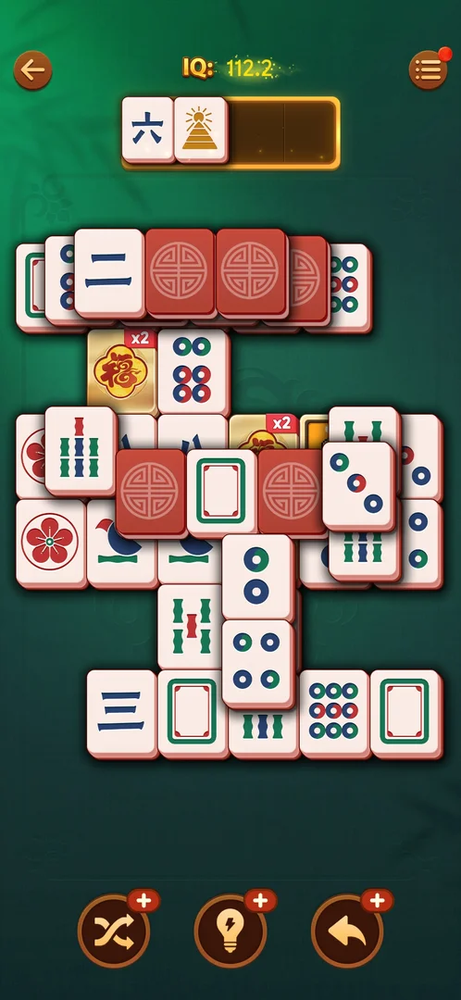
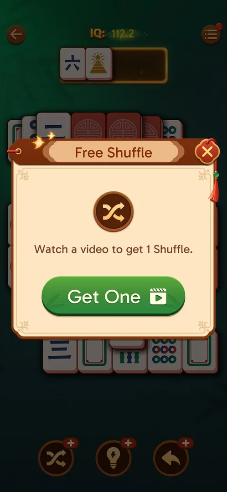
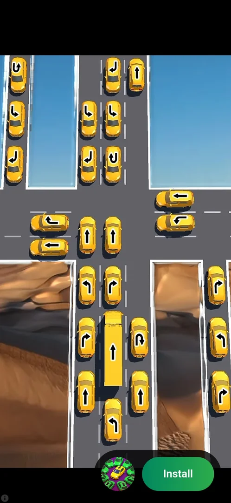
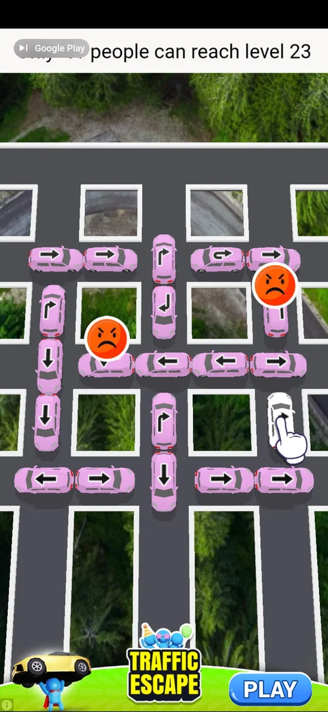

# Rewarded videos

A rewarded video is an ad the player chooses to watch in exchange for an in-game item. In Vita Mahjong
3.40.1 it is offered when a booster (Shuffle, Hint, Undo) has run out in a level: the booster's button
opens a "Free <booster>" window, and watching the video adds that booster [^s3] [^s5]. The same video icon
is on the level chest's "Collect x2" button [^s7].

## Why it appeared

A booster at 0 in a level: tapping Hint (then Shuffle, Undo) with a "+" badge opens a Free <booster>
window with a video button [^s1]. The video starts only from that window's green button: it is opt-in
[^s4].

## Where to find it

In a level, a booster button whose badge shows "+" instead of a number (0 left). In level 22 all three
showed "+" at a dead end; the Shuffle button at the bottom left was tapped [^s2] [^s3].

 [^s2]
*The entry: the Shuffle button bottom left with its "+" badge (0 left)*

Other places with the video icon:

- the level chest's reward window, "Collect x2" (green, with a video icon) above the plain "Collect";
  not tapped [^s7];
- possibly the green Revive button of the "Out of space" loss window (a red badge "5"); whether it plays
  a video is not verified [^s8].

## What it looks like

The offer is a window over the dimmed level: the title "Free Shuffle", the booster's icon, the line
"Watch a video to get 1 Shuffle.", a green "Get One" button with a video (clapperboard) icon, and a red
close X at the top right [^s3]. For Undo and Hint the window reads the same with "Get Two" and 2 boosters
[^s1] [^s6].

 [^s3]
*The offer window: Get One starts the video, X closes it*

## What you can do

| Tab or button | What it does |
|---|---|
| [Close X](#close-x) | Closes the offer window with nothing spent and nothing granted [^s9] |
| [Get One / Get Two](#get-one--get-two) | Starts the video: the screen goes black, then the ad plays full screen [^s4] |
| [The video](#the-video) | A full-screen ad for another game, with an Install button and no close control |
| [End card](#end-card) | The ad ends on a playable card with a PLAY button and no close X |
| [Reward](#reward) | Back in the level, the booster's badge shows the granted count |

### Close X

<!-- no-frame: the X is on the offer window frame above; the board after closing looks the same as the entry frame -->

The red X at the top right of the offer window closes it; the level goes on with the booster still at
"+" and nothing spent [^s9].

### Get One / Get Two

<!-- no-frame: the frame right after Get One is a black screen before the ad -->

The green button starts the video. The first frame after the tap was black, then the ad played full
screen [^s4].

### The video

 [^s4]
*About 40 s after Get One: the ad, an Install button, no X*

The ad was for another publisher's game (a traffic puzzle). About 40 s after Get One it was still
running, with only an Install button and a small info icon at the bottom left [^s4].

### End card

 [^s4]
*About 70 s after Get One: the playable end card, still no X*

About 70 s after Get One the ad showed a playable end card ("Traffic Escape", a Google Play badge, a PLAY
button) with no close X [^s4]. The game was brought back to the front by relaunching it, without the Back
button [^s5].

### Reward

 [^s5]
*Back in the level: Shuffle 1*

The level came back as it was left, with the Shuffle badge at 1: the reward was granted although the end
card was never closed [^s5]. The Shuffle was then used, and the badge went back to "+" [^s10].

## How it works

Version 3.40.1.

| Offer | Window | Button | Reward per video | Watched |
|---|---|---|---|---|
| Shuffle at 0 | Free Shuffle | Get One | 1 Shuffle | yes, level 22 [^s5] |
| Undo at 0 | Free Undo | Get Two | 2 Undos | no [^s6] |
| Hint at 0 | Free Hint | Get Two | 2 Hints | no [^s1] |
| Level chest | chest reward window | Collect x2 | the chest's contents doubled | no [^s7] |

- The video is opt-in: it plays only after Get One / Get Two (or Collect x2) [^s4].
- The video watched was an ad for another game, full screen, with no close control during the video and
  none on its end card; the reward reached the game anyway [^s4] [^s5].
- Timings of the one video watched: the ad still playing about 40 s after Get One, the end card about
  70 s after, the game brought back about 88 s after [^s4] [^s5].
- No unasked (interstitial) ad was seen after the wins of levels 19 to 22 (the feature's record).

## Cases

| Case | What was done | Result | Source |
|---|---|---|---|
| Where the videos are offered <!-- case:chk-entry --> | Boosters at 0 tapped in levels; the level chest and the loss window looked at | A booster at 0 (Free Hint and Free Undo "Get Two", Free Shuffle "Get One"); Collect x2 on the level chest; possibly Revive in the Out of space window | [^s3] [^s7] [^s8] |
| What a video gives <!-- case:chk-reward --> | Free Shuffle's Get One watched in level 22 | Shuffle "+" to 1; Free Undo and Free Hint offer 2 | [^s5] [^s6] [^s1] |
| What kind of ad <!-- case:chk-kind --> | The Free Shuffle video watched | A rewarded, opt-in, full-screen ad for another game, ending on a playable card (Traffic Escape, Google Play badge, PLAY) | [^s4] |
| How it closes <!-- case:chk-close --> | The video left to run; the game relaunched from the end card; the offer window closed with X | The ad ended on a playable card with no close X; back in the game the reward was kept. The offer window's X closes it with nothing spent | [^s5] [^s9] |
| The screens <!-- case:chk-screen --> | Frames of the offer window, the ad and its end card kept | The offer window, the ad and the playable end card, shown above | [^s3] [^s4] |
| Why it appeared <!-- case:chk-appeared --> | A booster at 0 tapped in a level | It opens the Free <booster> offer with the video button | [^s1] |
| How often <!-- case:chk-frequency --> | Not tested | not verified | |

## Not verified

- Whether a booster video can be watched again right away (a second Get One in a row), and whether any
  interstitial (unasked) ad shows between levels; none seen after the wins of levels 19 to 22
  <!-- case:chk-frequency -->
- The Free Undo and Free Hint videos and Collect x2 were not watched: their rewards are read from the
  windows only.
- Whether Revive in the "Out of space" window plays a video.
- Whether the reward is granted when the ad is left before its end (not tried).

[^s1]: session 20261005-073804-chrono-2FYKPJ, step 53 — [video at 18:45](https://youtu.be/nmXrQmoLWlU?t=1125)
[^s2]: session 20261006-122751-chrono-2FYKPJ, step 28 — [video at 7:40](https://youtu.be/B2PSO6tOKeQ?t=460)
[^s3]: session 20261006-122751-chrono-2FYKPJ, step 29 — [video at 8:01](https://youtu.be/B2PSO6tOKeQ?t=481)
[^s4]: session 20261006-122751-chrono-2FYKPJ, step 30 — [video at 8:08](https://youtu.be/B2PSO6tOKeQ?t=488)
[^s5]: session 20261006-122751-chrono-2FYKPJ, step 31 — [video at 9:37](https://youtu.be/B2PSO6tOKeQ?t=577)
[^s6]: session 20261006-122751-chrono-2FYKPJ, step 15 — [video at 3:58](https://youtu.be/B2PSO6tOKeQ?t=238)
[^s7]: session 20261005-133525-chrono-2FYKPJ, step 46 — [video at 18:23](https://youtu.be/D10jI230Oks?t=1103)
[^s8]: session 20261005-002327-chrono-2FYKPJ, step 6 — [video at 2:00](https://youtu.be/2aQPmh7YksQ?t=120)
[^s9]: session 20261006-122751-chrono-2FYKPJ, step 3 — [video at 1:27](https://youtu.be/B2PSO6tOKeQ?t=87)
[^s10]: session 20261006-122751-chrono-2FYKPJ, step 32 — [video at 9:47](https://youtu.be/B2PSO6tOKeQ?t=587)
